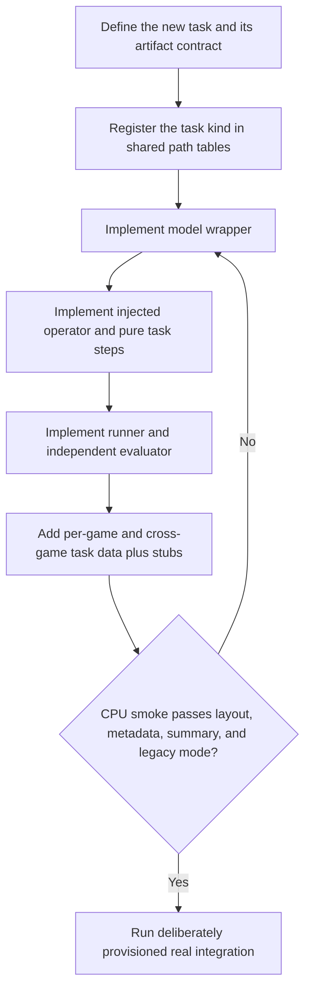

# 3AGameFactory asset-task pipeline development

| Evidence capsule | Value |
| --- | --- |
| Scope | Discipline: adding a model-to-operator-to-runner asset task without GPU-first development |
| Trigger | A coding-agent contributor must add or modify an asset-generation task in 3AGameFactory |
| Source | OpenDCAI's [development harness SOP](https://github.com/OpenDCAI/GameFactory-3A/blob/7d724a51c4e596a21da9a076f274229b3d9eb425/agent_skills/develop_harness/README.md#L1-L55) |
| Author and evidence date | OpenDCAI contributors; source revision and retrieval 2026-08-21 |
| Evidence signals | Source-documented |
| Evidence limit | The source documents a contributor workflow and smoke assertions but does not publish a study of defect prevention or demonstrate every registered task through non-empty evaluators. |

## Loop

## Run the loop

1. Define the task kind and its artifacts, then register it only in the four shared path tables.
2. Implement a model wrapper that owns model transport/runtime but not tasks, JSONL, games, or output
   paths.
3. Implement an operator that accepts an injected model, interprets one task, calls pure logical
   steps, saves artifacts and metadata, and returns a result dictionary.
4. Implement `run.py` with the documented five-function API. Keep `eval.py` independent: it reads
   existing artifacts and must not import generation or load generation models.
5. Add both per-game and cross-game JSONL rows, register stub operator inputs and locations, and run
   the CPU-only smoke harness.
6. Repair until smoke asserts canonical paths, `meta.json`, grouped summaries, and unchanged legacy
   flat mode. Then run the real integration only on a deliberately provisioned GPU/API environment.

## Outputs and stop conditions

Outputs are a registered task kind, model wrapper, injected operator and pure steps, runner,
independent evaluator, task fixtures, stubs, passing CPU smoke evidence, and—when provisioned—real
integration evidence. Stop before GPU/API integration if the free contract gate fails.

## Supporting skills

**Observed:** a coding agent, Python model/operator/runner layers, shared path registry, JSONL task
data, stub models, CPU smoke harness, metadata and summary assertions, backward-compatibility mode,
and separate GPU/API integration tests.

**Potential (inference):** contract-schema generation, import-boundary linting, failure injection,
artifact golden tests, and evaluator-completeness checks.

## Evidence boundaries

The source prescribes `eval.py`, but several current asset routes have empty evaluator files; a new
task is not proven fully evaluated merely because the generic SOP names that stage. Smoke tests use
stubs and validate contracts rather than model quality. Cloud and model integrations remain subject
to credentials, cost, hardware, and third-party licenses; repository code is Apache-2.0.

## Sources

- [Layer contracts and development order](https://github.com/OpenDCAI/GameFactory-3A/blob/7d724a51c4e596a21da9a076f274229b3d9eb425/agent_skills/develop_harness/README.md#L1-L85)
- [Test data, stubs, and smoke gate](https://github.com/OpenDCAI/GameFactory-3A/blob/7d724a51c4e596a21da9a076f274229b3d9eb425/agent_skills/develop_harness/README.md#L86-L110)
- [Canonical output and compatibility contracts](https://github.com/OpenDCAI/GameFactory-3A/blob/7d724a51c4e596a21da9a076f274229b3d9eb425/agent_skills/develop_harness/README.md#L112-L146)
- [Layering anti-patterns](https://github.com/OpenDCAI/GameFactory-3A/blob/7d724a51c4e596a21da9a076f274229b3d9eb425/agent_skills/develop_harness/README.md#L148-L159)
- [Contributor entry point](https://github.com/OpenDCAI/GameFactory-3A/blob/7d724a51c4e596a21da9a076f274229b3d9eb425/README.md#L156-L161)
- Empty evaluator examples: [3D object](https://github.com/OpenDCAI/GameFactory-3A/blob/7d724a51c4e596a21da9a076f274229b3d9eb425/pipeline/assets_gen/gen_3d_object/eval.py), [T-pose](https://github.com/OpenDCAI/GameFactory-3A/blob/7d724a51c4e596a21da9a076f274229b3d9eb425/pipeline/assets_gen/gen_tpose_image/eval.py), [audio](https://github.com/OpenDCAI/GameFactory-3A/blob/7d724a51c4e596a21da9a076f274229b3d9eb425/pipeline/assets_gen/gen_audio/eval.py), and [CG video](https://github.com/OpenDCAI/GameFactory-3A/blob/7d724a51c4e596a21da9a076f274229b3d9eb425/pipeline/assets_gen/gen_cg_video/eval.py)
