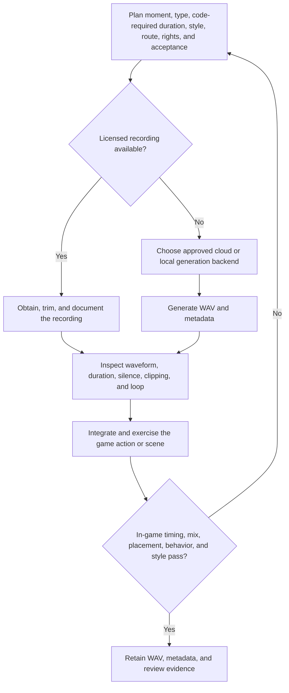

# 3AGameFactory audio acquisition, generation, and in-game QA

| Evidence capsule | Value |
| --- | --- |
| Scope | Asset: dialogue, one-shots, foley, ambience, and offline WAV validation |
| Trigger | A game plan requires an offline audio asset tied to a named game moment and runtime duration |
| Source | OpenDCAI's [audio generation and QA skill](https://github.com/OpenDCAI/GameFactory-3A/blob/7d724a51c4e596a21da9a076f274229b3d9eb425/agent_skills/asset_qa/audio/SKILL.md#L1-L38) |
| Author and evidence date | OpenDCAI contributors; source revision and retrieval 2026-08-21 |
| Evidence signals | Source-documented |
| Evidence limit | The source defines contracts and review criteria but publishes no retained WAVs, in-game audio reviews, listening study, or independent result. |

## Loop

## Run the loop

1. Record the source moment, dialogue/effect type, duration required by the code, delivery and
   spatial context, style, mix intent, loop need, route, expected cost, rights, and acceptance.
2. For common natural or mechanical sounds, prefer a license-checked recording and trim/fade it to
   the game timing. Generate fictional or unsourceable sounds, and dialogue, with an appropriate
   backend. Seed Audio requires explicit paid-call approval; local Qwen3-TTS and Woosh-DFlow are
   fallbacks.
3. Produce the offline WAV and `meta.json`. Inspect for unintended music, clipping, abrupt cuts,
   noise, wrong duration, leading silence, tail overlap, and loop seams.
4. Integrate through the selected engine context, exercise the related action or scene, and inspect
   trigger timing, attenuation, looping, intelligibility, spatial placement, mix, and style. Capture
   representative gameplay audio where the platform permits it.
5. If either asset-level or in-game checks fail, revise the plan, route, timing, source, or generation
   and repeat. Do not conceal a wrong-length clip by truncating it in gameplay code.

## Outputs and stop conditions

Output is a WAV plus metadata recording provider/model or source, prompt/text, rights, configuration,
cache state, and review result. Stop only when the in-game behavior and style meet the plan. A valid
WAV alone is not acceptance.

## Supporting skills

**Observed:** licensed engine/free libraries, Qwen3-TTS, Seed Audio, Woosh-DFlow, WAV and metadata
inspection, engine audio integration, gameplay capture, and stub/API contract tests.

**Potential (inference):** loudness metering, transient and silence detection, loop-correlation
checks, automated timing comparison, and audio-video event alignment.

## Evidence boundaries

This is offline asset production, not a runtime playback API. Capture support and mix behavior vary
by engine and platform. Paid providers require approval, and source recordings, voices, models,
references, and outputs have separate rights. The generic audio `eval.py` is empty at this revision,
so the page does not claim an automated scoring stage.

## Sources

- [Scope, plan, and artifact chain](https://github.com/OpenDCAI/GameFactory-3A/blob/7d724a51c4e596a21da9a076f274229b3d9eb425/agent_skills/asset_qa/audio/SKILL.md#L1-L38)
- [Route and paid-backend decision](https://github.com/OpenDCAI/GameFactory-3A/blob/7d724a51c4e596a21da9a076f274229b3d9eb425/agent_skills/asset_qa/audio/SKILL.md#L44-L85)
- [Generation contract](https://github.com/OpenDCAI/GameFactory-3A/blob/7d724a51c4e596a21da9a076f274229b3d9eb425/agent_skills/asset_qa/audio/SKILL.md#L126-L187)
- [QA and in-game acceptance](https://github.com/OpenDCAI/GameFactory-3A/blob/7d724a51c4e596a21da9a076f274229b3d9eb425/agent_skills/asset_qa/audio/SKILL.md#L189-L214)
- [Empty audio evaluator at the frozen revision](https://github.com/OpenDCAI/GameFactory-3A/blob/7d724a51c4e596a21da9a076f274229b3d9eb425/pipeline/assets_gen/gen_audio/eval.py)
