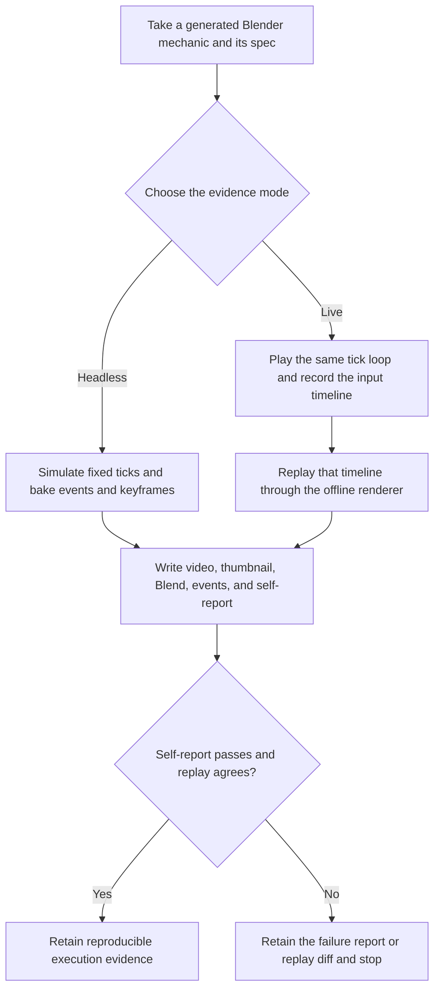

# 3AGameFactory Blender deterministic play and replay evidence

| Evidence capsule | Value |
| --- | --- |
| Scope | Engine-specific verification: fixed-step simulation, live input capture, deterministic replay, and rendered evidence for a generated Blender mechanic |
| Trigger | A generated Blender mechanic implements `build`, `tick`, and `summary` against the repository gameplay kit and needs execution evidence |
| Source | OpenDCAI's [Blender gameplay kit and evidence modes](https://github.com/OpenDCAI/GameFactory-3A/blob/7d724a51c4e596a21da9a076f274229b3d9eb425/engine_adapters/blender/README.md#L99-L146) |
| Author and evidence date | OpenDCAI contributors; source revision and retrieval 2026-08-21 |
| Evidence signals | Source-documented; Author-practiced |
| Evidence limit | The source reports template runs, replay measurements, and Blender demos, but it does not establish that every generated mechanic is deterministic, visually correct, or playable. |

## Loop

## Run the loop

1. Start from game-owned Blender mechanic code that subclasses the kit's `Game` and supplies
   `build()`, fixed-step `tick()`, and `summary()`. Assets remain optional visual additions; missing
   assets fall back to primitives without changing reported gameplay events.
2. For a headless evidence run, simulate at the fixed timestep, bake the resulting state to
   keyframes, and render through the recorder. Do not use Blender's process code as the verdict;
   require the mechanic's report and confirmed files.
3. For interactive evidence, run the same rules with `--play`. Keyboard and mouse input changes
   when ticks happen, not their duration, and the session records keys and mouse deltas to
   `input_timeline.json` without baking keyframes live.
4. Replay that input timeline offline through the identical tick loop. Compare the resulting
   positions, shots, events, and run output with the original session; the source's measured route
   uses tick-index boundaries and unrounded aim deltas to preserve agreement.
5. Retain `gameplay.mp4`, `thumbnail.png`, `session.blend`, `events.json`, `report.json`, and, for a
   played session, the input timeline. A failed self-verdict, missing artifact, or replay difference
   remains failure evidence rather than being masked by Blender's exit status.

## Outputs and stop conditions

The outputs are a self-verdict report, deterministic event log, rendered gameplay evidence,
editable Blend, thumbnail, and optional live-input timeline plus its replay result. Stop successfully
when the report passes, every required artifact exists, and a requested replay agrees. Otherwise
stop with the failing report or diff for later repair; this verification flow does not define the
repair itself.

## Supporting skills

**Observed:** generated Blender Python, the `engine_adapters.blender.game` kit, fixed-timestep
simulation, keyframe baking, event logs, geometric HUD, Cycles/FFMPEG recording, live keyboard and
mouse controls, input-timeline capture, and deterministic replay comparison.

**Potential (inference):** replay minimization, event/video alignment, deterministic-state hashing,
and frame-diff triage. These capabilities may not exist.

## Evidence boundaries

A game-computed verdict can encode its own mistake and is not independent evaluation. The source
reports interactive-path verification on Blender 4.5.12 but also says the reference host could not
open a visible live window because it lacked OpenGL; this evidence does not replace human play and
visual review. The pip `bpy` wheel lacks FFMPEG and may fall back to image sequences. Repository
code is Apache-2.0; Blender, downloaded art, generated assets, and video media retain separate terms.

## Sources

- [Batch, runtime, and gameplay-mode distinction](https://github.com/OpenDCAI/GameFactory-3A/blob/7d724a51c4e596a21da9a076f274229b3d9eb425/engine_adapters/blender/README.md#L27-L41)
- [Fixed-step kit and headless artifact contract](https://github.com/OpenDCAI/GameFactory-3A/blob/7d724a51c4e596a21da9a076f274229b3d9eb425/engine_adapters/blender/README.md#L99-L146)
- [Live play uses the same rules](https://github.com/OpenDCAI/GameFactory-3A/blob/7d724a51c4e596a21da9a076f274229b3d9eb425/engine_adapters/blender/README.md#L148-L187)
- [Input capture, replay, and measured determinism fixes](https://github.com/OpenDCAI/GameFactory-3A/blob/7d724a51c4e596a21da9a076f274229b3d9eb425/engine_adapters/blender/README.md#L189-L211)
- [Verified and unexecuted boundaries](https://github.com/OpenDCAI/GameFactory-3A/blob/7d724a51c4e596a21da9a076f274229b3d9eb425/engine_adapters/blender/README.md#L250-L270)
- [Author-provided Blender gameplay recordings](https://github.com/OpenDCAI/GameFactory-3A/blob/7d724a51c4e596a21da9a076f274229b3d9eb425/README.md#L66-L87)
