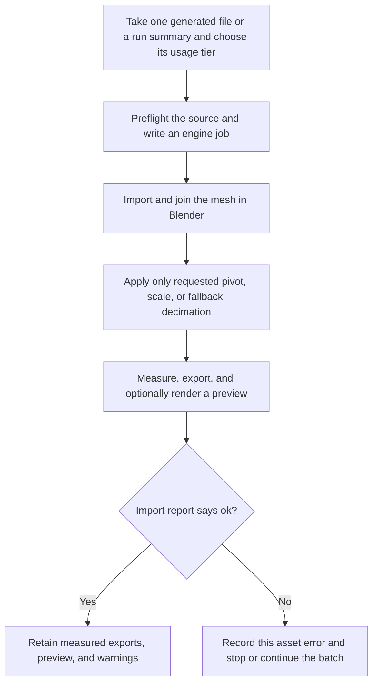

# 3AGameFactory Blender generated-asset conditioning

| Evidence capsule | Value |
| --- | --- |
| Scope | Asset: neutral-DCC import, explicit conditioning, measurement, and re-export for a generated mesh |
| Trigger | A file produced by the framework's model layer must be checked or converted before a game engine consumes it |
| Source | OpenDCAI's [Blender generated-asset importer](https://github.com/OpenDCAI/GameFactory-3A/blob/7d724a51c4e596a21da9a076f274229b3d9eb425/engine_adapters/blender/import_generated/README.md#L1-L14) |
| Author and evidence date | OpenDCAI contributors; source revision and retrieval 2026-08-21 |
| Evidence signals | Source-documented; Author-practiced |
| Evidence limit | The documented mesh route was exercised on Blender 5.0.1; that does not validate every supported format, Blender version, or downstream engine. The separately documented world-preparation helper is absent at the frozen revision. |

## Loop

## Run the loop

1. Resolve one generated source or every source named by a generation summary. Inspect the file on
   the host first so a missing file, malformed GLB, or non-geometric PLY does not spend a Blender
   launch.
2. Select `asset`, `vfx_standalone`, or `vfx_particle`, then write the shared JSON job and launch a
   Blender application or a Python environment carrying `bpy`. Use the explicit exit-on-completion
   setting because Blender's background launcher can otherwise report success after script failure.
3. Import the supported mesh format and join multiple imported meshes before measurement. The
   `asset` tier leaves pivot and scale untouched; the VFX tiers apply only their documented defaults.
4. Apply a requested data-level pivot or scale normalization. Treat post-generation decimation as a
   warned fallback: generation-time low-poly controls preserve UVs and normals better.
5. Measure triangles, vertices, bounds, dimensions, and materials; compare source and conditioned
   triangle counts; write requested GLB, FBX, or Blend outputs; and optionally render a Cycles-CPU
   preview.
6. Read the JSON report rather than scraping logs. A degraded preview or lossy operation remains a
   warning, while a failed asset receives its own error; other entries in a batch continue.

## Outputs and stop conditions

The contract is a JSON report containing `ok`, object identity, source and conditioned counts,
bounds, materials, exports, preview, and warnings, plus the confirmed files it names. Stop with the
conditioned asset when `ok` is true. Stop the single-asset run, or record the entry and continue a
batch, when preflight or import fails. Do not treat a raw world collider PLY as an engine-ready asset.

## Supporting skills

**Observed:** `scripts/import_generated_asset.py`, Blender or the `bpy` wheel, JSON job files,
Blender mesh importers, mesh-data pivoting, scale normalization, Decimate, GLB/FBX/Blend export,
Cycles-CPU preview, and structured reports.

**Potential (inference):** asset-batch dashboards, report-to-manifest promotion, conditioned/source
geometry diffs, and automated warning policy. These capabilities may not exist.

## Evidence boundaries

The default tier deliberately performs no silent cleanup. OBJ, PLY, STL, USD, and Alembic support
depends on Blender operators that vary by version. The README's world branch names
`scripts/prepare_world_asset.py` and `models/common/mesh_repair.py`, but neither path exists in the
frozen repository tree; that branch is documented intent, not a runnable route at this revision.
The repository is Apache-2.0, while Blender, generation models, input media, and generated assets
retain their own terms.

## Sources

- [Launcher and job contract](https://github.com/OpenDCAI/GameFactory-3A/blob/7d724a51c4e596a21da9a076f274229b3d9eb425/engine_adapters/blender/import_generated/README.md#L16-L49)
- [Conditioning order and usage tiers](https://github.com/OpenDCAI/GameFactory-3A/blob/7d724a51c4e596a21da9a076f274229b3d9eb425/engine_adapters/blender/import_generated/README.md#L67-L91)
- [Report contract and world boundary](https://github.com/OpenDCAI/GameFactory-3A/blob/7d724a51c4e596a21da9a076f274229b3d9eb425/engine_adapters/blender/import_generated/README.md#L93-L122)
- [Measured Blender 5.0.1 run and failure behavior](https://github.com/OpenDCAI/GameFactory-3A/blob/7d724a51c4e596a21da9a076f274229b3d9eb425/engine_adapters/blender/import_generated/README.md#L124-L175)
- [Host preflight and per-asset failure handling](https://github.com/OpenDCAI/GameFactory-3A/blob/7d724a51c4e596a21da9a076f274229b3d9eb425/scripts/import_generated_asset.py#L227-L262)
- [Frozen scripts tree](https://github.com/OpenDCAI/GameFactory-3A/tree/7d724a51c4e596a21da9a076f274229b3d9eb425/scripts)
- [Frozen shared-model tree](https://github.com/OpenDCAI/GameFactory-3A/tree/7d724a51c4e596a21da9a076f274229b3d9eb425/models/common)
