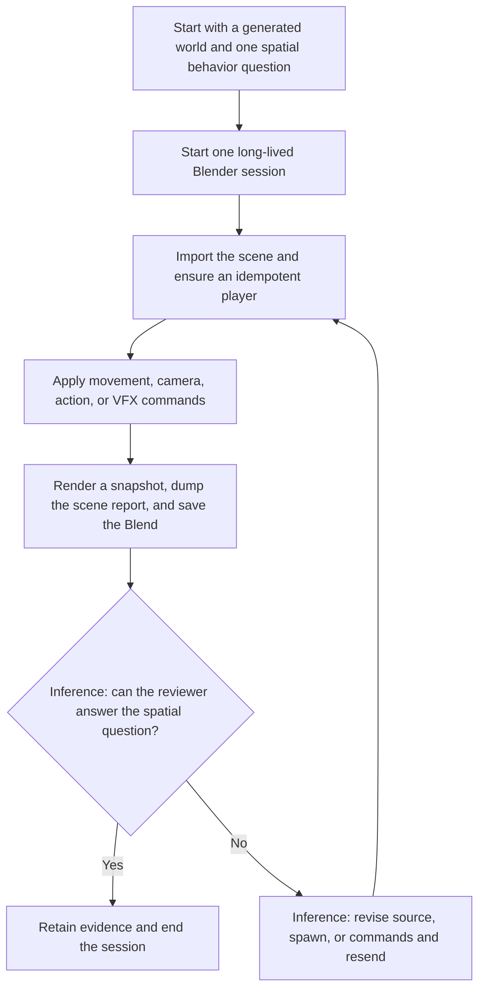

# 3AGameFactory Blender live spatial review

| Evidence capsule | Value |
| --- | --- |
| Scope | Verification: walking a generated world in a long-lived Blender session before engine import |
| Trigger | A generated or repaired world raises a behavior-in-space question that a batch import report cannot answer |
| Source | OpenDCAI's [playable Blender runtime](https://github.com/OpenDCAI/GameFactory-3A/blob/7d724a51c4e596a21da9a076f274229b3d9eb425/engine_adapters/blender/runtime/README.md#L1-L12) |
| Author and evidence date | OpenDCAI contributors; source revision and retrieval 2026-08-21 |
| Evidence signals | Source-documented; Author-practiced |
| Evidence limit | The runtime and its machine diagnostic were exercised on Blender 5.0.1, but the source supplies no automatic semantic oracle for doorway clearance, spawn-floor correctness, or other project-specific spatial questions. |

## Loop

## Run the loop

1. Name the question that requires behavior in space, such as whether a repaired doorway is
   passable or the generated floor aligns with the character spawn. Start the Blender runtime once
   and keep that process alive.
2. Send JSON commands over UDP. Import the generated scene, create the player by stable entity id,
   and apply movement; optionally load actions, move the camera, or trigger effects needed to expose
   the condition.
3. Capture the live scene with `render_snapshot`, `dump_scene_report`, and `save_blend`. Cycles on
   CPU is the headless default, and the Blend retains content that headless rendering must hide.
4. **Inference:** a human or vision-capable agent reviews the evidence against the original spatial
   question; the source states the questions this mode is for but does not prescribe a semantic
   judge. If evidence is insufficient or the condition fails, revise the generated source, spawn,
   or command sequence and send another pass to the same session.
5. End or clear the session after the question is answered. Keep Blender calls on the main thread;
   the UDP thread may parse and queue commands only.

## Outputs and stop conditions

Outputs are the mutated live scene, snapshot, scene report, saved `.blend`, and the reviewer's
answer to the named spatial question. The semantic acceptance decision and retry selection are
explicit library inference. Stop with retained evidence when that decision is possible; otherwise
repeat from scene import or stop with the unresolved question. Do not substitute the bundled
machine self-test for project-specific spatial review.

## Supporting skills

**Observed:** Blender/`bpy`, a long-lived UDP command server, generated scene import, idempotent
player entities, fixed movement input, camera control, five VFX backends, Cycles-CPU snapshots,
scene reports, Blend saves, and a headless self-test.

**Potential (inference):** vision review, scripted traversal probes, collision-clearance metrics,
spawn-height assertions, and snapshot annotation. These capabilities may not exist.

## Evidence boundaries

UDP can drop commands; idempotent spawn ids reduce retry duplication but do not guarantee delivery.
`bpy` is not thread-safe, headless GL paths can abort rather than raise, and Mantaflow teardown can
corrupt an otherwise successful exit unless the subsystem clears the file. The 17/17 self-test
checks one installation and its artifacts, not the playability of a supplied world. Repository code
is Apache-2.0; Blender and imported or generated assets retain separate terms.

## Sources

- [Session start and transport](https://github.com/OpenDCAI/GameFactory-3A/blob/7d724a51c4e596a21da9a076f274229b3d9eb425/engine_adapters/blender/runtime/README.md#L14-L37)
- [Commands, units, and retained artifacts](https://github.com/OpenDCAI/GameFactory-3A/blob/7d724a51c4e596a21da9a076f274229b3d9eb425/engine_adapters/blender/runtime/README.md#L39-L62)
- [Main-thread and headless-render boundaries](https://github.com/OpenDCAI/GameFactory-3A/blob/7d724a51c4e596a21da9a076f274229b3d9eb425/engine_adapters/blender/runtime/README.md#L81-L107)
- [Measured runtime diagnostic and teardown findings](https://github.com/OpenDCAI/GameFactory-3A/blob/7d724a51c4e596a21da9a076f274229b3d9eb425/engine_adapters/blender/runtime/README.md#L109-L148)
- [Ordered generated-world command example](https://github.com/OpenDCAI/GameFactory-3A/blob/7d724a51c4e596a21da9a076f274229b3d9eb425/engine_adapters/blender/runtime/examples/walk_a_generated_world.json#L1-L26)
- [Self-test acceptance and artifact gate](https://github.com/OpenDCAI/GameFactory-3A/blob/7d724a51c4e596a21da9a076f274229b3d9eb425/engine_adapters/blender/runtime/selftest.py#L155-L198)
