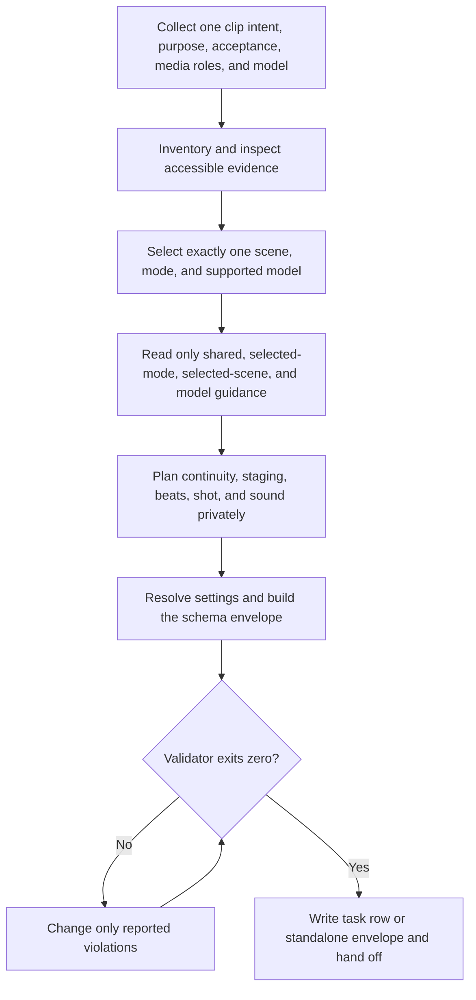

# 3AGameFactory CG directing-envelope authoring

| Evidence capsule | Value |
| --- | --- |
| Scope | Asset planning: turning one game-CG intent into a validated model-specific task envelope |
| Trigger | An approved game plan or standalone request defines one opening, cutscene, ultimate, or promo clip but lacks a model-ready task |
| Source | OpenDCAI's [game CG director skill](https://github.com/OpenDCAI/GameFactory-3A/blob/7d724a51c4e596a21da9a076f274229b3d9eb425/agent_skills/asset_qa/cg_video/game-cg-director/SKILL.md#L1-L40) |
| Author and evidence date | OpenDCAI contributors; source revision and retrieval 2026-08-21 |
| Evidence signals | Source-documented |
| Evidence limit | The skill produces and validates task envelopes, not videos; the source does not link published clips to their exact envelopes. |

## Loop

## Run the loop

1. Require one approved clip intent, purpose, acceptance criteria, declared media roles, selected or
   defaultable model, and optional duration, ratio, seed, and task id. Split multi-clip sequences
   into independently validated envelopes while preserving continuity anchors.
2. Inventory inputs and inspect accessible media. Preserve opaque paths without guessing their
   content; request one short description only when unknown content controls motion or endpoint.
3. Choose one scene and one input mode from text, first-frame, first/last-frame, or reference mode,
   then one supported `h3` or `seedance` model profile.
4. Read only common principles plus the selected style, mode, scene, and model guidance. Privately
   plan recurring subjects, stage, performance beats, shot purpose, endpoint, and sound progression.
5. Resolve model-bounded defaults, build the schema envelope, and run the bundled validator. Repair
   only reported violations until exit code 0.
6. For the framework, add only `game_id` after validation and update the ordered JSONL row without
   overwriting unrelated tasks. For standalone use, write the requested JSON file and return its
   validation status.

## Outputs and stop conditions

Output is one validated JSON envelope per clip, or one compact row in `cg_tasks.jsonl`, plus ordered
task ids and validation status. Stop at successful handoff. This workflow must not choose a run id,
invoke a generation model, spend credits, write media, or claim a video exists.

## Supporting skills

**Observed:** media inventory, scene templates, input-mode guides, H3 and Seedance profiles, JSON
Schema, a deterministic Python validator, JSONL task maintenance, and continuity planning.

**Potential (inference):** storyboard thumbnailing, duration budgeting, continuity linting,
reference-access checks, and prompt diff review.

## Evidence boundaries

Validation proves envelope structure and declared constraints, not prompt quality or video outcome.
Opaque media is deliberately not interpreted. The child skill supports model/reference fields that
the current parent operator can reject or ignore, including video and audio references. Repository
text and scripts are Apache-2.0; supplied media and downstream provider output keep separate rights.

## Sources

- [Caller context and evidence inventory](https://github.com/OpenDCAI/GameFactory-3A/blob/7d724a51c4e596a21da9a076f274229b3d9eb425/agent_skills/asset_qa/cg_video/game-cg-director/SKILL.md#L1-L55)
- [Routing and selected guidance](https://github.com/OpenDCAI/GameFactory-3A/blob/7d724a51c4e596a21da9a076f274229b3d9eb425/agent_skills/asset_qa/cg_video/game-cg-director/SKILL.md#L57-L89)
- [Private scene plan and settings](https://github.com/OpenDCAI/GameFactory-3A/blob/7d724a51c4e596a21da9a076f274229b3d9eb425/agent_skills/asset_qa/cg_video/game-cg-director/SKILL.md#L91-L121)
- [Build, validate, and hand off](https://github.com/OpenDCAI/GameFactory-3A/blob/7d724a51c4e596a21da9a076f274229b3d9eb425/agent_skills/asset_qa/cg_video/game-cg-director/SKILL.md#L123-L174)
