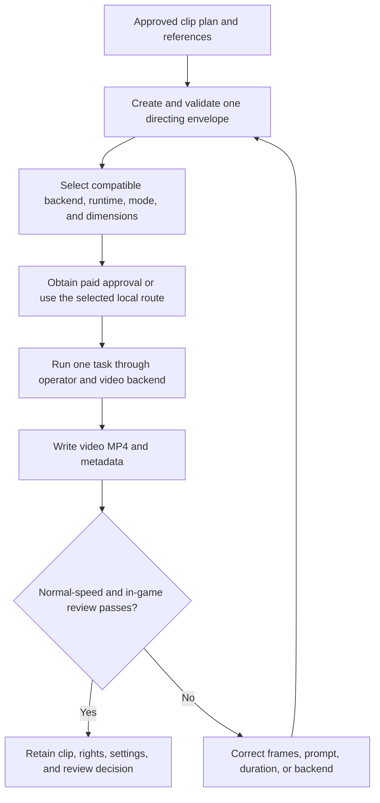

# 3AGameFactory CG-video generation and QA

| Evidence capsule | Value |
| --- | --- |
| Scope | Asset: directed text-, frame-, or reference-conditioned game-CG video |
| Trigger | A game plan defines a clip's narrative purpose, style, shot, duration, acceptance, and validated directing task |
| Source | OpenDCAI's [CG-video generation and QA skill](https://github.com/OpenDCAI/GameFactory-3A/blob/7d724a51c4e596a21da9a076f274229b3d9eb425/agent_skills/asset_qa/cg_video/SKILL.md#L1-L43) |
| Author and evidence date | OpenDCAI contributors; source revision and retrieval 2026-08-21 |
| Evidence signals | Source-documented; Author-practiced |
| Evidence limit | Four author-provided clips demonstrate the route, but there is no independent comparison, retained task corpus, or published reviewer record. |

## Loop

## Run the loop

1. Start only after the game plan specifies narrative purpose, style, shot, duration, acceptance,
   and reference roles. Use the director sub-skill to create one validated task per generated clip.
2. Select a compatible shared mode and backend. Preserve reference-image order. Run mixed model or
   aspect configurations as separate tasks, and reject unsupported pairs instead of silently
   substituting a model.
3. Before Seedance or MiniMax API use, estimate clip-by-duration-by-resolution cost and pause for
   explicit approval and credentials. Use local H3 only with its stated hardware and storage.
4. Run the operator, which resolves local media and invokes the selected backend, then retain
   `video.mp4` and `meta.json`.
5. Watch at normal speed and in game context. Check prompt adherence, temporal consistency, identity,
   camera motion, flicker, anatomy and prop stability, transitions, readable action, unwanted text,
   ratio, lighting, effects, composition, duration, audio choice, and requested style.
6. On failure, correct frames, prompt, duration, or backend and regenerate; do not accept a broken
   clip merely because the MP4 is valid.

## Outputs and stop conditions

Output is one MP4 per task plus metadata for provider/model, prompt, mode, reference rights,
parameters, cache state, and human or vision-review decision. Stop at visual and game-context
acceptance. Multi-clip editing is a separate post-production step.

## Supporting skills

**Observed:** game-CG director, JSONL tasks, Seedance, MiniMax Hailuo/H3, local ComfyUI runtime,
image input conversion, smoke/API tests, normal-speed playback, and in-game review.

**Potential (inference):** temporal-difference inspection, identity tracking, shot-continuity review,
safe-area overlays, and audio-visual synchronization checks.

## Evidence boundaries

Current execution supports image references but blocks authored video/audio-reference modes. Cloud
routes cost credits; local H3 is hardware-intensive. The generic CG-video evaluator is empty at this
revision, so acceptance remains visual. Provider, model, input-media, and generated-video rights are
outside the repository's Apache-2.0 grant.

## Sources

- [Chain, artifacts, and director handoff](https://github.com/OpenDCAI/GameFactory-3A/blob/7d724a51c4e596a21da9a076f274229b3d9eb425/agent_skills/asset_qa/cg_video/SKILL.md#L1-L106)
- [Modes and backend decision](https://github.com/OpenDCAI/GameFactory-3A/blob/7d724a51c4e596a21da9a076f274229b3d9eb425/agent_skills/asset_qa/cg_video/SKILL.md#L108-L143)
- [QA and correction loop](https://github.com/OpenDCAI/GameFactory-3A/blob/7d724a51c4e596a21da9a076f274229b3d9eb425/agent_skills/asset_qa/cg_video/SKILL.md#L308-L345)
- [Author-provided CG-video examples](https://github.com/OpenDCAI/GameFactory-3A/blob/7d724a51c4e596a21da9a076f274229b3d9eb425/README.md#L112-L132)
- [Empty CG-video evaluator at the frozen revision](https://github.com/OpenDCAI/GameFactory-3A/blob/7d724a51c4e596a21da9a076f274229b3d9eb425/pipeline/assets_gen/gen_cg_video/eval.py)
