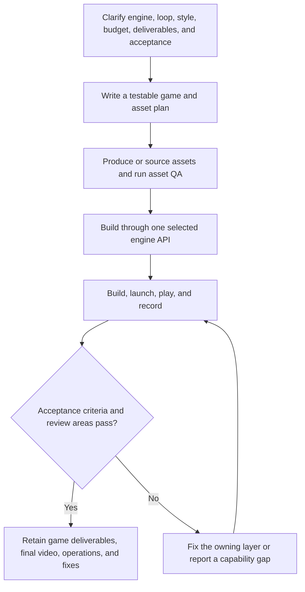

# 3AGameFactory requirement-to-playable-slice pipeline

| Evidence capsule | Value |
| --- | --- |
| Scope | End-to-end: coordinated assets, gameplay, UI, engine integration, and playability evidence |
| Trigger | A coding agent receives a game requirement or a request to improve a game |
| Source | OpenDCAI's [game-generation agent guide](https://github.com/OpenDCAI/GameFactory-3A/blob/7d724a51c4e596a21da9a076f274229b3d9eb425/agent_skills/setting_overview.md#L37-L68) |
| Author and evidence date | OpenDCAI contributors; source revision and retrieval 2026-08-21 |
| Evidence signals | Source-documented; Author-practiced |
| Evidence limit | Repository-authored gameplay recordings demonstrate examples, not controlled comparisons, independent reproduction, or production use. |

## Loop

## Run the loop

1. Clarify the target engine, genre, player loop, platform, deliverables, style, references,
   budget, privacy constraints, and acceptance criteria. Confirm a missing engine or style before
   implementation.
2. Plan controls, camera, roles, level flow, UI, assets, motion, audio, VFX, lighting, integration,
   and validation scenes. Give every asset a purpose, style, source route, and acceptance gate.
3. Generate or select licensed assets, run the applicable asset QA, and record provenance and
   license information. Paid cloud routes pause for explicit user approval and credentials.
4. Select exactly one engine context and use its public adapter/API to create the game-owned scene,
   mechanics, UI, materials, animation, effects, and project structure.
5. Build, launch, execute the majority of intended operations, record a short evidence video, and
   review the plan's criteria plus image quality, lighting, style, dynamic effects, facing,
   attachments, collision, camera, controls, and UI.
6. Log each failure as symptom, owning layer, fix, and new-recording verification. Repair the owning
   layer and repeat; report a capability gap when no permitted route can provide a shippable result.

## Outputs and stop conditions

Outputs are the separate generated assets, game-owned mechanic and UI artifacts, engine project or
playable product, provenance, review findings, exercised operations, and final gameplay video. Stop
only after the requested core loop and edge cases pass the stated acceptance criteria. A compile,
launch, source review, or single screenshot is not playability evidence.

## Supporting skills

**Observed:** a coding agent; task-specific image, 3D-object, scene, motion, audio, and CG-video
skills; mechanic and UI generation skills; one of the UE5, Blender, Unity, or Three.js contexts;
browser or engine capture.

**Potential (inference):** acceptance-led planning, provenance capture, cross-discipline dependency
tracking, defect ownership, and evidence packaging.

## Evidence boundaries

The source is an agent-run framework workflow, not proof that every referenced model or engine route
is available, reliable, or economical. Generated outputs are not retained in this checkout; the
README embeds author-provided recordings. The repository is Apache-2.0, while engines, models,
checkpoints, downloaded assets, and generated media remain subject to their own terms.

## Sources

- [End-to-end workflow](https://github.com/OpenDCAI/GameFactory-3A/blob/7d724a51c4e596a21da9a076f274229b3d9eb425/agent_skills/setting_overview.md#L37-L68)
- [Asset decision policy and validation loop](https://github.com/OpenDCAI/GameFactory-3A/blob/7d724a51c4e596a21da9a076f274229b3d9eb425/agent_skills/setting_overview.md#L118-L192)
- [Recorded generated-game examples](https://github.com/OpenDCAI/GameFactory-3A/blob/7d724a51c4e596a21da9a076f274229b3d9eb425/README.md#L29-L110)
- [Capability and artifact map](https://github.com/OpenDCAI/GameFactory-3A/blob/7d724a51c4e596a21da9a076f274229b3d9eb425/README.md#L165-L177)
- [Apache-2.0 and third-party boundary](https://github.com/OpenDCAI/GameFactory-3A/blob/7d724a51c4e596a21da9a076f274229b3d9eb425/README.md#L251-L257)
