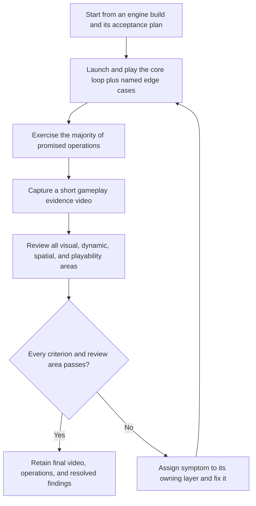

# 3AGameFactory gameplay-video validation

| Evidence capsule | Value |
| --- | --- |
| Scope | Verification: representative play, recorded review, defect ownership, and re-verification |
| Trigger | An engine build exists and its playability must be established beyond compile or launch success |
| Source | OpenDCAI's [validate, play, and iterate procedure](https://github.com/OpenDCAI/GameFactory-3A/blob/7d724a51c4e596a21da9a076f274229b3d9eb425/agent_skills/setting_overview.md#L139-L175) |
| Author and evidence date | OpenDCAI contributors; source revision and retrieval 2026-08-21 |
| Evidence signals | Source-documented |
| Evidence limit | Public recordings show gameplay capture, but the checkout contains no retained review logs or defect histories proving that the authors applied this exact validation-and-repair loop. |

## Loop

## Run the loop

1. Launch through the selected engine's documented path and play the core loop end to end. Include
   the plan's edge cases and most promised actions, screens, transitions, and failure states.
2. Record a short, low-resolution evidence video covering idle, movement, turning, the main verb,
   any vehicle, a VFX trigger, a full UI pass, and a scene transition where applicable.
3. Watch the recording. Review asset and scene quality, lighting, requested style, effect timing and
   cleanup, facing during movement, combined-part placement, scale, collision, camera, controls,
   UI bindings, and runtime responsiveness.
4. Record each defect as video symptom, owning layer, fix, and re-verification in a new recording.
   Repair asset/import facts in their layer rather than compensating in gameplay code.
5. Repeat build, play, record, and review until every row and acceptance criterion passes. If a flow
   cannot be exercised, report the capability gap instead of declaring it verified.

## Outputs and stop conditions

The retained evidence is the final gameplay video, list of operations exercised, acceptance result,
and findings fixed. Stop at complete passage of both the task-specific criteria and source review
areas. A successful compile, startup, log, or screenshot does not satisfy this gate.

## Supporting skills

**Observed:** selected engine launcher/client, browser or engine video capture, asset inspection,
orientation metadata, gameplay and UI operation checks, and visual review.

**Potential (inference):** scripted input coverage, timestamped issue annotation, capture diffing,
and trace-to-video synchronization.

## Evidence boundaries

The checklist is broad but does not prescribe performance thresholds, statistical test coverage, or
platform-specific capture tooling. The embedded demos are author-provided and do not expose their
full review history. Repository code and prose are Apache-2.0; recorded or imported assets can carry
separate terms.

## Sources

- [Validation procedure and evidence contract](https://github.com/OpenDCAI/GameFactory-3A/blob/7d724a51c4e596a21da9a076f274229b3d9eb425/agent_skills/setting_overview.md#L139-L165)
- [Review areas](https://github.com/OpenDCAI/GameFactory-3A/blob/7d724a51c4e596a21da9a076f274229b3d9eb425/agent_skills/setting_overview.md#L167-L175)
- [Completion rules](https://github.com/OpenDCAI/GameFactory-3A/blob/7d724a51c4e596a21da9a076f274229b3d9eb425/agent_skills/setting_overview.md#L177-L194)
- [Author-provided gameplay recordings](https://github.com/OpenDCAI/GameFactory-3A/blob/7d724a51c4e596a21da9a076f274229b3d9eb425/README.md#L29-L110)
