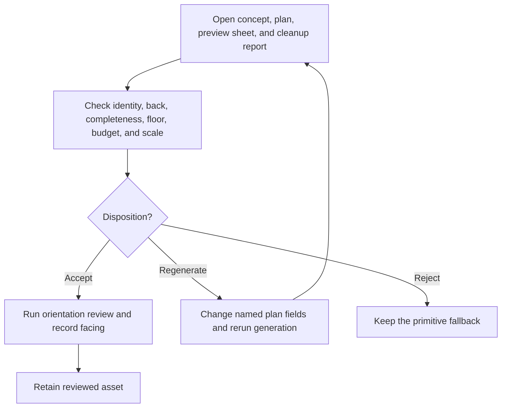

# 3AGameFactory generated-mesh review and disposition

| Evidence capsule | Value |
| --- | --- |
| Scope | Verification: deciding whether an image-to-3D mesh is fit for a browser game |
| Trigger | `Gen3DObjectOperator.run_art_plan` has produced a mesh, concept image, plan entry, and five-view preview sheet |
| Source | OpenDCAI's [generated asset review skill](https://github.com/OpenDCAI/GameFactory-3A/blob/7d724a51c4e596a21da9a076f274229b3d9eb425/agent_skills/asset_qa/3d_object/SKILL.md#L1-L10) |
| Author and evidence date | OpenDCAI contributors; source revision and retrieval 2026-08-21 |
| Evidence signals | Source-documented |
| Evidence limit | Game demos contain generated meshes, but the source does not publish their preview sheets or decisions, so application of this exact gate is not observable. |

## Loop

## Run the loop

1. Immediately after the art-plan operator, compare the five orthographic views with `concept.png`
   and the task plan.
2. Check that it is the requested subject; its unseen back is adequate for the player's view; it is
   upright and complete; no solid ground slab remains; its triangle and texture budget matches its
   draw-frequency role; and its planned real-world height is plausible.
3. Accept only when all checks pass, then run the separate orientation review and record facing.
4. Regenerate when a fix belongs in generation. Name the changed prompt, seed, role, triangle,
   texture, source-image, or height field so the next attempt differs, then inspect the new sheet.
5. Reject when the mesh is not worth another run and retain the framework's primitive fallback.

## Outputs and stop conditions

The output is an explicit accept, regenerate, or reject decision with the reviewed evidence and
changed plan fields. Accepted output is not finished until orientation is verified. Rejection stops
at a usable primitive fallback; do not decimate a textured asset by eye or use a fused generated
mesh for behavior that must articulate.

## Supporting skills

**Observed:** Tripo, Meshy, TRELLIS.2, generated concept images, five-view preview sheets, mesh
cleanup reports, role-based budgets, primitive fallbacks, and the orientation-review skill.

**Potential (inference):** contact-sheet annotation, silhouette comparison, triangle-budget
reporting, scale-reference overlays, and defect-to-plan-field routing.

## Evidence boundaries

The gate is tuned to the framework's browser-game roles and preview output. Back quality is
view-dependent, and a facade can pass where a walk-around prop fails. Cloud generation is paid and
requires approval; model, input, and output rights are provider-specific. Repository code and skill
text are Apache-2.0, but generated or downloaded assets are not automatically covered.

## Sources

- [Trigger and review authority](https://github.com/OpenDCAI/GameFactory-3A/blob/7d724a51c4e596a21da9a076f274229b3d9eb425/agent_skills/asset_qa/3d_object/SKILL.md#L1-L35)
- [Six review checks](https://github.com/OpenDCAI/GameFactory-3A/blob/7d724a51c4e596a21da9a076f274229b3d9eb425/agent_skills/asset_qa/3d_object/SKILL.md#L37-L93)
- [Accept, regenerate, and reject outcomes](https://github.com/OpenDCAI/GameFactory-3A/blob/7d724a51c4e596a21da9a076f274229b3d9eb425/agent_skills/asset_qa/3d_object/SKILL.md#L95-L107)
- [Generation limits and primitive boundary](https://github.com/OpenDCAI/GameFactory-3A/blob/7d724a51c4e596a21da9a076f274229b3d9eb425/agent_skills/asset_qa/3d_object/SKILL.md#L109-L124)
