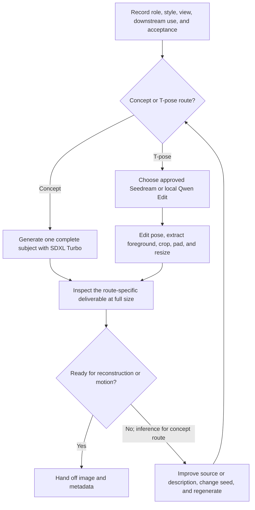

# 3AGameFactory image and T-pose preparation

| Evidence capsule | Value |
| --- | --- |
| Scope | Asset: single-subject reconstruction concepts and transparent character T-poses |
| Trigger | A game plan needs a reconstruction concept, a cleaned character reference, or a front-facing transparent T-pose |
| Source | OpenDCAI's [image preparation and T-pose skill](https://github.com/OpenDCAI/GameFactory-3A/blob/7d724a51c4e596a21da9a076f274229b3d9eb425/agent_skills/asset_qa/image/SKILL.md#L1-L45) |
| Author and evidence date | OpenDCAI contributors; source revision and retrieval 2026-08-21 |
| Evidence signals | Source-documented |
| Evidence limit | The source defines generation, artifacts, and review, but this checkout retains no production images, review decisions, or independent quality evidence. |

## Loop

## Run the loop

1. Record the asset role, style, camera/view, downstream use, silhouette, material cues, and
   acceptance criteria. T-pose work also needs one visible character reference and identity details.
2. For a reconstruction concept, generate one centered, complete subject and exclude turnarounds,
   duplicates, crops, ground planes, shadows, text, and busy backgrounds.
3. For a T-pose, use the paid Seedream editor only after explicit cost and key approval; otherwise
   use local Qwen Image Edit. Request an upright, front-facing, full-body pose on white, then apply
   RMBG or the deliberately selected depth mask, crop the foreground, pad square, and resize.
4. Inspect at full size. Concepts must be a usable single-object reconstruction input. T-poses must
   pass pose/framing, facing/identity, alpha/background, reconstruction readiness, and style checks,
   including light- and dark-background alpha inspection.
5. On failure, improve the input or description, change the seed, regenerate, and re-review. The
   source states this retry for T-poses; applying the same connector to a failed concept review is
   editorial inference.

## Outputs and stop conditions

Concept output is a reviewed single-object image for the 3D-object workflow. T-pose output is
`tpose_fg.png`, optionally `tpose.png`, and `meta.json` with source, model, seed, steps, size, and task
metadata. Stop only at the route-specific visual gate; do not defer a malformed pose to mesh rotation
or gameplay code.

## Supporting skills

**Observed:** SDXL Turbo, Qwen Image Edit, Seedream, RMBG, Depth Anything, PIL-based preprocessing,
JSONL tasks, stub smoke checks, and full-size visual inspection.

**Potential (inference):** pose estimation, alpha-edge visualization, identity comparison,
reconstruction-readiness scoring, and provenance automation.

## Evidence boundaries

Concept output is an input, not final game art. Paid routes require user approval; local routes need
model weights and usually CUDA. API, checkpoint, reference-image, and generated-content terms are
separate from the repository's Apache-2.0 license. The repository advertises a generic `eval.py`
lifecycle, but the T-pose evaluator is empty at this revision, so this page relies on the documented
visual gate and smoke contracts instead.

## Sources

- [Scope, routes, and paid-backend gate](https://github.com/OpenDCAI/GameFactory-3A/blob/7d724a51c4e596a21da9a076f274229b3d9eb425/agent_skills/asset_qa/image/SKILL.md#L1-L45)
- [Planning and generation routes](https://github.com/OpenDCAI/GameFactory-3A/blob/7d724a51c4e596a21da9a076f274229b3d9eb425/agent_skills/asset_qa/image/SKILL.md#L63-L161)
- [Artifacts and metadata](https://github.com/OpenDCAI/GameFactory-3A/blob/7d724a51c4e596a21da9a076f274229b3d9eb425/agent_skills/asset_qa/image/SKILL.md#L163-L176)
- [Visual gate and retry](https://github.com/OpenDCAI/GameFactory-3A/blob/7d724a51c4e596a21da9a076f274229b3d9eb425/agent_skills/asset_qa/image/SKILL.md#L178-L224)
- [Empty T-pose evaluator at the frozen revision](https://github.com/OpenDCAI/GameFactory-3A/blob/7d724a51c4e596a21da9a076f274229b3d9eb425/pipeline/assets_gen/gen_tpose_image/eval.py)
