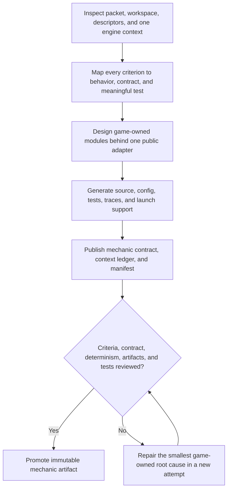

# 3AGameFactory mechanic generation and immutable publication

| Evidence capsule | Value |
| --- | --- |
| Scope | Discipline: game-owned mechanics, public runtime contract, native tests, and immutable artifact publication |
| Trigger | A prepared mechanic packet, canonical engine, descriptors, and acceptance criteria are ready for one task |
| Source | OpenDCAI's [game mechanic generation skill](https://github.com/OpenDCAI/GameFactory-3A/blob/7d724a51c4e596a21da9a076f274229b3d9eb425/agent_skills/code_gen/mechanic/game_generation.md#L1-L49) |
| Author and evidence date | OpenDCAI contributors; source revision and retrieval 2026-08-21 |
| Evidence signals | Source-documented |
| Evidence limit | Generation produces repair evidence, not authoritative build, runtime, benchmark, or playability evidence; no retained generated artifacts are present in the checkout. |

## Loop

## Run the loop

1. Inspect the prepared workspace and read the packet, acceptance criteria, descriptors, canonical
   engine context, and minimum useful same-engine examples without changing engine or copying an
   example as a base.
2. Map each criterion to generated source, observable behavior, contract state/events/commands, and
   at least one meaningful native test. Translate presentation requests into mechanic signals, not UI.
3. Design task-owned modules behind a public runtime adapter, consume assets only through supplied
   descriptors, and generate gameplay source, build/config, tests, adapter, launch/replay/trace source.
4. Publish `mechanic_contract.json`, `context_used.json`, and an artifact manifest whose digest and
   files are run-relative. Keep mechanic independent from UI.
5. Review all criteria, replay/determinism requirements, contract entries, artifacts, and tests.
   Tests must fail when behavior is absent; never weaken them to pass.
6. For structured failure, change the smallest game-owned root cause. Keep unpublished retries under
   attempts; a content repair after publication creates a new run with parent and failure digest.

## Outputs and stop conditions

Output is an immutable mechanic artifact containing native source, contract, tests, traces, context
ledger, and manifest. Stop at generation status `generated`. Assembly and execution/evaluation alone
may set `assembled` and `verified`; this workflow must not claim playability.

## Supporting skills

**Observed:** a coding agent, prepared task packets, one engine API, same-engine examples, asset
descriptors, native tests, public runtime adapters, JSON contracts/manifests, SHA-256 tree digests,
replay/trace source, and structured failure reports.

**Potential (inference):** criterion traceability matrices, contract-schema validation, mutation
testing, deterministic replay comparison, and artifact attestation.

## Evidence boundaries

The procedure deliberately separates generation from assembly and evaluation. Generated tests are
repair evidence, not benchmark authority, and example code is structural reference only. Engine APIs
and generated content remain version-sensitive. Repository material is Apache-2.0; input and engine
licenses remain separate.

## Sources

- [Inputs and generation workflow](https://github.com/OpenDCAI/GameFactory-3A/blob/7d724a51c4e596a21da9a076f274229b3d9eb425/agent_skills/code_gen/mechanic/game_generation.md#L1-L49)
- [Contract, outputs, and meaningful tests](https://github.com/OpenDCAI/GameFactory-3A/blob/7d724a51c4e596a21da9a076f274229b3d9eb425/agent_skills/code_gen/mechanic/game_generation.md#L70-L117)
- [Immutable run and artifact contract](https://github.com/OpenDCAI/GameFactory-3A/blob/7d724a51c4e596a21da9a076f274229b3d9eb425/agent_skills/code_gen/mechanic/game_generation.md#L150-L230)
- [Repair and completion boundary](https://github.com/OpenDCAI/GameFactory-3A/blob/7d724a51c4e596a21da9a076f274229b3d9eb425/agent_skills/code_gen/mechanic/game_generation.md#L232-L240)
