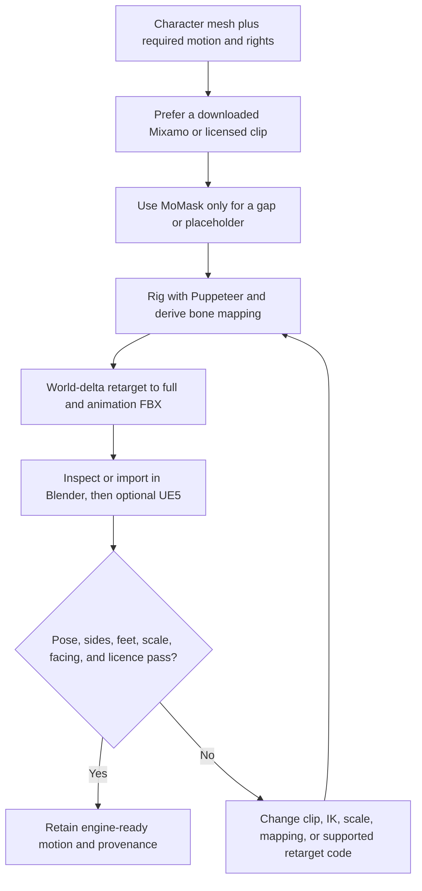

# 3AGameFactory motion acquisition, retargeting, and import

| Evidence capsule | Value |
| --- | --- |
| Scope | Asset: obtaining, rigging, retargeting, importing, and visually checking humanoid motion |
| Trigger | A humanoid needs motion, a downloaded clip needs a generated rig, or a retargeted FBX must be proved usable in Blender or UE5 |
| Source | OpenDCAI's [motion generation skill](https://github.com/OpenDCAI/GameFactory-3A/blob/7d724a51c4e596a21da9a076f274229b3d9eb425/agent_skills/asset_qa/motion/SKILL.md#L1-L67) |
| Author and evidence date | OpenDCAI contributors; source revision and retrieval 2026-08-21 |
| Evidence signals | Source-documented; Author-practiced |
| Evidence limit | Repository recordings show named motion routes in example games, not controlled retarget accuracy or reusable success across skeletons. |

## Loop

## Run the loop

1. Start with the character mesh, requested movement, target engine, and source rights. Prefer a
   manually downloaded Mixamo FBX without skin, then other licensed libraries; do not scrape gated
   sources. Use MoMask only when no library clip fits or a placeholder is acceptable.
2. Rig the unchanged mesh with Puppeteer, retaining `rig.txt`, `skeleton.txt`, and `mesh.obj` so
   vertex indices remain aligned.
3. Let the pipeline derive the per-character bone map. Apply world-delta retargeting, correct source
   units, and export `retargeted.fbx`, animation-only FBX, and `mapping.json`.
4. Inspect or import in Blender first and reject `pose_animated=false`. Import into UE5 only after
   Blender validation passes when UE5 is the target.
5. Visually check limb motion, left/right mapping, foot contact, 1.6–2.0 m scale, facing, and license
   records. Change IK/clip/scale or re-derive mapping as indicated. If a supported real format or
   skeleton exposes an operator gap, patch the retarget stack and tests, then rerun through the
   operator rather than building a one-off workaround.

## Outputs and stop conditions

Outputs are rig files, source clip and provenance, mapping, retargeted full and animation FBXs,
engine import/inspection evidence, and facing/scale/license notes. Stop only when the imported pose
actually animates and the visual checklist passes. A translating T-pose or structurally valid FBX is
a failure.

## Supporting skills

**Observed:** Mixamo and other licensed mocap libraries, MoMask, Puppeteer, Blender Python,
world-delta retargeting, automatic bone mapping, FBX inspection, Blender/UE5 import, and engine
orientation review.

**Potential (inference):** foot-slip measurement, skeleton-map visualization, clip-loop analysis,
unit inference, and engine-side animation regression capture.

## Evidence boundaries

The source states text-to-motion quality and controllability are not sufficient as the default
shipping route. Mapping is character-specific, source units vary, and UE5 support does not imply
Unity support. Mixamo, MoCap, Bandai, model checkpoints, and character assets have their own terms;
the repository's Apache-2.0 license does not replace them.

## Sources

- [Motion chain, source priority, and trigger](https://github.com/OpenDCAI/GameFactory-3A/blob/7d724a51c4e596a21da9a076f274229b3d9eb425/agent_skills/asset_qa/motion/SKILL.md#L1-L70)
- [Rig, generation, and source provenance](https://github.com/OpenDCAI/GameFactory-3A/blob/7d724a51c4e596a21da9a076f274229b3d9eb425/agent_skills/asset_qa/motion/SKILL.md#L129-L204)
- [Retarget and operator-gap repair](https://github.com/OpenDCAI/GameFactory-3A/blob/7d724a51c4e596a21da9a076f274229b3d9eb425/agent_skills/asset_qa/motion/SKILL.md#L204-L244)
- [Import and quality gate](https://github.com/OpenDCAI/GameFactory-3A/blob/7d724a51c4e596a21da9a076f274229b3d9eb425/agent_skills/asset_qa/motion/SKILL.md#L262-L342)
- [Agent execution order](https://github.com/OpenDCAI/GameFactory-3A/blob/7d724a51c4e596a21da9a076f274229b3d9eb425/agent_skills/asset_qa/motion/SKILL.md#L402-L418)
- [Author-described motion examples](https://github.com/OpenDCAI/GameFactory-3A/blob/7d724a51c4e596a21da9a076f274229b3d9eb425/README.md#L29-L68)
