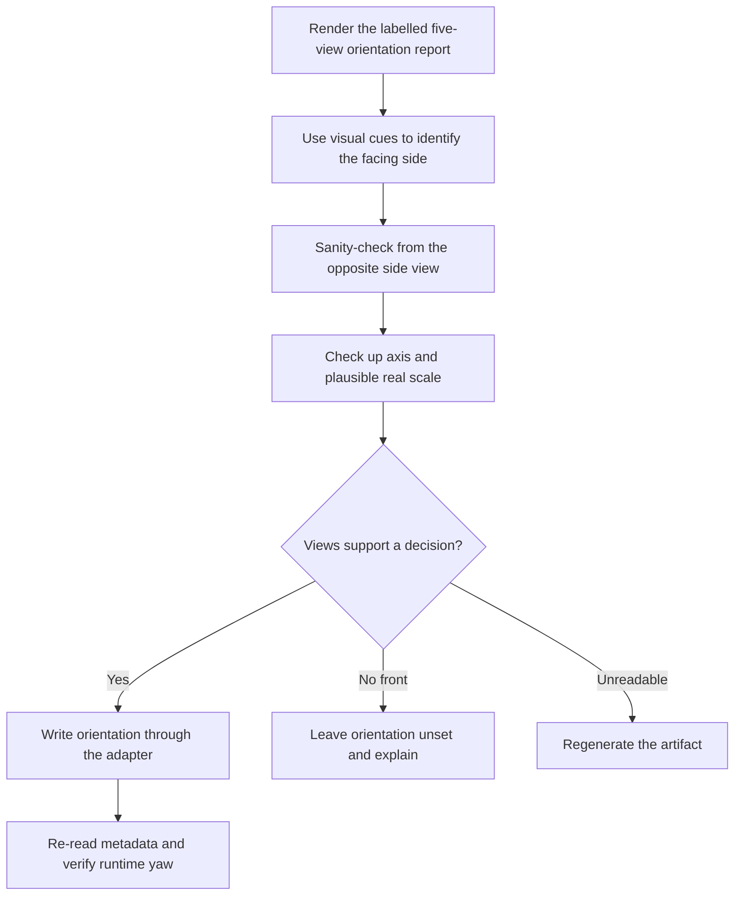

# 3AGameFactory imported-asset orientation review

| Evidence capsule | Value |
| --- | --- |
| Scope | Verification: vision-based facing, up-axis, and scale metadata for a staged mesh |
| Trigger | A mesh is imported or staged, orientation is unverified, or play shows sideways or backward movement |
| Source | OpenDCAI's [imported asset orientation review](https://github.com/OpenDCAI/GameFactory-3A/blob/7d724a51c4e596a21da9a076f274229b3d9eb425/agent_skills/asset_qa/3d_object/orientation_review.md#L1-L50) |
| Author and evidence date | OpenDCAI contributors; source revision and retrieval 2026-08-21 |
| Evidence signals | Source-documented; Author-practiced |
| Evidence limit | The source includes one worked asset example, not an independent study of accuracy across asset classes or ambiguous views. |

## Loop

## Run the loop

1. Render `three.preview.orientation_report` and read its labelled five orthographic views plus the
   artifact's existing orientation metadata. The images outrank geometric hints.
2. Identify the view that shows the subject's face or functional front, then confirm it from the
   `-x` and `+x` side relationship. Do not infer facing from animation names.
3. Inspect the top view for a lying Z-up model and record the pitch needed to stand it upright before
   deriving yaw. Compare the bounding-box height with the subject's plausible real height.
4. Call `three.assets.set_orientation` with facing or yaw, scale hint, `verified_by="agent_vision"`,
   and evidence notes. Re-read the metadata and verify the derived runtime yaw.
5. For a symmetric object with no front, leave orientation unset. For diagonal facing, record an
   estimated yaw offset. For genuinely unreadable views, regenerate rather than guess.

## Outputs and stop conditions

Output is persisted manifest metadata for forward axis or yaw, optional pitch, real-world scale,
verification identity, and notes, followed by a matching runtime-yaw readback. Stop without writing
a facing value when the object has no front; stop with regeneration when the model is unreadable.

## Supporting skills

**Observed:** a vision-capable model, five-view contact sheets, Three.js preview and asset APIs,
manifest metadata, runtime-yaw derivation, and Pillow/numpy rendering.

**Potential (inference):** orientation-review batching, confidence recording, side-by-side cue
annotation, and play-video confirmation.

## Evidence boundaries

glTF fixes units and up-axis conventions but does not bind a semantic front, so this is explicitly a
visual decision. Cardinal-axis output cannot exactly encode every diagonal model, and texture decode
failures reduce available cues. The worked RobotExpressive example is author evidence only. The
framework is Apache-2.0; the reviewed model and textures retain their own licenses.

## Sources

- [Trigger, authority, and inputs](https://github.com/OpenDCAI/GameFactory-3A/blob/7d724a51c4e596a21da9a076f274229b3d9eb425/agent_skills/asset_qa/3d_object/orientation_review.md#L1-L50)
- [Ordered review and writeback](https://github.com/OpenDCAI/GameFactory-3A/blob/7d724a51c4e596a21da9a076f274229b3d9eb425/agent_skills/asset_qa/3d_object/orientation_review.md#L52-L120)
- [Ambiguous-view outcomes](https://github.com/OpenDCAI/GameFactory-3A/blob/7d724a51c4e596a21da9a076f274229b3d9eb425/agent_skills/asset_qa/3d_object/orientation_review.md#L122-L153)
- [Worked example and cost boundary](https://github.com/OpenDCAI/GameFactory-3A/blob/7d724a51c4e596a21da9a076f274229b3d9eb425/agent_skills/asset_qa/3d_object/orientation_review.md#L155-L184)
