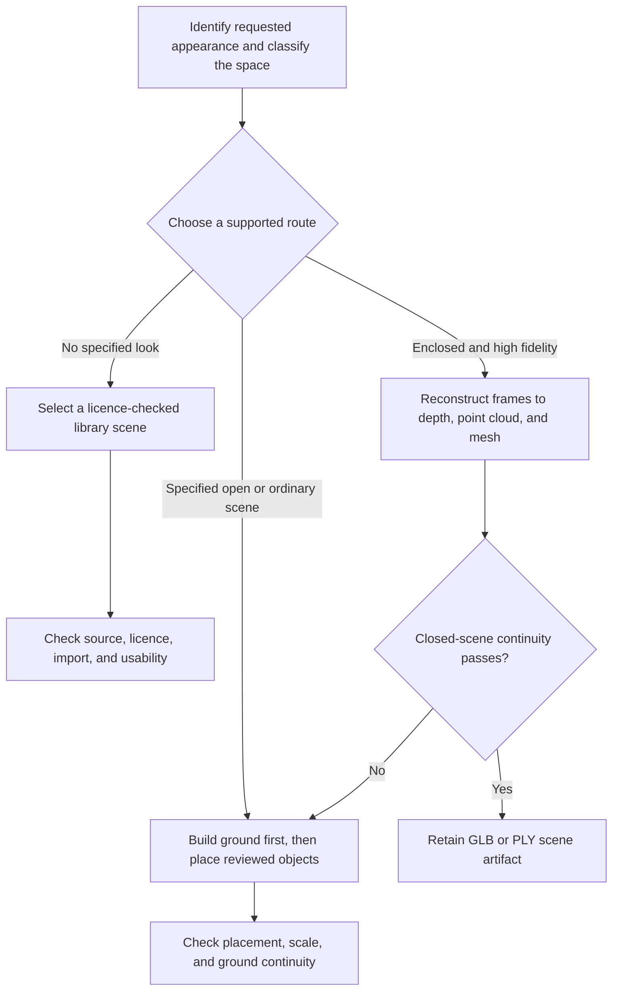

# 3AGameFactory 3D-scene strategy and assembly

| Evidence capsule | Value |
| --- | --- |
| Scope | Asset: selecting and executing a licensed, composed, or reconstructed 3D-scene route |
| Trigger | A game plan needs a `3d_scene` asset and the agent must choose a strategy from the requested appearance and space type |
| Source | OpenDCAI's [3D-scene strategy skill](https://github.com/OpenDCAI/GameFactory-3A/blob/7d724a51c4e596a21da9a076f274229b3d9eb425/agent_skills/asset_qa/3d_scene/SKILL.md#L1-L22) |
| Author and evidence date | OpenDCAI contributors; source revision and retrieval 2026-08-21 |
| Evidence signals | Source-documented |
| Evidence limit | The source labels reconstruction unstable and provides no comparative trials establishing which route will satisfy a new scene. |

## Loop

## Run the loop

1. Ask whether the user specified the scene's appearance. Classify the space as closed/bounded or
   open/unbounded from the requirement and reference.
2. With no specified look, search the selected engine's asset library for a usable licensed scene
   and record source and license. Prefer an existing close match even when a look is specified.
3. For a specified open or ordinary scene, establish a plane, terrain, road, or ground kit first;
   generate or select reviewed foreground objects; place them at gameplay-defined spawns, lanes,
   cover, and landmarks; and retain the scene as an editable assembly.
4. Only for a high-fidelity enclosed space, run the unstable reconstruction chain: reference image
   to video frames, frames to depth or point cloud, point cloud to guarded continuous mesh, then GLB
   or PLY export.
5. Inspect continuity for a closed reconstruction or placement and scale on the ground for an open
   assembly. If reconstruction is inconsistent, explain the limitation and switch to ground-first
   composition or a library scene; do not repeatedly re-roll the same chain.

## Outputs and stop conditions

Outputs are a provenance-recorded library scene, an editable ground-plus-instances assembly, or a
reconstructed `3d_scene` GLB/PLY in the framework path. Stop after the route-specific visual gate.
An inconsistent reconstruction stops as a failed route and feeds a strategy switch, not repeated
generation with unchanged assumptions.

## Supporting skills

**Observed:** engine asset libraries, license/provenance recording, terrain or base planes,
`gen_3d_object`, WorldPlay-style frame generation, WorldMirror depth/point clouds, sky culling,
tangent-plane meshing, GLB/PLY export, and visual inspection.

**Potential (inference):** route-cost estimation, layout-spec tooling, collision-floor checks,
scene-continuity metrics, and assembly-manifest generation.

## Evidence boundaries

The default route is deliberately not generative reconstruction. WorldPlay-style reconstruction is
limited to enclosed, high-fidelity cases and is described as the least stable option; horizon and
sky commonly break it. Inference from reference imagery may misclassify a space. The repository is
Apache-2.0, but downloaded scenes, generation models, references, and outputs retain separate terms.

## Sources

- [Appearance-based route decision](https://github.com/OpenDCAI/GameFactory-3A/blob/7d724a51c4e596a21da9a076f274229b3d9eb425/agent_skills/asset_qa/3d_scene/SKILL.md#L1-L22)
- [Inconsistency fallback and space classification](https://github.com/OpenDCAI/GameFactory-3A/blob/7d724a51c4e596a21da9a076f274229b3d9eb425/agent_skills/asset_qa/3d_scene/SKILL.md#L24-L52)
- [Reconstruction chain and limits](https://github.com/OpenDCAI/GameFactory-3A/blob/7d724a51c4e596a21da9a076f274229b3d9eb425/agent_skills/asset_qa/3d_scene/SKILL.md#L54-L84)
- [Ground-first assembly and acceptance checklist](https://github.com/OpenDCAI/GameFactory-3A/blob/7d724a51c4e596a21da9a076f274229b3d9eb425/agent_skills/asset_qa/3d_scene/SKILL.md#L86-L133)
