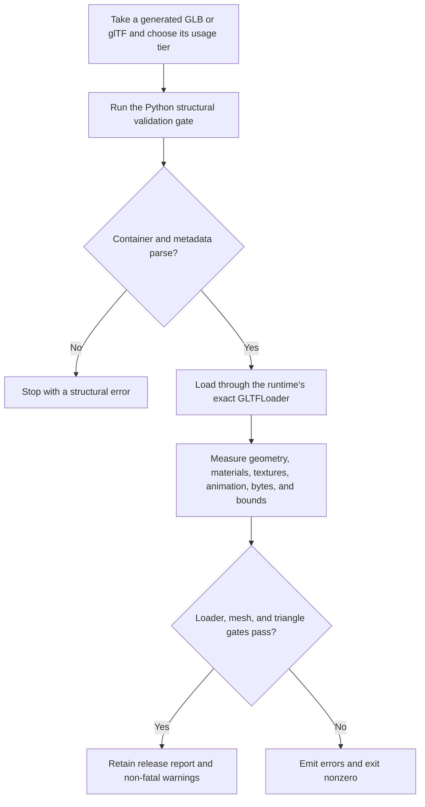

# 3AGameFactory Three.js generated-GLB release validation

| Evidence capsule | Value |
| --- | --- |
| Scope | Verification: structural and real-loader validation of a generated glTF asset for a Three.js game |
| Trigger | A generated GLB or glTF is destined for a Three.js runtime and needs auditable load and budget evidence |
| Source | OpenDCAI's [Three.js generated-mesh bridge](https://github.com/OpenDCAI/GameFactory-3A/blob/7d724a51c4e596a21da9a076f274229b3d9eb425/engine_adapters/three_js/import_generated/README.md#L1-L28) |
| Author and evidence date | OpenDCAI contributors; source revision and retrieval 2026-08-21 |
| Evidence signals | Source-documented |
| Evidence limit | The repository provides the inspectors and their contracts, but no retained report or source-specific verification run establishes that this exact release gate was applied to a published game. |

## Loop

## Run the loop

1. Select a generated `.glb` or `.gltf` and classify it as `asset`, `vfx_standalone`, or
   `vfx_particle`. File staging and manifest registration remain owned by the public Three.js asset
   API, not this validator.
2. Use the pure-Python inspector for the early validation gate. It reads the glTF container and
   exposes structural metadata without Node or a browser.
3. After structural passage, invoke the Node inspector from the target project so it imports the
   same Three.js `GLTFLoader` the game uses. Supply the served Draco decoder when the file requires
   it.
4. Record byte size, mesh and skinned-mesh counts, triangles, materials, textures, animation names,
   and bounds. Apply the selected usage tier's budgets.
5. Fail when the runtime loader rejects the file, no mesh exists, or the triangle budget is
   exceeded. Retain texture-count and byte-budget overages as warnings. Emit JSON on stdout and,
   after a successful loader parse, write the requested report file; use nonzero process status for
   a failed release check.

## Outputs and stop conditions

Output is a structured JSON result on stdout, plus a requested release-evidence file after the real
loader parses successfully. It contains `ok`, errors, warnings, source identity, usage and budget,
size, mesh/material/texture/animation counts, and bounds. Stop successfully only after the runtime
loader and hard gates pass. Structural, load, empty-mesh, or triangle failures stop with JSON errors
and nonzero status; warnings do not change `ok`.

## Supporting skills

**Observed:** the Python glTF inspector, Node 20+, Three.js `GLTFLoader`, optional `DRACOLoader`,
usage-tier budgets, JSON reporting, and process exit status.

**Potential (inference):** CI release gating, report-to-asset-registry promotion, budget trend
tracking, and compressed/uncompressed comparison. These capabilities may not exist.

## Evidence boundaries

This route validates loadability and recorded structure, not semantic facing, scale, texture
placement, animation quality, or in-game appearance. The README lists the common host launcher as a
Three.js entry point, but that launcher's frozen `--engine` choices contain only UE5, Unity, and
Blender; use the documented direct Node command or the public Three.js adapter at this revision.
Early argument or loader failures emit JSON but do not write the optional report file, despite the
README's broader report wording.
Repository code is Apache-2.0; Three.js, decoder binaries, models, and generated media keep their
own terms.

## Sources

- [Two-inspector responsibility split](https://github.com/OpenDCAI/GameFactory-3A/blob/7d724a51c4e596a21da9a076f274229b3d9eb425/engine_adapters/three_js/import_generated/README.md#L14-L28)
- [Usage tiers, gates, and report shape](https://github.com/OpenDCAI/GameFactory-3A/blob/7d724a51c4e596a21da9a076f274229b3d9eb425/engine_adapters/three_js/import_generated/README.md#L30-L58)
- [Prerequisites and ownership boundary](https://github.com/OpenDCAI/GameFactory-3A/blob/7d724a51c4e596a21da9a076f274229b3d9eb425/engine_adapters/three_js/import_generated/README.md#L61-L74)
- [Runtime-loader execution and failure paths](https://github.com/OpenDCAI/GameFactory-3A/blob/7d724a51c4e596a21da9a076f274229b3d9eb425/engine_adapters/three_js/import_generated/import_mesh.mjs#L134-L210)
- [Budget, empty-mesh, report, and exit gates](https://github.com/OpenDCAI/GameFactory-3A/blob/7d724a51c4e596a21da9a076f274229b3d9eb425/engine_adapters/three_js/import_generated/import_mesh.mjs#L212-L268)
- [Frozen host-launcher engine choices](https://github.com/OpenDCAI/GameFactory-3A/blob/7d724a51c4e596a21da9a076f274229b3d9eb425/scripts/import_generated_asset.py#L507-L524)
