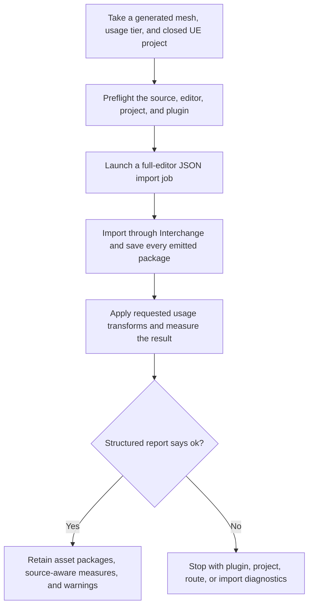

# 3AGameFactory UE5 generated-asset import and reporting

| Evidence capsule | Value |
| --- | --- |
| Scope | Engine-specific asset: importing, saving, and measuring a generated mesh in UE5 |
| Trigger | A generated mesh and a closed target UE project are ready for engine import |
| Source | OpenDCAI's [UE5 generated-asset importer](https://github.com/OpenDCAI/GameFactory-3A/blob/7d724a51c4e596a21da9a076f274229b3d9eb425/engine_adapters/ue5/import_generated/README.md#L1-L14) |
| Author and evidence date | OpenDCAI contributors; source revision and retrieval 2026-08-21 |
| Evidence signals | Source-documented; Author-practiced |
| Evidence limit | The source reports runs on UE 5.7 and one real Meshy asset; it does not validate the untested FBX, OBJ, USD, multi-material, or triangle-reduction paths. |

## Loop

## Run the loop

1. Resolve one generated source or a generation summary, select a usage tier, and preflight the
   file before launching UE. Require a target `.uproject` and the Python Editor Script Plugin.
2. Close any editor already using the project. Write the JSON job and launch the full
   `UnrealEditor` route; UE 5.7's commandlet route imports the asset and then crashes while syncing
   the unavailable Slate Content Browser.
3. Import GLB/glTF through Interchange, rename or move the generated mesh to the requested package
   path, and save the mesh plus separately emitted material and texture packages.
4. Let the translator perform glTF's metric/Y-up to UE's centimetre/Z-up conversion. Apply only the
   requested asset or VFX tier behavior; record a warning for attempted post-generation reduction.
5. Write asset path, source and reported triangle counts, vertices, LODs, bounds, materials, Nanite
   state, and warnings. Use `source_tris` for density comparisons because UE's reported LOD-0 count
   can be the Nanite fallback mesh.
6. On the first normal-mapped import in a project, inspect it under a moving light: the structured
   report cannot reveal an OpenGL-versus-DirectX green-channel mistake.

## Outputs and stop conditions

Outputs are the saved UE mesh, material, and texture packages and a JSON report naming the final
asset path and measurements. Stop successfully when `ok` is true and every emitted package is on
disk. Stop with diagnostics for missing prerequisites, failed import, or missing report. A normal-map
visual concern remains unresolved until inspected; a commandlet crash is not success even if a mesh
was written first.

## Supporting skills

**Observed:** `scripts/import_generated_asset.py`, JSON jobs, UE Python Editor Script Plugin,
Interchange glTF translation, AssetTools fallback routes, package saving, usage tiers, Nanite-aware
reporting, and moving-light inspection.

**Potential (inference):** automated package-dirty checks, normal-map test scenes, source-versus-
Nanite dashboards, and import-route compatibility matrices. These capabilities may not exist.

## Evidence boundaries

The full-editor workaround and measurements are version-specific. An already-open editor can retain
a stale Content Browser view even though another process wrote assets. The source explicitly leaves
several formats and reduction unverified, and its report cannot establish visual correctness or
gameplay fit. Repository code is Apache-2.0; Unreal Engine, generation providers, project plugins,
and imported or generated assets retain separate terms.

## Sources

- [Launcher, job, and full-editor route](https://github.com/OpenDCAI/GameFactory-3A/blob/7d724a51c4e596a21da9a076f274229b3d9eb425/engine_adapters/ue5/import_generated/README.md#L16-L80)
- [Report, formats, and coordinate conversion](https://github.com/OpenDCAI/GameFactory-3A/blob/7d724a51c4e596a21da9a076f274229b3d9eb425/engine_adapters/ue5/import_generated/README.md#L82-L120)
- [Usage tiers and generation-time reduction preference](https://github.com/OpenDCAI/GameFactory-3A/blob/7d724a51c4e596a21da9a076f274229b3d9eb425/engine_adapters/ue5/import_generated/README.md#L122-L139)
- [Measured fixtures and real generated asset](https://github.com/OpenDCAI/GameFactory-3A/blob/7d724a51c4e596a21da9a076f274229b3d9eb425/engine_adapters/ue5/import_generated/README.md#L141-L192)
- [Closed-project requirement](https://github.com/OpenDCAI/GameFactory-3A/blob/7d724a51c4e596a21da9a076f274229b3d9eb425/engine_adapters/ue5/import_generated/README.md#L194-L200)
- [Nanite and normal-map reporting boundaries](https://github.com/OpenDCAI/GameFactory-3A/blob/7d724a51c4e596a21da9a076f274229b3d9eb425/engine_adapters/ue5/import_generated/README.md#L202-L244)
