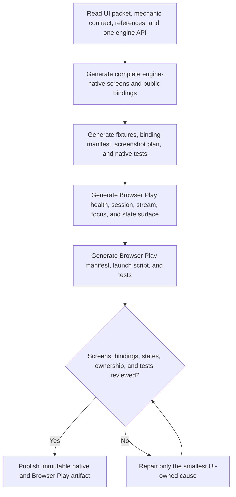

# 3AGameFactory native UI and Browser Play generation

| Evidence capsule | Value |
| --- | --- |
| Scope | Discipline: engine-native UI followed by a task-owned Browser Play delivery surface |
| Trigger | A prepared UI packet and finalized public mechanic contract are ready for one canonical engine |
| Source | OpenDCAI's [game UI generation skill](https://github.com/OpenDCAI/GameFactory-3A/blob/7d724a51c4e596a21da9a076f274229b3d9eb425/agent_skills/code_gen/ui/game_ui_generation.md#L1-L40) |
| Author and evidence date | OpenDCAI contributors; source revision and retrieval 2026-08-21 |
| Evidence signals | Source-documented |
| Evidence limit | The workflow generates source and tests but delegates authoritative rendering, browser smoke, runtime evidence, and evaluation to later stages. |

## Loop

## Run the loop

1. Read the UI packet, acceptance criteria, references, canonical engine, finalized mechanic
   contract, declared adapter paths, and minimum relevant examples. Contract bindings outrank visual
   references; do not change engine or access private mechanic types.
2. Generate engine-native HUD, screens, widgets, resources, layouts, focus/input behavior, feedback,
   all loading/empty/disabled/success/error states, bindings, fixtures, and native tests. Query state,
   subscribe to events, and invoke commands only through the public adapter.
3. Generate Browser Play source after native UI. Health-check Browser Serving; recover or create a
   session; consume the engine-neutral stream URL; preserve keyboard/mouse focus; and show truthful
   booting, ready, and error states without duplicating the in-engine HUD.
4. Produce binding, Browser Play, context, screenshot, launch, test, and artifact manifests. Tests
   must fail when required binding, state, layout, interaction, focus, or screen behavior is absent.
5. Review ownership and every criterion. On structured failure, repair only UI-owned source,
   resources, fixtures, manifests, or tests; preserve mechanic behavior and browser backend boundaries.

## Outputs and stop conditions

Output is an immutable UI artifact with native and Browser Play source, bindings, fixtures, tests,
screenshot plan, context ledger, and manifest. Stop at generation status `generated`. Static checks
and artifact presence cannot set verified status or claim rendering and playability.

## Supporting skills

**Observed:** a coding agent, one engine API, finalized mechanic contract, native UI examples,
Browser Serving API and example, reference-image inspection, mocked mechanic and browser fixtures,
native/browser tests, manifests, and SHA-256 artifact digests.

**Potential (inference):** accessibility auditing, visual snapshot comparison, focus-path exploration,
contract-to-binding linting, and streamed-input latency checks.

## Evidence boundaries

Browser Play is a delivery shell around an engine stream, not a second gameplay UI or backend.
Generated tests use fixtures and do not prove the assembled product works. Evaluation owns builds,
screenshots, browser smoke, logs, and scores. Repository material is Apache-2.0; engines, references,
fonts, and other UI assets can carry separate licenses.

## Sources

- [Inputs and two-stage delivery order](https://github.com/OpenDCAI/GameFactory-3A/blob/7d724a51c4e596a21da9a076f274229b3d9eb425/agent_skills/code_gen/ui/game_ui_generation.md#L1-L40)
- [Native UI and Browser Play contracts](https://github.com/OpenDCAI/GameFactory-3A/blob/7d724a51c4e596a21da9a076f274229b3d9eb425/agent_skills/code_gen/ui/game_ui_generation.md#L42-L102)
- [Outputs and meaningful tests](https://github.com/OpenDCAI/GameFactory-3A/blob/7d724a51c4e596a21da9a076f274229b3d9eb425/agent_skills/code_gen/ui/game_ui_generation.md#L104-L131)
- [Immutable artifact and status boundary](https://github.com/OpenDCAI/GameFactory-3A/blob/7d724a51c4e596a21da9a076f274229b3d9eb425/agent_skills/code_gen/ui/game_ui_generation.md#L164-L247)
- [Repair and completion](https://github.com/OpenDCAI/GameFactory-3A/blob/7d724a51c4e596a21da9a076f274229b3d9eb425/agent_skills/code_gen/ui/game_ui_generation.md#L249-L261)
