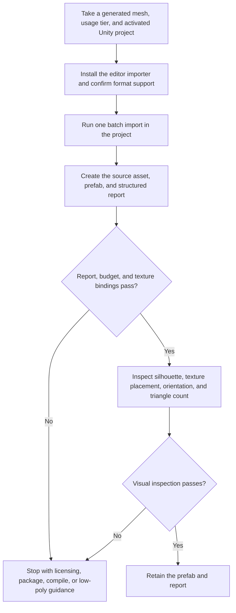

# 3AGameFactory Unity generated-asset import and visual inspection

| Evidence capsule | Value |
| --- | --- |
| Scope | Engine-specific asset: turning a generated mesh into a measured Unity prefab and inspecting it in context |
| Trigger | A generated GLB, FBX, or OBJ and an activated target Unity project are ready for import |
| Source | OpenDCAI's [Unity generated-asset importer](https://github.com/OpenDCAI/GameFactory-3A/blob/7d724a51c4e596a21da9a076f274229b3d9eb425/engine_adapters/unity3d/import_generated/README.md#L1-L14) |
| Author and evidence date | OpenDCAI contributors; source revision and retrieval 2026-08-21 |
| Evidence signals | Source-documented; Author-practiced |
| Evidence limit | The source reports Unity 6000.5.2f1 with glTFast 6.16.0 and the built-in render pipeline; URP, HDRP, FBX, and OBJ remain unverified. |

## Loop

## Run the loop

1. Require an activated Unity Editor and the exact project root. For GLB/glTF, install glTFast;
   otherwise choose the documented FBX or OBJ fallback.
2. Copy `ImportGeneratedMesh.cs` into `Assets/Editor/` unless the project already vendors it, then
   launch Unity in batch mode with the source, destination, name, usage tier, and report path.
3. Let Unity's importer create the source asset and a prefab. Store pivot offset and normalized
   scale on the prefab root so scene, particle, and VFX references use one game-ready object.
4. Read the report's prefab and asset paths, geometry counts, materials, bound textures, bounds,
   and warnings. Missing texture bindings warn even when the mesh and material objects exist.
5. When a target triangle budget is exceeded, regenerate with a low-poly backend setting; this
   importer cannot decimate. Diagnose a missing report from the adjacent Unity log and re-resolve a
   corrupted `Library/` package cache when its documented compile signature appears.
6. Open the result after the batch process ends, place the prefab in a scene, and compare its
   silhouette, texture placement, and orientation visually. Check the Inspector triangle count
   against the report before retaining it.

## Outputs and stop conditions

Outputs are an imported source asset, a scene-ready prefab, a Unity log, and a JSON report with
geometry, material, texture, and bounds evidence. Stop successfully only after both structured and
visual checks pass. Stop as blocked for licensing, stop with diagnostics for importer or package
failure, and return an over-budget source to generation instead of silently decimating it.

## Supporting skills

**Observed:** Unity Hub licensing, Unity batch mode, `ImportGeneratedMesh.cs`, `AssetDatabase`,
glTFast, prefab construction, usage tiers, JSON reports, Unity logs, Inspector mesh information, and
manual scene inspection.

**Potential (inference):** automated prefab preview scenes, render-pipeline material probes,
texture-binding regression checks, and source/report count diffing. These capabilities may not exist.

## Evidence boundaries

The numeric report cannot reveal inside-out geometry, misplaced texture islands, or semantic
orientation. Render-pipeline shader variants can make an intact import appear broken. Unity and
glTF share metres and Y-up, so a model lying on its face is a source defect rather than a blanket
axis-conversion requirement. Repository code is Apache-2.0; Unity, glTFast, generators, and assets
retain separate terms.

## Sources

- [Licensing, launcher, and editor-script installation](https://github.com/OpenDCAI/GameFactory-3A/blob/7d724a51c4e596a21da9a076f274229b3d9eb425/engine_adapters/unity3d/import_generated/README.md#L16-L43)
- [glTF prerequisite and fallback](https://github.com/OpenDCAI/GameFactory-3A/blob/7d724a51c4e596a21da9a076f274229b3d9eb425/engine_adapters/unity3d/import_generated/README.md#L45-L66)
- [Prefab and report contract](https://github.com/OpenDCAI/GameFactory-3A/blob/7d724a51c4e596a21da9a076f274229b3d9eb425/engine_adapters/unity3d/import_generated/README.md#L68-L98)
- [Usage, low-poly, and render-pipeline boundaries](https://github.com/OpenDCAI/GameFactory-3A/blob/7d724a51c4e596a21da9a076f274229b3d9eb425/engine_adapters/unity3d/import_generated/README.md#L100-L123)
- [Measured Unity run](https://github.com/OpenDCAI/GameFactory-3A/blob/7d724a51c4e596a21da9a076f274229b3d9eb425/engine_adapters/unity3d/import_generated/README.md#L125-L139)
- [Manual inspection and failure recovery](https://github.com/OpenDCAI/GameFactory-3A/blob/7d724a51c4e596a21da9a076f274229b3d9eb425/engine_adapters/unity3d/import_generated/README.md#L141-L166)
