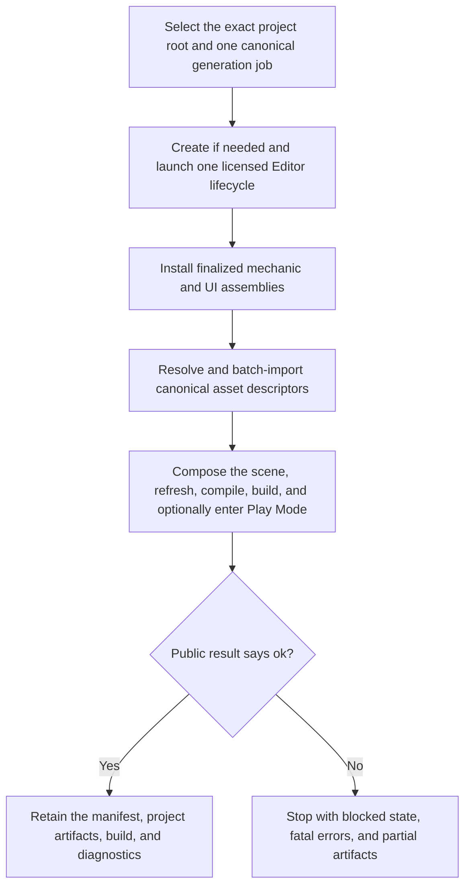

# 3AGameFactory Unity one-session game assembly

| Evidence capsule | Value |
| --- | --- |
| Scope | Engine-specific assembly: installing generated game artifacts, importing dependencies, composing a scene, and building in one Unity Editor lifecycle |
| Trigger | A pipeline-selected Unity project root, finalized mechanic/UI artifacts, canonical asset descriptors, and a generated scene specification are ready |
| Source | OpenDCAI's [Unity complete-run launcher contract](https://github.com/OpenDCAI/GameFactory-3A/blob/7d724a51c4e596a21da9a076f274229b3d9eb425/scripts/engine_install/unity/README.md#L5-L37) |
| Author and evidence date | OpenDCAI contributors; source revision and retrieval 2026-08-21 |
| Evidence signals | Source-documented |
| Evidence limit | The source documents an implemented public operation and structured result contract, but no retained job report ties the exact one-session path to the repository's published Unity demos. |

## Loop

## Run the loop

1. Have the agent select the exact Unity project root containing `Assets`, `Packages`, and
   `ProjectSettings`. Reuse that path for the entire run; create a minimal project only when it is
   genuinely new.
2. Require an installed and activated editor, launch one lifecycle, and submit one
   `generate-game` JSON job. Do not split a full game into one process per asset or start competing
   licensing clients.
3. Install the finalized mechanic and UI assemblies, resolve every input from canonical output
   descriptors, and import avatars, meshes, motions, and scenes in dependency-aware order.
4. Compose the generated scene, repair or remap imported materials as owned by the adapter, refresh
   the AssetDatabase, compile scripts, run `BuildPipeline`, and optionally enter Play Mode in the
   same editor session.
5. Read the public result's `ok`, artifacts, diagnostics, warnings, errors, and payload. Retain the
   project-local generation manifest and produced artifacts when successful; preserve blocked
   licensing or fatal stage information on failure.

## Outputs and stop conditions

Outputs are the project-local generation manifest, installed assemblies, imported assets, composed
scene, compiled Unity project, build artifacts, optional Play Mode state, and structured public
result. Stop at a successful assembly result. A blocked licence, descriptor violation, import,
compile, or build error stops with its diagnostics; assembly success alone is not authoritative
test, gameplay, or benchmark success.

## Supporting skills

**Observed:** a coding agent, `UnityClient.generate_game`, canonical artifact descriptors, one Unity
Editor session, generated C# assemblies, dependency-aware batch import, AssetDatabase refresh,
material remapping, scene composition, `BuildPipeline`, optional Play Mode, and JSON results.

**Potential (inference):** resumable stage manifests, assembly provenance graphs, build artifact
attestation, and single-session timing telemetry. These capabilities may not exist.

## Evidence boundaries

The launcher refuses arbitrary raw source paths and does not establish visual quality or runtime
behavior. A zero editor exit code is not sufficient evidence, and later execution/evaluation owns
Unity Test Framework reports, runtime capture, and benchmark results. Unity version, package, and
licensing state remain host-specific. Repository code is Apache-2.0; Unity, packages, generated
content, and imported assets retain separate terms.

## Sources

- [One-project, one-editor lifecycle and ownership](https://github.com/OpenDCAI/GameFactory-3A/blob/7d724a51c4e596a21da9a076f274229b3d9eb425/scripts/engine_install/unity/README.md#L5-L37)
- [Generate-game operation order and descriptor gate](https://github.com/OpenDCAI/GameFactory-3A/blob/7d724a51c4e596a21da9a076f274229b3d9eb425/scripts/engine_install/unity/README.md#L41-L62)
- [Dependency-aware batch import](https://github.com/OpenDCAI/GameFactory-3A/blob/7d724a51c4e596a21da9a076f274229b3d9eb425/scripts/engine_install/unity/README.md#L107-L130)
- [Agent boundary and public result contract](https://github.com/OpenDCAI/GameFactory-3A/blob/7d724a51c4e596a21da9a076f274229b3d9eb425/agent_skills/engine_context/unity3d_api.md#L1-L54)
- [Implemented generate-game capability](https://github.com/OpenDCAI/GameFactory-3A/blob/7d724a51c4e596a21da9a076f274229b3d9eb425/agent_skills/engine_context/unity3d_api.md#L56-L65)
- [Licensing failure boundary](https://github.com/OpenDCAI/GameFactory-3A/blob/7d724a51c4e596a21da9a076f274229b3d9eb425/agent_skills/engine_context/unity3d_api.md#L261-L299)
