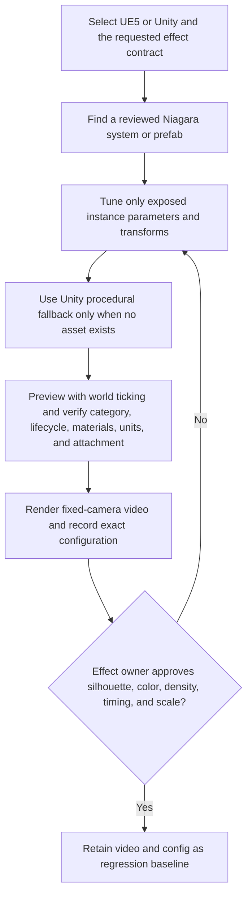

# 3AGameFactory VFX creation and visual approval

| Evidence capsule | Value |
| --- | --- |
| Scope | Discipline: reusable UE5 or Unity effects, runtime lifecycle checks, and owner approval |
| Trigger | A game requires a natural, stylized, environmental, combat, or action-attached VFX |
| Source | OpenDCAI's [create VFX effects skill](https://github.com/OpenDCAI/GameFactory-3A/blob/7d724a51c4e596a21da9a076f274229b3d9eb425/agent_skills/engine_context/create-vfx-effects/SKILL.md#L1-L34) |
| Author and evidence date | OpenDCAI contributors; source revision and retrieval 2026-08-21 |
| Evidence signals | Source-documented |
| Evidence limit | The source specifies approval evidence but publishes no retained fixed-camera baseline, owner decision, or independent effect-quality result. |

## Loop

## Run the loop

1. Select UE5 or Unity and keep engine-specific implementation behind the documented adapter
   boundary. Search the project for a reviewed system with the required silhouette and timing.
2. Tune exposed instance parameters, transforms, material instances, and colors without modifying
   the source template. Supply project-specific paths where defaults are absent. Use Unity's named
   procedural effect only when no reviewed prefab exists.
3. Preview for at least one second with world ticking. Verify category readability at gameplay
   distance, loop stop or one-shot cleanup, blending/emissive behavior, density strategy, coordinate
   units, socket/transform attachment, and grayscale then color/timing/scale for stylized effects.
4. Capture startup and stable behavior in a fixed-camera video. Record asset path, sequence, render
   config, fps, resolution, and duration.
5. Keep the preset pending until the effect owner approves silhouette, color, density, timing, and
   scale. On rejection, retune the instance and repeat; on approval, retain the exact media/config.

## Outputs and stop conditions

Outputs are generated engine code or configuration, selected system/prefab identity, runtime
lifecycle result, fixed-camera video, exact render configuration, owner decision, and approved
regression baseline. Stop only at explicit owner approval.

## Supporting skills

**Observed:** UE5 Niagara, Unity ParticleSystem/VFX Graph prefabs, adapter spawn/stop APIs,
WorldFlexVFXBinder detection, material/blend inspection, engine ticking, fixed-camera capture, and
human owner review.

**Potential (inference):** frame-time profiling, particle-count telemetry, motion-difference plots,
automated cleanup assertions, and baseline-video comparison.

## Evidence boundaries

The two engines use different units and APIs; Unity's stylized procedural fallbacks are marked
experimental, while reviewed stylized baselines are UE-specific. Still images cannot validate motion
cadence. Approval is subjective and owner-specific. Repository material is Apache-2.0; Niagara,
prefab, texture, and material assets may have separate licenses.

## Sources

- [Engine selection and template-first route](https://github.com/OpenDCAI/GameFactory-3A/blob/7d724a51c4e596a21da9a076f274229b3d9eb425/agent_skills/engine_context/create-vfx-effects/SKILL.md#L1-L36)
- [UE5 and Unity lifecycle contracts](https://github.com/OpenDCAI/GameFactory-3A/blob/7d724a51c4e596a21da9a076f274229b3d9eb425/agent_skills/engine_context/create-vfx-effects/SKILL.md#L38-L120)
- [Runtime validation](https://github.com/OpenDCAI/GameFactory-3A/blob/7d724a51c4e596a21da9a076f274229b3d9eb425/agent_skills/engine_context/create-vfx-effects/SKILL.md#L122-L137)
- [Visual approval and retained baseline](https://github.com/OpenDCAI/GameFactory-3A/blob/7d724a51c4e596a21da9a076f274229b3d9eb425/agent_skills/engine_context/create-vfx-effects/SKILL.md#L139-L151)
