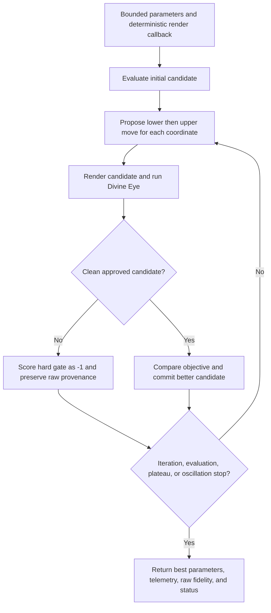

# img2threejs analysis-by-synthesis parameter fitting

| Evidence capsule | Value |
| --- | --- |
| Scope | Tuning: bounded deterministic coordinate descent against render-review fidelity |
| Trigger | A caller can expose one to fifteen bounded scene or rendering parameters and a deterministic render callback |
| Source | The frozen [analysis-by-synthesis fitting contract](https://github.com/img2threejs/img2threejs/blob/d6673386f89673a58736f8d398dd16ece67874f5/grimoire/build/analysis_by_synthesis_fitting.md#L1-L44) |
| Author and evidence date | Hoài Nhớ and img2threejs contributors; frozen implementation contract 2026-08-06; retrieved 2026-08-21 |
| Evidence signals | Source-documented |
| Evidence limit | Unit tests use deterministic fixture renderers/evaluators; the CLI itself exposes only a quadratic fixture objective, not a production browser renderer. |

## Loop

## Run the loop

1. Validate one to fifteen finite initial values, a lower/upper bound per value, and finite objective
   behavior. The search is deterministic; the seed is metadata rather than randomness.
2. Evaluate the initial point, then examine the bounded lower move before the upper move for each
   coordinate in a fixed order.
3. For a production caller, render every parameter vector and evaluate the image against the
   reference with Divine Eye.
4. Use raw fidelity for clean, approved results. Assign objective `-1.0` to any hard-gated or pending
   candidate while preserving its raw fidelity, paths, signals, failures, and routing provenance.
5. Commit a better evaluated move, record iterations/evaluations/step sizes, and retain the last
   approved baseline when a proposal regresses or is not approved.
6. Repeat until success is routed by the evaluator or the fitter reaches plateau, coordinate
   thrashing, maximum iterations, or maximum evaluations. Commit an already evaluated improvement
   even when the remaining evaluation budget prevents the second direction.

## Outputs and stop conditions

Output contains final parameters, gate-aware objective, optional best raw fidelity, status,
evaluation/iteration totals, deterministic seed, per-iteration telemetry, copied Divine Eye records,
and normalized correction history. Stop on plateau, oscillation, evaluation or iteration limit, or a
parent correction-loop decision; never let a higher raw but hard-gated score win.

## Supporting skills

**Observed:** bounded coordinate descent, deterministic rendering callbacks, Divine Eye evaluation,
hard-gate-aware objectives, deep-copied provenance, telemetry, plateau/oscillation detection, and
budgeted search.

**Potential (inference):** differentiable parameter gradients, Bayesian search, multi-fidelity
rendering, and sensitivity reports. These capabilities may not exist in the source.

## Evidence boundaries

The fitter is useful only when the caller provides a repeatable parameter-to-render mapping and a
meaningful evaluator. It searches a small vector and cannot repair the spec, invent topology, or
recover missing reference evidence. Divine Eye's own calibration and 2D limits carry through to the
objective. Test determinism and gate preservation do not establish better-looking game assets.

## Sources

- [Parameter bounds, deterministic order, and stop limits](https://github.com/img2threejs/img2threejs/blob/d6673386f89673a58736f8d398dd16ece67874f5/grimoire/build/analysis_by_synthesis_fitting.md#L7-L37)
- [Render callback, hard-gate objective, and raw provenance](https://github.com/img2threejs/img2threejs/blob/d6673386f89673a58736f8d398dd16ece67874f5/grimoire/build/analysis_by_synthesis_fitting.md#L39-L44)
- [Executable Divine Eye fitting contract](https://github.com/img2threejs/img2threejs/blob/d6673386f89673a58736f8d398dd16ece67874f5/grimoire/build/analysis_by_synthesis_fitting.md#L64-L87)
- [Approval, reversion, and stop-policy order](https://github.com/img2threejs/img2threejs/blob/d6673386f89673a58736f8d398dd16ece67874f5/grimoire/build/analysis_by_synthesis_fitting.md#L89-L114)
- [Determinism and integration tests](https://github.com/img2threejs/img2threejs/blob/d6673386f89673a58736f8d398dd16ece67874f5/forge/tests/test_fit_params.py#L35-L100)
