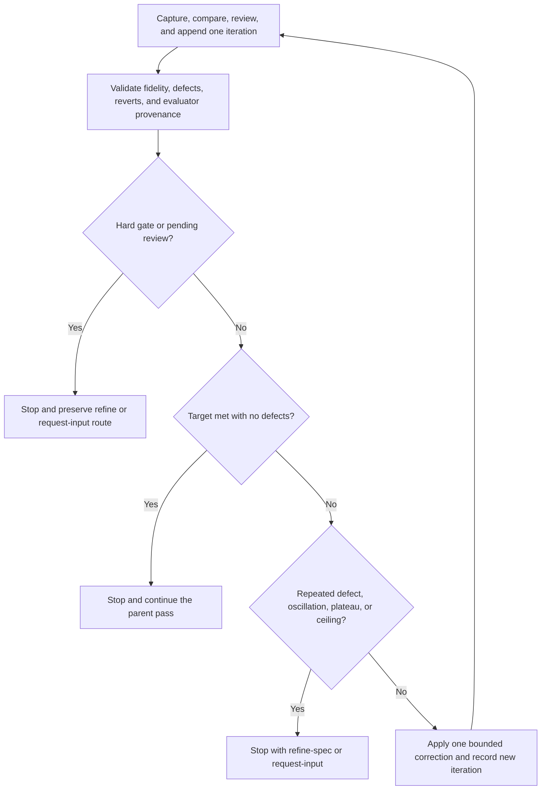

# img2threejs bounded visual self-correction

| Evidence capsule | Value |
| --- | --- |
| Scope | Tuning: terminate or reroute an agent-driven visual correction loop from review history |
| Trigger | At least one render-review iteration or a new correction session needs a deterministic next-action decision |
| Source | The frozen [bounded stop-policy implementation](https://github.com/img2threejs/img2threejs/blob/d6673386f89673a58736f8d398dd16ece67874f5/forge/stage4_review/correction_loop.py#L1-L50) and [review-order contract](https://github.com/img2threejs/img2threejs/blob/d6673386f89673a58736f8d398dd16ece67874f5/grimoire/review/self_correction.md#L19-L35) |
| Author and evidence date | TamL., Hoài Nhớ, and img2threejs contributors; implementation through 2026-08-06; retrieved 2026-08-21 |
| Evidence signals | Source-documented |
| Evidence limit | The module is a tested stop-policy state machine; it does not generate a correction, render an asset, or establish that the fidelity scalar measures useful 3D quality. |

## Loop

## Run the loop

1. After a pass, collect a screenshot, comparison, global/layer/feature review, root-cause decision,
   and one action. Normalize the iteration into fidelity, defect tags, revert state, and preserved
   Divine Eye provenance.
2. Reject malformed, non-finite, conflicting, or tampered history before making a routing decision.
3. Evaluate stop conditions in fixed priority: hard gate, pending evaluator route, success, repeated
   defect, two trailing reverts, plateau, then hard iteration ceiling.
4. Preserve `refine-code` or `refine-spec` from a pending review; route other non-pass pending states
   to `request-input`. A hard gate always stops for code correction.
5. Stop successfully only when fidelity meets the target and no defect remains. Repeated defects or
   oscillation route to spec repair; plateau and ceiling request input.
6. Only while no stop condition applies may the caller make one more correction, append its outcome,
   and repeat. The default policy cannot exceed six iterations.

## Outputs and stop conditions

Output is `{"stop", "action", "reason"}` plus preserved iteration provenance. Successful stop returns
`continue`; other stops return `refine-code`, `refine-spec`, or `request-input`. The loop also stops on
the repository-local per-pass or total correction ceilings; a token budget circuit breaker halts and
asks rather than continuing silently.

## Supporting skills

**Observed:** browser/agent review inputs, structured defect tagging, immutable evaluator provenance,
finite-value validation, deterministic priority routing, oscillation and plateau detection, revert
tracking, iteration ceilings, and token-budget checks.

**Potential (inference):** defect-cause clustering, correction-cost forecasting, rollback diffs, and
human escalation policies. These capabilities may not exist in the source.

## Evidence boundaries

The stop policy trusts the incoming fidelity semantics after structural validation; it cannot detect
whether a global score hides a small feature or whether a 2D pass still looks flat in orbit. A stop is
a routing decision, not proof that an asset is good. The repository also has separate local-state
ceilings of three corrections per pass and six total, so callers must obey the stricter applicable
limit rather than treating this module as the only authority.

## Sources

- [Review evidence and exactly-one-action order](https://github.com/img2threejs/img2threejs/blob/d6673386f89673a58736f8d398dd16ece67874f5/grimoire/review/self_correction.md#L19-L35)
- [Root-cause and explicit stop routing](https://github.com/img2threejs/img2threejs/blob/d6673386f89673a58736f8d398dd16ece67874f5/grimoire/review/self_correction.md#L37-L70)
- [Termination guarantee and history contract](https://github.com/img2threejs/img2threejs/blob/d6673386f89673a58736f8d398dd16ece67874f5/forge/stage4_review/correction_loop.py#L1-L50)
- [Priority-ordered stop decisions](https://github.com/img2threejs/img2threejs/blob/d6673386f89673a58736f8d398dd16ece67874f5/forge/stage4_review/correction_loop.py#L54-L142)
- [Termination tests](https://github.com/img2threejs/img2threejs/blob/d6673386f89673a58736f8d398dd16ece67874f5/forge/tests/test_correction_loop.py#L181-L226)
