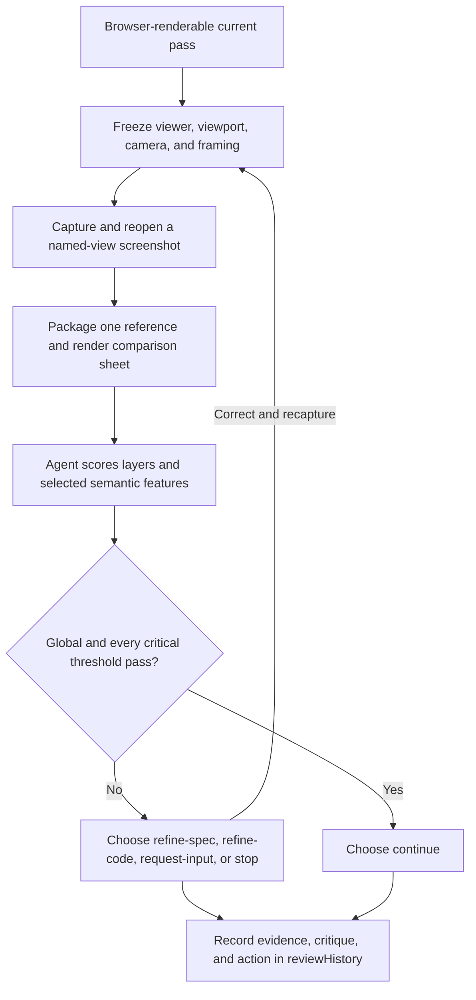

# img2threejs browser screenshot and agent-vision review

| Evidence capsule | Value |
| --- | --- |
| Scope | Verification: deterministic browser capture, comparison packaging, and semantic visual decision |
| Trigger | A procedural Three.js build pass has a browser-renderable preview |
| Source | The frozen [browser screenshot feedback contract](https://github.com/img2threejs/img2threejs/blob/d6673386f89673a58736f8d398dd16ece67874f5/grimoire/feedback/render_capture.md#L1-L20) |
| Author and evidence date | TamL., kokorolx, and img2threejs contributors; contract through 2026-08-03; public review artifact 2026-07-25; retrieved 2026-08-21 |
| Evidence signals | Source-documented; Author-practiced |
| Evidence limit | The practiced spec records scores and local screenshot paths, but the images are not committed; it does not independently validate the review scores. |

## Loop

## Run the loop

1. Disable interactive camera updates, freeze the viewport/DPR, and match reference framing before
   treating any comparison as evidence.
2. Capture a named browser view with the host's existing browser/screenshot path. Reopen the saved PNG
   and reject blank, stale, clipped, unreadable, or wrongly sized output.
3. Package one side-by-side image. The packaging script aligns evidence; it does not calculate the
   acceptance score.
4. Have agent vision inspect silhouette/proportion, component structure, form detail, material
   response, local features, lighting/camera, and performance tradeoffs. Score at most five critical
   semantic systems plus suspicious important systems.
5. Require both the global threshold and every critical feature threshold. Decide whether failure
   belongs to the spec, code, camera/lighting, missing input, or an accepted tradeoff.
6. Record screenshots, comparison, camera, layer and feature scores, concrete critique, and exactly one
   action. Correct and recapture before another decision.

## Outputs and stop conditions

Output is an evidence-backed `reviewHistory` entry containing image paths, named view, global/layer/
feature scores, notes, and action. Stop this review with `continue` only after all required thresholds
pass. Otherwise stop for input, stop the reconstruction, or loop after a spec/code correction.

## Supporting skills

**Observed:** deterministic Three.js viewer control, browser screenshots, viewport emulation,
comparison-sheet packaging, agent image review, semantic feature scoring, root-cause classification,
and structured review-history updates.

**Potential (inference):** screenshot freshness attestation, blinded review panels, reviewer variance
tracking, and automatic camera registration. These capabilities may not exist in the source.

## Evidence boundaries

Pixel diagnostics can support but cannot approve this source's pass; agent vision is the stated
authority. A matching fixed view can conceal flat or invalid 3D form, so non-planar subjects also need
orbit evidence. Background segmentation and mismatched framing can produce misleading scores. The
Classic Fade artifact is author practice, not independent validation, and its recorded image paths are
not portable outside the author's workstation.

## Sources

- [Capture, packaging, and agent-score authority](https://github.com/img2threejs/img2threejs/blob/d6673386f89673a58736f8d398dd16ece67874f5/grimoire/feedback/render_capture.md#L1-L20)
- [Deterministic viewer and reference framing](https://github.com/img2threejs/img2threejs/blob/d6673386f89673a58736f8d398dd16ece67874f5/grimoire/feedback/render_capture.md#L23-L76)
- [Layer order, decision matrix, and thresholds](https://github.com/img2threejs/img2threejs/blob/d6673386f89673a58736f8d398dd16ece67874f5/grimoire/feedback/render_capture.md#L78-L114)
- [Evidence record](https://github.com/img2threejs/img2threejs/blob/d6673386f89673a58736f8d398dd16ece67874f5/grimoire/feedback/render_capture.md#L124-L138)
- [Classic Fade review-history evidence](https://github.com/img2threejs/img2threejs-showcase/blob/bf44f8f1fdef70fcc87f91fc4e777fd760b9757f/src/demos/classic-fade/object-sculpt-spec.json#L6815-L6890)
