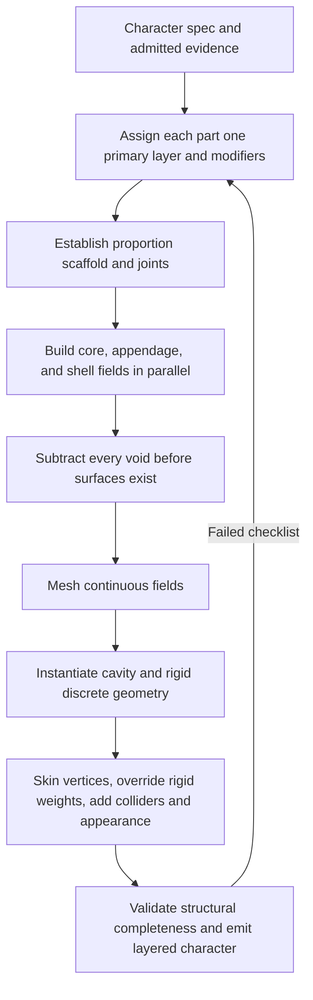

# img2threejs layered procedural character assembly design

| Evidence capsule | Value |
| --- | --- |
| Scope | Asset design: classify, construct, skin, and validate layered procedural character geometry |
| Trigger | A `character` or `hybrid` spec needs an explicit part/build/rig decomposition |
| Source | The frozen [character structure-decomposition contract](https://github.com/img2threejs/img2threejs/blob/d6673386f89673a58736f8d398dd16ece67874f5/grimoire/character/structure_decomposition.md#L1-L29) |
| Author and evidence date | Hoài Nhớ and img2threejs contributors; frozen design 2026-08-06; retrieved 2026-08-21 |
| Evidence signals | Source-documented |
| Evidence limit | The source is a detailed design and worked coverage analysis; its referenced rig plan is not committed, and no current test executes the complete seven-stage DAG. |

## Loop

## Run the loop

1. Classify every part into one primary geometry layer—core, deformable appendage, cavity, rigid
   isolate, cross-joint shell, or VFX—and any scaffold, void, marking, or collision modifiers.
2. Use whether a part crosses a joint, rather than a vague hard/soft label, to select its build and
   skinning behavior. Override a joint-crossing rigid accessory instead of letting metal squash.
3. Establish the proportion scaffold and derive joints. Build continuous SDF/sweep/shell fields for
   core, appendages, and clothing in parallel.
4. Apply negative-space operators before meshing, then mesh the fields. Instantiate internal cavity
   parts and single-bone isolates separately.
5. Evaluate spatial weights, force rigid L2/L3 parts to one bone, attach collision proxies, and add
   topology-independent shader markings and VFX.
6. Check every spec part/layer/evidence mapping, bounds, void edge, bone and weight invariant, seam,
   pose sweep, clothing collision, collider, and invented-part prohibition. Reclassify or rebuild the
   owning stage on failure.

## Outputs and stop conditions

The intended output is a named layered character graph, meshed continuous fields, discrete parts,
shared skeleton/weights, markings, VFX, colliders, and structural-completeness record. Stop after all
15 checklist items pass; delete unsupported invented parts and repeat on classification, mesh, seam,
weight, pose, or collision failure.

## Supporting skills

**Observed:** agent semantic decomposition, evidence tracing, SDF composition, spline sweeps, shell
construction, CSG subtraction, marching cubes, procedural primitives, spatial skinning, shader
markings, pose sweeps, and collision-proxy authoring.

**Potential (inference):** dependency-graph scheduling, automatic layer classification, seam welding,
and pose-space collision optimization. These capabilities may not exist in the source.

## Evidence boundaries

This is a source-authored design, not an integrated shipped route. The repository explicitly excludes
strand grooming, sculpt-bake detail, and LOD chains from this character contract. The mini-dragon
coverage table records analysis, including rejected invented mane/scales, but not a complete accepted
build. Its referenced local rig-plan file is ignored and absent from the frozen repository.

## Sources

- [Layer ontology and build/rig membership](https://github.com/img2threejs/img2threejs/blob/d6673386f89673a58736f8d398dd16ece67874f5/grimoire/character/structure_decomposition.md#L13-L29)
- [Joint-crossing classification and modifier rule](https://github.com/img2threejs/img2threejs/blob/d6673386f89673a58736f8d398dd16ece67874f5/grimoire/character/structure_decomposition.md#L31-L73)
- [Seven-stage execution DAG](https://github.com/img2threejs/img2threejs/blob/d6673386f89673a58736f8d398dd16ece67874f5/grimoire/character/structure_decomposition.md#L75-L88)
- [Deliberate exclusions and worked coverage](https://github.com/img2threejs/img2threejs/blob/d6673386f89673a58736f8d398dd16ece67874f5/grimoire/character/structure_decomposition.md#L106-L156)
- [Structural completeness and failure checks](https://github.com/img2threejs/img2threejs/blob/d6673386f89673a58736f8d398dd16ece67874f5/grimoire/character/structure_decomposition.md#L193-L230)
