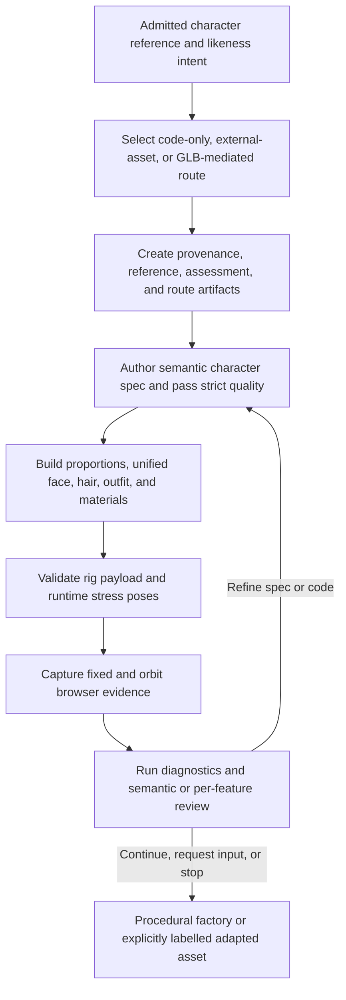

# img2threejs standard character reconstruction contract

| Evidence capsule | Value |
| --- | --- |
| Scope | Asset: anatomy-aware procedural or explicitly adapted character reconstruction for Three.js |
| Trigger | An admitted reference is classified as `character` or `hybrid` and the accepted likeness route is known |
| Source | The frozen [standard character pipeline contract](https://github.com/img2threejs/img2threejs/blob/d6673386f89673a58736f8d398dd16ece67874f5/grimoire/readiness/standard_character_pipeline.md#L1-L24) |
| Author and evidence date | Hoài Nhớ and img2threejs contributors; frozen beta/alpha contract 2026-08-06; retrieved 2026-08-21 |
| Evidence signals | Source-documented |
| Evidence limit | The contract combines beta and alpha work, while the repository roadmap still treats v1.5 character work as in progress; no committed artifact proves every mandatory gate in one run. |

## Loop

## Run the loop

1. Route explicitly. Code-only creates a procedural TypeScript factory; an external generator emits
   a provenance-labelled GLB/VRM adapter result; GLB-mediated reference work still creates a separate
   procedural factory. External artifacts must not be called code-only output.
2. Preserve admitted views, hashes, camera roles, hidden-region confidence, assessment, anatomy,
   landmarks, component hierarchy, topology class, materials, feature targets, and quality contract.
3. Pass reference readback and strict-quality validation, then lock silhouette/proportion before face
   landmarks, unified head volume, hair/outfit, and material modules.
4. Validate the Y-up/right-handed rig payload, bind one Three.js skeleton, and run neutral and stress
   poses. Structural payload validity alone is not deformation proof.
5. Capture hero, two orbit, profile, rear, and head views from the real browser route. Only the fixed
   view is pixel-aligned; orbit views test volume, attachment, rear coverage, and deformation.
6. Run deterministic diagnostics and agent semantic/per-feature review. Change only one correction
   group per v2 loop, then record exactly one next action.

## Outputs and stop conditions

The procedural route outputs reference/assessment/spec JSON, a TypeScript character factory, rig
payload, render manifest, comparison sheet, diagnostics, and review decision. Adapter routes retain
their external artifact type and provenance. Stop after all acceptance stages pass, or use
`request-input`/`stop` when views, rig evidence, or achievable likeness are insufficient.

## Supporting skills

**Observed:** agent character analysis, head-unit measurement, landmark and pose extraction,
procedural Three.js, semantic modularization, rig-payload validation, skinning, browser camera batches,
deterministic diagnostics, and feature-level visual review.

**Potential (inference):** expression-retarget evaluation, learned landmark uncertainty, wardrobe
collision repair, and cross-engine humanoid export. These capabilities may not exist in the source.

## Evidence boundaries

The frozen source contains conflicting maturity signals: the merged contract names executable entry
points, but roadmap material still presents v1.5 character capabilities as upcoming. External neural
systems are opt-in adapters with separate model, checkpoint, license, and output terms. A runtime-ready
flag, GLB export, or generated code does not prove likeness. Apache-2.0 covers repository source only.

## Sources

- [Route selection and reporting boundary](https://github.com/img2threejs/img2threejs/blob/d6673386f89673a58736f8d398dd16ece67874f5/grimoire/readiness/standard_character_pipeline.md#L7-L24)
- [Required artifacts and paired GLB passes](https://github.com/img2threejs/img2threejs/blob/d6673386f89673a58736f8d398dd16ece67874f5/grimoire/readiness/standard_character_pipeline.md#L26-L49)
- [Scene, coordinate, rig, and browser contracts](https://github.com/img2threejs/img2threejs/blob/d6673386f89673a58736f8d398dd16ece67874f5/grimoire/readiness/standard_character_pipeline.md#L51-L97)
- [Capture batch and ordered acceptance](https://github.com/img2threejs/img2threejs/blob/d6673386f89673a58736f8d398dd16ece67874f5/grimoire/readiness/standard_character_pipeline.md#L98-L132)
- [Roadmap maturity boundary](https://github.com/img2threejs/img2threejs/blob/d6673386f89673a58736f8d398dd16ece67874f5/ROADMAP.md#L71-L86)
