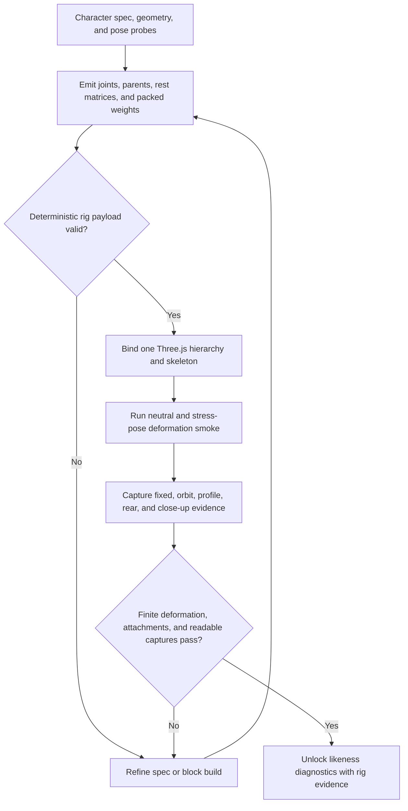

# img2threejs character rig validation and browser evidence

| Evidence capsule | Value |
| --- | --- |
| Scope | Verification: procedural character rig payload, deformation, and screenshot evidence |
| Trigger | A procedural character spec and geometry are ready to become a deformable Three.js character |
| Source | The frozen [procedural rigging contract](https://github.com/img2threejs/img2threejs/blob/d6673386f89673a58736f8d398dd16ece67874f5/grimoire/readiness/procedural_rigging_contract.md#L1-L18) |
| Author and evidence date | Hoài Nhớ and img2threejs contributors; frozen alpha contract 2026-08-06; retrieved 2026-08-21 |
| Evidence signals | Source-documented |
| Evidence limit | Structural validators and tests prove payload invariants only; no committed run demonstrates the complete payload-to-browser-pose evidence route on a reference character. |

## Loop

## Run the loop

1. Have the procedural factory own geometry and authored rig data. Emit Y-up, right-handed joints,
   parent indices, unique names, local matrices, sockets, and at most four normalized influences per
   vertex.
2. Validate finite values, parent-before-child order, affine matrices, name uniqueness, weight sums,
   and coverage warnings. Spec failures return to specification; payload failures block build.
3. Bind one shared `THREE.Skeleton` in rest pose, align skin attributes to vertex count, update world
   matrices before measurement, and maintain conservative dynamic bounds.
4. Exercise neutral, shoulder/elbow, hip/knee, wrist/ankle, head/spine, end-effector, and accessory
   poses. Reject NaN/Inf, collapse, excessive stretch, culling, or detached hair/ribbons.
5. Capture fixed, ±35-degree orbit, profile, rear, and close-up browser views. Reopen the screenshots
   before allowing any reference-likeness diagnosis.

## Outputs and stop conditions

Outputs are a rig payload, deterministic validation report, bound Three.js skeleton, pose-smoke
results, camera-batch manifest, screenshot hashes, and failure action. Stop on passed payload,
deformation, attachment, and readback evidence; otherwise refine the spec/code or request input.

## Supporting skills

**Observed:** agent-authored rig specs, joint hierarchy construction, packed linear-blend skinning,
finite-value and matrix validation, Three.js skeleton binding, stress-pose automation, dynamic-bounds
checks, browser capture, and screenshot readback.

**Potential (inference):** twist-bone insertion, deformation heat maps, muscle-volume preservation,
and animation-library compatibility scoring. These capabilities may not exist in the source.

## Evidence boundaries

A structurally valid payload is not proof that the mesh deforms well, and pose-smoke evidence is not a
likeness score. Auxiliary joints without direct weights may be legitimate and should remain explicit.
The source's broader roadmap still calls automatic rigging future work, so this page documents the
alpha procedural contract and its gate order, not production readiness or engine portability.

## Sources

- [Ownership, outputs, and failure actions](https://github.com/img2threejs/img2threejs/blob/d6673386f89673a58736f8d398dd16ece67874f5/grimoire/readiness/procedural_rigging_contract.md#L5-L18)
- [Runtime invariants](https://github.com/img2threejs/img2threejs/blob/d6673386f89673a58736f8d398dd16ece67874f5/grimoire/readiness/procedural_rigging_contract.md#L19-L30)
- [Pose probes and likeness gate](https://github.com/img2threejs/img2threejs/blob/d6673386f89673a58736f8d398dd16ece67874f5/grimoire/readiness/procedural_rigging_contract.md#L32-L46)
- [Standard character rig and capture ordering](https://github.com/img2threejs/img2threejs/blob/d6673386f89673a58736f8d398dd16ece67874f5/grimoire/readiness/standard_character_pipeline.md#L62-L72)
- [Payload hard-gate tests](https://github.com/img2threejs/img2threejs/blob/d6673386f89673a58736f8d398dd16ece67874f5/forge/tests/test_validate_rig_payload.py#L29-L58)
