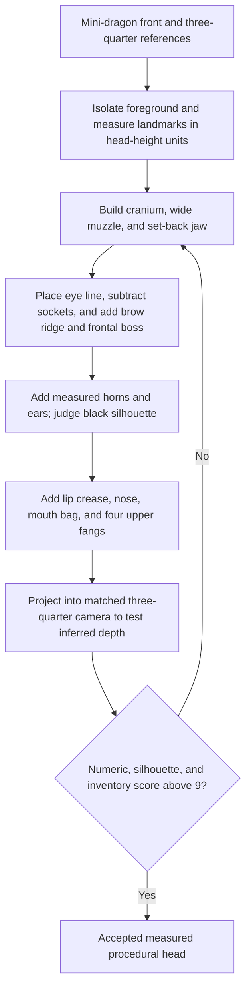

# img2threejs measured creature-head construction

| Evidence capsule | Value |
| --- | --- |
| Scope | Asset design: reference-measured procedural head construction for the mini-dragon worked case |
| Trigger | The Vijay Ghume mini-dragon reference set needs a likeness-critical procedural head |
| Source | The frozen [creature-head construction case](https://github.com/img2threejs/img2threejs/blob/d6673386f89673a58736f8d398dd16ece67874f5/grimoire/character/head_construction.md#L1-L28) |
| Author and evidence date | Hoài Nhớ and img2threejs contributors; frozen worked design 2026-08-06; retrieved 2026-08-21 |
| Evidence signals | Source-documented |
| Evidence limit | This is a source-specific measured recipe and rubric; no committed render, score sheet, or accepted implementation demonstrates a greater-than-nine result. |

## Loop

## Run the loop

1. Separate the subject from the studio background, measure crown-to-chin head height, and record
   landmark positions, widths, angles, and whether each value was scanned, gridded, or inferred.
2. Block an unusually wide cranium, six-to-one wide/flat upper muzzle, and jaw set behind the upper
   lip. Inspect top and bottom views so a canine-style protruding snout cannot hide in the front view.
3. Lock the high eye line and wide interocular spacing before adding the V brow and frontal boss.
4. Add horns and ears at measured length, base, span, and rake; evaluate their black silhouette before
   smaller facial forms.
5. Add a hard lip crease, flat nose pad, mouth cavity, and four maxillary fangs pointing downward.
6. Match the available three-quarter camera and project the build back onto it to test the uncertain
   depth axis. Score numeric widths/placement/depth, appendage silhouette, and part inventory; rebuild
   likeness-critical blocks when the weighted total does not exceed nine.

## Outputs and stop conditions

The intended output is a measured, topology-ready creature head with landmark/proportion evidence,
matched-camera projection, and ten-point rubric. Stop when the total exceeds nine and the topology/
inventory gates pass. Repeat on dog-snout depth, convergent eyes, narrow skull, wrong horn/ear
silhouette, human lips, underbite, or incorrectly parented fangs.

## Supporting skills

**Observed:** agent image measurement, flood-fill masking, colour discrimination, normalized anatomy,
procedural blocks and SDF union/subtraction, camera matching, silhouette review, deformation topology,
part inventory, and weighted acceptance rubrics.

**Potential (inference):** automated landmark extraction, multi-view camera solve, differentiable block
fitting, and uncertainty propagation into the rubric. These capabilities may not exist in the source.

## Evidence boundaries

The numeric values belong to one stylized creature and pose. The source explicitly says depth is not
measurable from its reference set, so cranium depth is a constrained assumption validated only by
projection. Its >9 rubric is authored, not empirically calibrated. Generalizing the ratios to other
characters would be an unsupported synthesis.

## Sources

- [Measurement method and head-height unit](https://github.com/img2threejs/img2threejs/blob/d6673386f89673a58736f8d398dd16ece67874f5/grimoire/character/head_construction.md#L11-L28)
- [Measured proportions and pose caveat](https://github.com/img2threejs/img2threejs/blob/d6673386f89673a58736f8d398dd16ece67874f5/grimoire/character/head_construction.md#L30-L82)
- [Unmeasured depth and projection validation](https://github.com/img2threejs/img2threejs/blob/d6673386f89673a58736f8d398dd16ece67874f5/grimoire/character/head_construction.md#L84-L106)
- [Block construction](https://github.com/img2threejs/img2threejs/blob/d6673386f89673a58736f8d398dd16ece67874f5/grimoire/character/head_construction.md#L108-L128)
- [Build order and matched-camera check](https://github.com/img2threejs/img2threejs/blob/d6673386f89673a58736f8d398dd16ece67874f5/grimoire/character/head_construction.md#L206-L222)
- [Acceptance rubric and gate ownership](https://github.com/img2threejs/img2threejs/blob/d6673386f89673a58736f8d398dd16ece67874f5/grimoire/character/head_construction.md#L250-L284)
