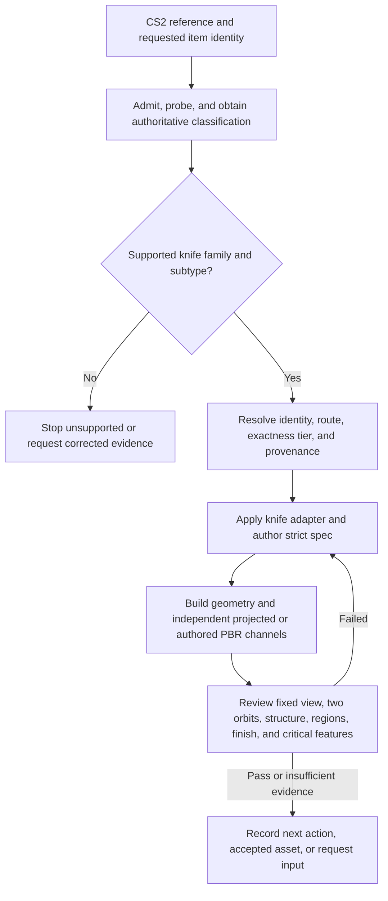

# img2threejs CS2 knife image-matched reconstruction

| Evidence capsule | Value |
| --- | --- |
| Scope | Asset: evidence-backed procedural reconstruction of a supported CS2 knife reference |
| Trigger | An agent receives a CS2 item image plus authoritative family/subtype classification |
| Source | The frozen [CS2 intake contract](https://github.com/img2threejs/img2threejs/blob/d6673386f89673a58736f8d398dd16ece67874f5/grimoire/intake/cs2_intake_contract.md#L1-L23) and [knife review contract](https://github.com/img2threejs/img2threejs/blob/d6673386f89673a58736f8d398dd16ece67874f5/docs/cs2/review-gates.md#L1-L28) |
| Author and evidence date | TamL., kokorolx, and img2threejs contributors; contract through 2026-08-03; frozen revision 2026-08-06; Classic Fade artifact 2026-07-25; retrieved 2026-08-21 |
| Evidence signals | Source-documented; Author-practiced |
| Evidence limit | The public Classic Fade artifact is author-produced, and the frozen source contradicts itself about pistol support; the executable intake path permits knives only. |

## Loop

## Run the loop

1. Admit and technically probe every view. Treat filename/aspect heuristics only as routing hints and
   require a provider/version/evidence-backed classification record before choosing an adapter.
2. Stop unsupported families and unknown knife subtypes. For the frozen executable manifest,
   `knife` is the only family that can enter `proceed` and receive `cs2-knife-v1`.
3. Resolve identity from explicit user metadata, unambiguous metadata, then classification. Choose
   implementation route independently from `image-only`, `metadata-assisted`, or `exact-texture`.
4. Prefer reference projection for a specific patterned image; use authored textures only with
   independent legal maps and procedural finish only as a disclosed fallback. De-light before
   projection, and keep geometry independent of projected colour.
5. Build the family-specific component tree and record painted regions, substrate, hardware,
   hidden-region confidence, and approximations in the strict spec.
6. Gate a fixed camera plus two non-degenerate orbits on family, silhouette, projection coverage,
   finish/material response, per-region parity, critical identity details, geometry integrity, and
   component coverage. Record exactly one next action.

## Outputs and stop conditions

Outputs include `cs2-intake.json`, identity/provenance records, route and exactness tier, a knife
`ObjectSculptSpec`, procedural factory, independent texture channels, review metrics/screenshots, and
machine-readable knife report. Stop on an accepted report; stop as unsupported for other families;
request input for missing or contradictory classification, coverage, provenance, or hidden geometry.

## Supporting skills

**Observed:** agent weapon classification, reference admission, local BM25 evidence search, metadata
resolution, de-lighting and projection, family adapters, procedural hard-surface Three.js, PBR maps,
multi-angle capture, geometry integrity, part coverage, and critical-feature review.

**Potential (inference):** signed workshop-manifest import, calibrated weapon classifiers, automatic
UV correspondence, and license-aware texture lineage. These may not exist in the source.

## Evidence boundaries

The frozen repository is internally contradictory. README, roadmap, changelog, and
`cs2_adapters.py` describe a Glock-18 adapter, but the governing intake contract and
`cs2_manifest.py` reject every pistol before spec generation. This page therefore scopes the
operative route to knives. The companion Glock report also says the strict orchestrator, append
review, Divine Eye, and VLM route was not run. Valve pixels must remain local and unredistributed;
repository source is Apache-2.0, not the MIT license mistakenly named in the texture guide.

## Sources

- [Knife-only boundary and manifest timing](https://github.com/img2threejs/img2threejs/blob/d6673386f89673a58736f8d398dd16ece67874f5/grimoire/intake/cs2_intake_contract.md#L12-L23)
- [Layer ownership, intake order, and route selection](https://github.com/img2threejs/img2threejs/blob/d6673386f89673a58736f8d398dd16ece67874f5/grimoire/intake/cs2_intake_contract.md#L25-L65)
- [Surface, review, and next-action rule](https://github.com/img2threejs/img2threejs/blob/d6673386f89673a58736f8d398dd16ece67874f5/grimoire/intake/cs2_intake_contract.md#L67-L80)
- [Executable supported-family boundary](https://github.com/img2threejs/img2threejs/blob/d6673386f89673a58736f8d398dd16ece67874f5/forge/stage1_intake/cs2_manifest.py#L18-L37)
- [Blocking knife review gates and calibration limit](https://github.com/img2threejs/img2threejs/blob/d6673386f89673a58736f8d398dd16ece67874f5/docs/cs2/review-gates.md#L1-L28)
- [Classic Fade practiced intake](https://github.com/img2threejs/img2threejs-showcase/blob/bf44f8f1fdef70fcc87f91fc4e777fd760b9757f/src/demos/classic-fade/cs2-intake.json#L1-L42)
- [Glock custom-route non-equivalence](https://github.com/img2threejs/img2threejs-showcase/blob/bf44f8f1fdef70fcc87f91fc4e777fd760b9757f/src/demos/glock-ghost-protocol/cs2-review.json#L176-L189)
