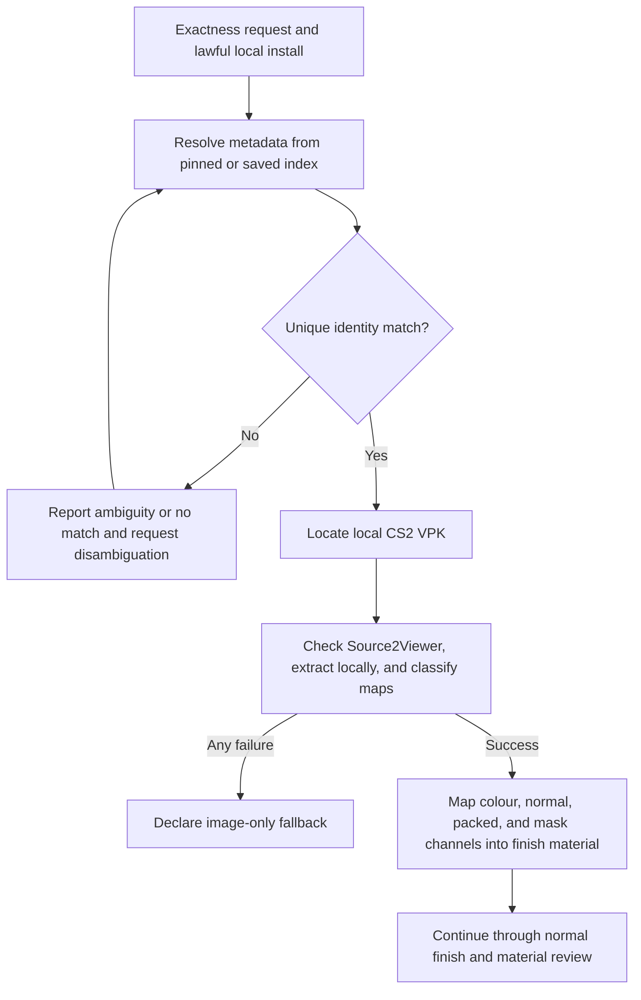

# img2threejs local CS2 texture acquisition

| Evidence capsule | Value |
| --- | --- |
| Scope | Asset intake: optional local exact-texture evidence acquisition for a CS2 finish |
| Trigger | Exact texture likeness is requested and the user has a lawful local CS2 installation |
| Source | The frozen [optional acquisition contract](https://github.com/img2threejs/img2threejs/blob/d6673386f89673a58736f8d398dd16ece67874f5/grimoire/intake/cs2_texture_acquisition.md#L1-L13) |
| Author and evidence date | TamL. and img2threejs contributors; source artifact 2026-07-25; frozen revision 2026-08-06; retrieved 2026-08-21 |
| Evidence signals | Source-documented |
| Evidence limit | Source and tests define lookup, extraction, classification, and fallback behavior; no Valve texture or successful real extraction is committed for audit. |

## Loop

## Run the loop

1. Resolve paint index, float range, rarity, and preview metadata from a pinned online index or saved
   offline copy. Treat no match and multiple matches as errors; disambiguate with paint index when
   phase names collide.
2. Search per-platform Steam roots or explicit roots for `pak01_dir.vpk`. A missing VPK is a
   non-fatal, explicit fallback result.
3. Assert `Source2Viewer-CLI` and its runtime are available, extract into the gitignored local
   workspace, and bucket filenames as colour, normal, roughness/metalness, mask, or other.
4. On missing tools, flag drift, subprocess failure, or nonzero exit, report the reason and return to
   the image-only reconstruction instead of inventing exactness.
5. Feed successful maps to independent PBR channels and retain the normal finish/material realism
   gates; acquired pixels do not by themselves validate geometry or appearance.

## Outputs and stop conditions

Outputs are metadata JSON and, on success, local classified texture maps plus provenance for the
parent spec. Stop successfully at the parent material review. Stop this upgrade with a declared
image-only fallback on any acquisition failure. Stop and request clarification on ambiguous identity.

## Supporting skills

**Observed:** agent metadata lookup, reproducible source pinning, Steam-path discovery,
Source2Viewer-CLI orchestration, filename-based texture classification, PBR channel assignment,
failure reporting, and local IP isolation.

**Potential (inference):** content-hash manifests, packed-channel auto-detection, VPK version
compatibility checks, and policy-aware asset vaulting. These capabilities may not exist in the source.

## Evidence boundaries

This optional route requires the user's own legal installation and an external .NET tool. Extracted
Valve textures are Valve IP, remain in `cs2_textures/`, and must never be committed or redistributed.
The guide incorrectly says the repository is MIT; its frozen `LICENSE` is Apache-2.0. Community
metadata and CDN previews have separate provenance and terms. Exact maps do not establish exact UVs,
finish response, wear, geometry, or camera agreement.

## Sources

- [Optional-route and hard IP boundary](https://github.com/img2threejs/img2threejs/blob/d6673386f89673a58736f8d398dd16ece67874f5/grimoire/intake/cs2_texture_acquisition.md#L1-L11)
- [Metadata resolution and ambiguity behavior](https://github.com/img2threejs/img2threejs/blob/d6673386f89673a58736f8d398dd16ece67874f5/grimoire/intake/cs2_texture_acquisition.md#L13-L42)
- [VPK discovery, extraction, and fallback](https://github.com/img2threejs/img2threejs/blob/d6673386f89673a58736f8d398dd16ece67874f5/grimoire/intake/cs2_texture_acquisition.md#L44-L69)
- [PBR channel hand-off](https://github.com/img2threejs/img2threejs/blob/d6673386f89673a58736f8d398dd16ece67874f5/grimoire/intake/cs2_texture_acquisition.md#L71-L77)
- [Fallback and gitignore tests](https://github.com/img2threejs/img2threejs/blob/d6673386f89673a58736f8d398dd16ece67874f5/forge/tests/test_pipeline.py#L993-L1012)
- [Actual Apache-2.0 notice](https://github.com/img2threejs/img2threejs/blob/d6673386f89673a58736f8d398dd16ece67874f5/LICENSE#L189-L200)
