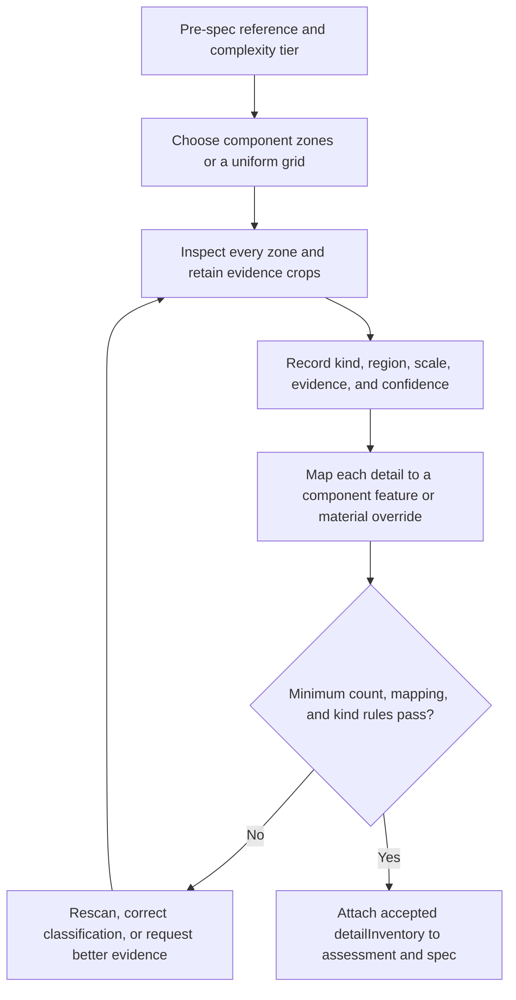

# img2threejs detail-first reference inventory

| Evidence capsule | Value |
| --- | --- |
| Scope | Asset intake: evidence-linked micro-detail inventory before procedural specification |
| Trigger | Pre-spec analysis begins for a reference, with a required minimum for moderate or more complex subjects |
| Source | The frozen [detail-inventory contract](https://github.com/img2threejs/img2threejs/blob/d6673386f89673a58736f8d398dd16ece67874f5/grimoire/intake/detail_inventory.md#L1-L14) |
| Author and evidence date | hoainho and img2threejs contributors; source artifact 2026-07-20; frozen revision 2026-08-06; retrieved 2026-08-21 |
| Evidence signals | Source-documented; Author-practiced |
| Evidence limit | The source and one public knife spec show the artifact and gate discipline; they do not show that the inventory is complete for arbitrary images or improves outcomes. |

## Loop

## Run the loop

1. Set `targetMinDetails` from the subject complexity and choose `component-zones`, `grid-3x3`, or
   `grid-4x4` as the recorded scan method.
2. Inspect each crop rather than the image only as a whole. For every identity-bearing mark, record
   its region, kind, affected property, evidence reference, scale, and confidence.
3. Classify the mark into the source taxonomy, including geometry-bearing bevels, fasteners, holes,
   grooves, and ridges or material-bearing gloss, linework, decals, stains, scratches, and emissive
   regions.
4. Bind every entry to a real `component.localFeatures[]` or `material.localOverrides[]` field that
   generation consumes. Prose-only observations fail the gate.
5. Rescan or request better evidence when the count is low, confidence is padded, a kind is
   ambiguous, or the mapping is absent. Only an accepted inventory advances to specification.

## Outputs and stop conditions

The output is an evidence-linked `detailInventory` embedded in the assessment and carried into the
spec. Stop successfully when the complexity minimum and all linkage/kind checks pass. Block code
generation while entries are missing or unmapped; request input when occlusion or resolution prevents
an honest classification.

## Supporting skills

**Observed:** agent vision, normalized region annotation, deterministic PNG cropping, procedural
geometry vocabulary, PBR vocabulary, confidence recording, and strict spec validation.

**Potential (inference):** active-learning crop selection, duplicate-detail detection, saliency hints,
and reviewer agreement on ambiguous feature kinds. These capabilities may not exist in the source.

## Evidence boundaries

The crop script scaffolds zones; the agent still supplies semantic observations. Meeting a numeric
minimum is not evidence that every meaningful detail was found, and the source forbids inflating
confidence merely to meet it. The Classic Fade artifact demonstrates a large mapped inventory for one
knife, not a general benchmark. Apache-2.0 covers repository source, not the supplied reference image.

## Sources

- [Required fields and real-spec mapping gate](https://github.com/img2threejs/img2threejs/blob/d6673386f89673a58736f8d398dd16ece67874f5/grimoire/intake/detail_inventory.md#L1-L14)
- [Zone scan methods and complexity minima](https://github.com/img2threejs/img2threejs/blob/d6673386f89673a58736f8d398dd16ece67874f5/grimoire/intake/detail_inventory.md#L114-L131)
- [Strict gate placement](https://github.com/img2threejs/img2threejs/blob/d6673386f89673a58736f8d398dd16ece67874f5/grimoire/review/gates_reference.md#L57-L59)
- [Classic Fade practiced inventory](https://github.com/img2threejs/img2threejs-showcase/blob/bf44f8f1fdef70fcc87f91fc4e777fd760b9757f/src/demos/classic-fade/object-sculpt-spec.json#L121-L220)
- [Executable crop test](https://github.com/img2threejs/img2threejs/blob/d6673386f89673a58736f8d398dd16ece67874f5/forge/tests/test_pipeline.py#L750-L758)
