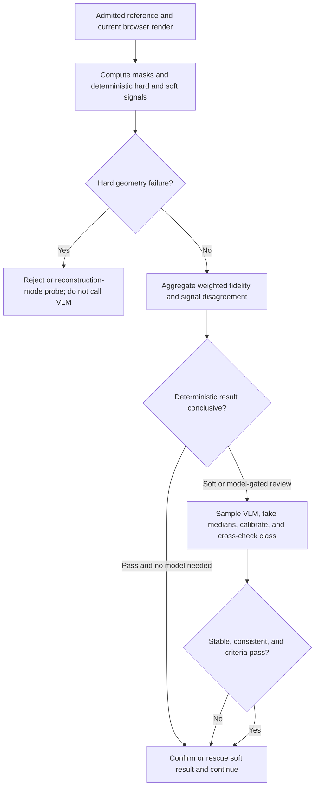

# img2threejs deterministic-first Divine Eye review

| Evidence capsule | Value |
| --- | --- |
| Scope | Verification: deterministic render/reference evaluation with a subordinate VLM gate |
| Trigger | A current-pass browser render and admitted reference are ready for fidelity evaluation |
| Source | The frozen [review-gate contract](https://github.com/img2threejs/img2threejs/blob/d6673386f89673a58736f8d398dd16ece67874f5/grimoire/review/gates_reference.md#L11-L21) and [evaluator implementation](https://github.com/img2threejs/img2threejs/blob/d6673386f89673a58736f8d398dd16ece67874f5/forge/stage4_review/divine_eye.py#L282-L377) |
| Author and evidence date | TamL., Hoài Nhớ, and img2threejs contributors; implementation through 2026-08-06; retrieved 2026-08-21 |
| Evidence signals | Source-documented |
| Evidence limit | Tests use fixtures and injected VLM samples; thresholds are not fully calibrated on a labelled real-render corpus and the module has known scale and resolution limits. |

## Loop

## Run the loop

1. Compute silhouette IoU and scale hard gates plus proportion, symmetry, pHash, SSIM, edge,
   blowout, flatness, tonal parity, and optional objectness soft signals.
2. Reject hard failures deterministically. A photo/procedural IoU-only failure may enter the bounded
   reconstruction-mode handling, but a VLM is never consulted while hard failures remain.
3. Weight the soft signals and use their spread to route to `pass`, `low-confidence`, or `reject` with
   `continue`, `probe`, or `refine-code`.
4. When a caller supplies a VLM sampler, take multiple samples, aggregate medians, apply the configured
   monotonic calibration, and send high sample spread to `probe`.
5. Cross-check the claimed class against deterministic geometry. A contradiction is uncertainty, not
   permission for model semantics to override measured form.
6. Let the VLM confirm a pass or rescue only a soft result. Route low objectness/semantics to
   `refine-spec` and low structure/specular response to `refine-code`.

## Outputs and stop conditions

The evaluator emits signal values, weights, hard failures, fidelity, disagreement, reconstruction
flag, verdict, action, paths, and notes. The VLM layer adds calibrated criteria and whether it ran.
Stop this evaluation on a final route; the parent correction loop decides whether to rebuild, seek
input, or advance.

## Supporting skills

**Observed:** standard-library image analysis, masks, IoU, pHash, SSIM, Sobel edges, objectness,
CIEDE2000 report signals, uncertainty routing, injected VLM sampling, score calibration, semantic
cross-checking, and structured JSON gates.

**Potential (inference):** labelled-corpus calibration, learned perceptual metrics, adversarial VLM
testing, and renderer-specific threshold profiles. These capabilities may not exist in the source.

## Evidence boundaries

The main luma and edge grids are 64×64 and 96×96, so small features disappear before scoring.
`hueZoneParity` and `specularWash` are report-only. The VLM module accepts an injected sampler and its
CLI can consume offline samples; it does not itself provide a hosted model call. The documentation's
simple claim that hard failures are never rescued is qualified by the evaluator's internal
photo-reconstruction IoU handling. A passing 2D verdict is not proof of multi-angle 3D realism.

## Sources

- [Deterministic-first and subordinate-VLM rules](https://github.com/img2threejs/img2threejs/blob/d6673386f89673a58736f8d398dd16ece67874f5/grimoire/review/gates_reference.md#L11-L21)
- [Resolution ceiling and report-only signals](https://github.com/img2threejs/img2threejs/blob/d6673386f89673a58736f8d398dd16ece67874f5/forge/stage4_review/divine_eye.py#L58-L78)
- [Verdict, reconstruction handling, and result artifact](https://github.com/img2threejs/img2threejs/blob/d6673386f89673a58736f8d398dd16ece67874f5/forge/stage4_review/divine_eye.py#L360-L435)
- [VLM sampling, calibration, cross-check, and routing](https://github.com/img2threejs/img2threejs/blob/d6673386f89673a58736f8d398dd16ece67874f5/forge/stage4_review/vlm_gate.py#L94-L163)
- [Hard-gate and soft-rescue tests](https://github.com/img2threejs/img2threejs/blob/d6673386f89673a58736f8d398dd16ece67874f5/forge/tests/test_vlm_gate.py#L40-L97)
