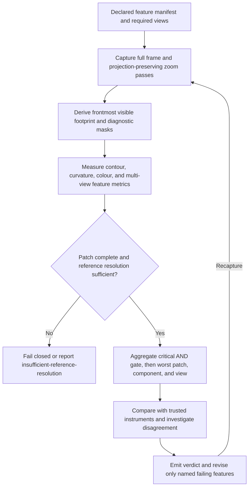

# img2threejs feature-scale fidelity microscope design

| Evidence capsule | Value |
| --- | --- |
| Scope | Verification design: macro-to-micro visible-footprint review of critical asset features |
| Trigger | Whole-image review cannot resolve an identity-critical component or feature at sufficient pixel scale |
| Source | The frozen [Divine Eye microscope design](https://github.com/img2threejs/img2threejs/blob/d6673386f89673a58736f8d398dd16ece67874f5/grimoire/review/divine_eye_microscope.md#L1-L37) |
| Author and evidence date | Hoài Nhớ and img2threejs contributors; frozen design and mini-dragon observations 2026-08-06; retrieved 2026-08-21 |
| Evidence signals | Source-documented; Author-practiced |
| Evidence limit | The visible-footprint and concave-colour lessons come from author practice, but the full microscope is explicitly unimplemented in the frozen repository. |

## Loop

## Run the loop

1. Declare each feature's component, criticality, required views, normalized reference ROI, local
   anchor, minimum projected pixels, capture resolution, and metrics. Missing required metadata fails.
2. Keep the original perspective and use `setViewOffset` plus render targets for high-resolution
   patches. Freeze camera, renderer, DPR, tone mapping, exposure, and iteration provenance.
3. Produce object-ID, depth, normal, albedo, and beauty evidence. Measure the frontmost visible
   footprint rather than an isolation render that exposes occluded geometry.
4. Apply signed-distance, directional Chamfer, curvature, worst-edge, per-ROI colour, and multi-view
   consistency measures appropriate to the feature. Do not hard-gate roughness under unknown light.
5. Fail closed on missing patches. Return `insufficient-reference-resolution` when the source cannot
   resolve the feature; super-resolution is not ground truth.
6. Apply critical-feature AND semantics and aggregate worst patch to worst component to worst view,
   never a global average. Investigate disagreement with existing trusted gates before changing form.
7. Route the named failing feature to a bounded correction, recapture, and repeat.

## Outputs and stop conditions

The design outputs a feature manifest, projection-preserving patches, ID/depth/normal/albedo/beauty
passes, visible-footprint masks, per-feature metrics, worst-first verdict, provenance hashes, and
named correction target. Stop on accepted critical features or insufficient source resolution; fail
closed on missing artifacts and repeat only for named correctable failures.

## Supporting skills

**Observed:** agent feature inventories, Three.js view offsets and render targets, object-ID passes,
occlusion-aware masks, image pyramids, SSIM, signed distances, Chamfer/Hausdorff metrics, curvature,
CIEDE2000, multi-view correspondence, and critical-feature gates.

**Potential (inference):** learned feature correspondence, perceptual uncertainty maps, automatic ROI
subdivision, and differentiable local correction. These capabilities may not exist in the source.

## Evidence boundaries

The source audits `setViewOffset`, render targets, several diagnostic passes, per-ROI metrics, and
stage-four occlusion masking as absent. Therefore this page records the authored design, not an
executable current route. The practiced mini-dragon observations establish that isolation and concave
colour ratios can yield confident false findings; they do not validate the proposed full metric stack.
Zoom cannot create information missing from the original reference.

## Sources

- [Current implementation audit and missing capabilities](https://github.com/img2threejs/img2threejs/blob/d6673386f89673a58736f8d398dd16ece67874f5/grimoire/review/divine_eye_microscope.md#L9-L37)
- [Feature descriptor and fail-closed rule](https://github.com/img2threejs/img2threejs/blob/d6673386f89673a58736f8d398dd16ece67874f5/grimoire/review/divine_eye_microscope.md#L39-L63)
- [Projection-preserving capture contract](https://github.com/img2threejs/img2threejs/blob/d6673386f89673a58736f8d398dd16ece67874f5/grimoire/review/divine_eye_microscope.md#L65-L78)
- [Practiced visible-footprint correction](https://github.com/img2threejs/img2threejs/blob/d6673386f89673a58736f8d398dd16ece67874f5/grimoire/review/divine_eye_microscope.md#L80-L108)
- [Metrics and colour-gate limits](https://github.com/img2threejs/img2threejs/blob/d6673386f89673a58736f8d398dd16ece67874f5/grimoire/review/divine_eye_microscope.md#L110-L165)
- [Worst-first aggregation, acceptance, and hard limit](https://github.com/img2threejs/img2threejs/blob/d6673386f89673a58736f8d398dd16ece67874f5/grimoire/review/divine_eye_microscope.md#L167-L205)
