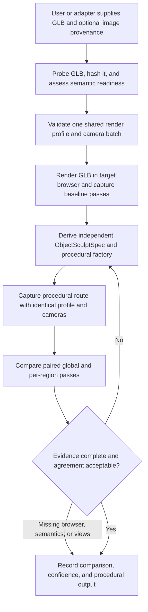

# img2threejs GLB-mediated procedural reference route

| Evidence capsule | Value |
| --- | --- |
| Scope | Asset: rebuild a GLB reference as an independent procedural Three.js factory |
| Trigger | A user supplies an image-derived GLB as an intermediate structural or visual reference |
| Source | The frozen [GLB-mediated bridge contract](https://github.com/img2threejs/img2threejs/blob/d6673386f89673a58736f8d398dd16ece67874f5/grimoire/build/python_threejs_render_bridge.md#L22-L62) |
| Author and evidence date | Hoài Nhớ and img2threejs contributors; frozen alpha contract 2026-08-06; retrieved 2026-08-21 |
| Evidence signals | Source-documented |
| Evidence limit | Source and tests establish manifest and comparison contracts, not that the route reproduces a supplied GLB or its originating image with useful fidelity. |

## Loop

## Run the loop

1. Hash and probe the GLB for bounds, nodes, meshes, materials, skins, provenance, and semantic
   decomposition. Treat a merged one-node asset as insufficient for reliable per-region labels.
2. Validate one renderer profile covering colour spaces, tone mapping, exposure, environment,
   viewport/DPR, camera, background, and lighting for both routes.
3. Load the GLB through the actual target Three.js browser route and record fresh baseline captures.
   In v2, collect beauty, silhouette, semantic-ID, depth, normal, and roughness/material-ID passes.
4. Author an independent procedural spec and TypeScript geometry/material/rig factory. Do not copy
   source topology, vertices, or imported materials.
5. Render the procedural route with the same profile and cameras, record hashes, and compare paired
   passes. Missing semantic-ID data blocks per-region claims.
6. Correct one source-ordered group at a time, recapture the full pass set, and retain the changed
   group, hashes, and score before the next comparison.

## Outputs and stop conditions

Outputs are `glb-reference.json`, a shared render profile, paired capture manifest, independent
`ObjectSculptSpec` and TypeScript factory, region-pass comparison, confidence notes, and decision.
Stop on accepted paired evidence; request input when browser access, semantic labels, or source views
are absent; stop with an explicit limitation when only whole-image agreement can be claimed.

## Supporting skills

**Observed:** GLB binary probing, provenance hashing, GLTFLoader, procedural Three.js, browser capture,
camera/profile normalization, diagnostic render passes, semantic-ID masks, per-region comparison, and
agent correction routing.

**Potential (inference):** topology-independent correspondence, learned semantic segmentation,
cross-renderer calibration, and automated parameter attribution. These may not exist in the source.

## Evidence boundaries

Agreement with a browser-rendered GLB is not agreement with the original image when that image is
absent. Segmented hypotheses are not semantic truth, and a raw GLB is never pixel evidence. The
optional Playwright adapter is outside the zero-dependency core. Apache-2.0 covers repository source;
the supplied GLB, its generator, embedded textures, Three.js dependencies, and source images may have
separate terms.

## Sources

- [Required GLB order and baseline rule](https://github.com/img2threejs/img2threejs/blob/d6673386f89673a58736f8d398dd16ece67874f5/grimoire/build/python_threejs_render_bridge.md#L22-L62)
- [Capture invariant and v2 paired passes](https://github.com/img2threejs/img2threejs/blob/d6673386f89673a58736f8d398dd16ece67874f5/grimoire/build/python_threejs_render_bridge.md#L64-L101)
- [Failure routing and executable alpha path](https://github.com/img2threejs/img2threejs/blob/d6673386f89673a58736f8d398dd16ece67874f5/grimoire/build/python_threejs_render_bridge.md#L103-L159)
- [Prohibited shortcuts](https://github.com/img2threejs/img2threejs/blob/d6673386f89673a58736f8d398dd16ece67874f5/grimoire/build/python_threejs_render_bridge.md#L161-L169)
- [Standard-contract paired-pass requirements](https://github.com/img2threejs/img2threejs/blob/d6673386f89673a58736f8d398dd16ece67874f5/grimoire/readiness/standard_character_pipeline.md#L39-L49)
