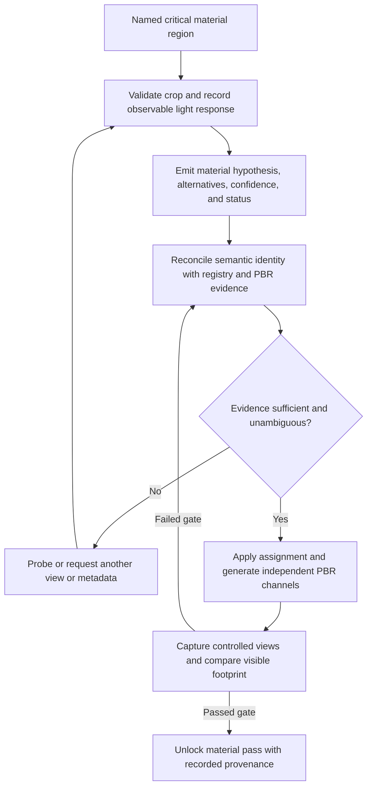

# img2threejs image-grounded material pipeline

| Evidence capsule | Value |
| --- | --- |
| Scope | Asset: per-region material identification, PBR authoring, controlled rendering, and acceptance |
| Trigger | A critical visible component region needs a material assignment for the material build pass |
| Source | The frozen [mandatory material analysis](https://github.com/img2threejs/img2threejs/blob/d6673386f89673a58736f8d398dd16ece67874f5/docs/materials/IMAGE_MATERIAL_ANALYSIS.md#L1-L16) and [executable hand-off](https://github.com/img2threejs/img2threejs/blob/d6673386f89673a58736f8d398dd16ece67874f5/docs/ARCHITECTURE.md#L32-L51) |
| Author and evidence date | Hoài Nhớ and img2threejs contributors; frozen revision 2026-08-06; retrieved 2026-08-21 |
| Evidence signals | Source-documented |
| Evidence limit | Repository tests exercise a synthetic vertical slice; no public corpus calibrates the priors or demonstrates material recognition accuracy on real assets. |

## Loop

## Run the loop

1. Reject empty, inverted, fragmented, duplicate, or undersized component crops. Record observable
   colour, highlight, frequency, opacity, wear, and context signals before naming a material.
2. Emit a structured hypothesis with family, subtype, finish, alternatives, confidence, evidence
   views, and one of `proceed`, `probe`, `request-input`, or `unknown`.
3. Reconcile semantic candidates with deterministic image evidence and the versioned material
   registry. Explicit user metadata outranks visual identity inference, but it does not supply final
   colour, wear, or roughness.
4. Seed a candidate recipe, derive colour and independent PBR channels, and carry the assignment into
   `ObjectSculptSpec`. Keep colour and mathematical map colour spaces distinct.
5. Capture required unlit, studio, grazing, reflection, transmission, and reference-beauty views as
   applicable. Reopen the images and compare the component's visible footprint.
6. Feed mismatch tags back into evidence reconciliation or fitting. Unlock the material pass only
   when every critical region, required map/view, and cross-pass compatibility check succeeds.

## Outputs and stop conditions

Outputs include region crops, hypotheses, PBR evidence, registry assignments, spec fields, generated
material provenance, controlled captures, comparisons, feedback, and `materialGate`. Stop on a pass;
remain at `probe`/`request-input` when identity is ambiguous; fail closed on missing evidence, maps,
readback, or incompatible response. `unknown` is an acceptable analysis result.

## Supporting skills

**Observed:** agent semantic vision, deterministic crop analysis, a versioned material registry,
Three.js physical materials, PBR channel and colour-space handling, controlled browser views,
per-region comparison, visible-footprint masking, and compatibility gates.

**Potential (inference):** calibrated inverse-rendering priors, multi-light material fitting, spectral
reference capture, and uncertainty-aware material ensembles. These capabilities may not exist.

## Evidence boundaries

The registry contains bounded starting priors, not universal material truth. One RGB image does not
uniquely separate illumination, reflectance, geometry, and roughness. Specs opt into this pipeline;
older specs remain compatible without it. Synthetic tests prove wiring and failure behavior, not real
recognition quality. Repository source is Apache-2.0; reference images, texture maps, HDR environments,
and external research retain separate terms.

## Sources

- [Observation, hypothesis, and ambiguity routing](https://github.com/img2threejs/img2threejs/blob/d6673386f89673a58736f8d398dd16ece67874f5/docs/materials/IMAGE_MATERIAL_ANALYSIS.md#L18-L72)
- [PBR authoring, controlled views, and failure policy](https://github.com/img2threejs/img2threejs/blob/d6673386f89673a58736f8d398dd16ece67874f5/docs/materials/IMAGE_MATERIAL_ANALYSIS.md#L74-L112)
- [Lookup, application, and hard limits](https://github.com/img2threejs/img2threejs/blob/d6673386f89673a58736f8d398dd16ece67874f5/docs/materials/README.md#L15-L68)
- [Implemented wiring and opt-in gate](https://github.com/img2threejs/img2threejs/blob/d6673386f89673a58736f8d398dd16ece67874f5/docs/materials/README.md#L92-L111)
- [Nine-phase synthetic vertical-slice test](https://github.com/img2threejs/img2threejs/blob/d6673386f89673a58736f8d398dd16ece67874f5/forge/tests/test_material_pipeline.py#L44-L128)
