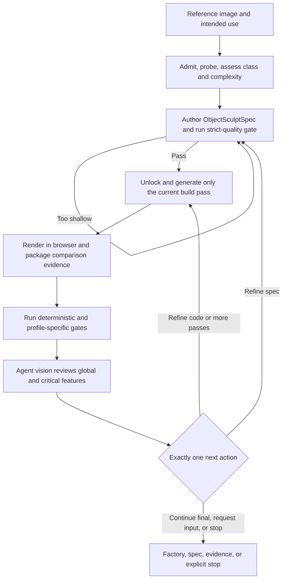

# img2threejs staged procedural reconstruction

| Evidence capsule | Value |
| --- | --- |
| Scope | Asset: image-to-code procedural Three.js reconstruction with staged visual gates |
| Trigger | An agent receives an admitted object or character reference and a requested procedural Three.js result |
| Source | The frozen [pipeline architecture](https://github.com/img2threejs/img2threejs/blob/d6673386f89673a58736f8d398dd16ece67874f5/docs/ARCHITECTURE.md#L7-L30) and [agent operating contract](https://github.com/img2threejs/img2threejs/blob/d6673386f89673a58736f8d398dd16ece67874f5/SKILL.md#L28-L48) |
| Author and evidence date | Hoài Nhớ and img2threejs contributors; frozen revision 2026-08-06; public Classic Fade artifact 2026-07-25; retrieved 2026-08-21 |
| Evidence signals | Source-documented; Author-practiced |
| Evidence limit | The public practice artifact records one author-run reconstruction and review history; it does not establish repeatability, independent validation, or general effectiveness. |

## Loop

## Run the loop

1. Admit and probe the reference, then have the agent classify the subject, measure complexity, and
   write the pre-spec quality contract. Optional masks, landmarks, depth evidence, and local search
   may support the assessment but do not decide geometry.
2. Author an `ObjectSculptSpec` containing the component tree, materials, attachments, action
   anchors, review targets, and evidence references. Strict-quality validation blocks a shallow or
   internally inconsistent spec before code generation.
3. Advance through the locked build order: blockout, structure, form, material, surface, lighting,
   interaction, and optimization. Generate only the currently unlocked TypeScript factory pass.
4. Render the actual browser route, save a screenshot, and package one reference/render comparison.
   Run Tier 1, multi-angle, structure, attachment, material, and profile-specific gates as applicable.
5. Agent vision reviews the comparison and every critical feature. It records exactly one of
   `continue`, `refine-spec`, `refine-code`, `request-input`, or `stop` in review history.
6. Revalidate after a spec correction, rebuild after a code correction, or advance only when the
   current pass has the required render, comparison, score, and feature evidence.

## Outputs and stop conditions

Successful output is a diffable `ObjectSculptSpec`, a TypeScript factory returning a named
`THREE.Group`, runtime nodes/sockets/colliders, and per-pass render evidence. Stop successfully after
the final accepted pass. Stop or request input when the reference cannot support the requested
fidelity, when a gate requires new evidence, or when the bounded correction limits fire.

## Supporting skills

**Observed:** agent image understanding, procedural Three.js and TypeScript, standard-library Python
gates, browser capture, comparison-sheet packaging, deterministic diagnostics, spec validation,
semantic feature review, and resumable JSON state.

**Potential (inference):** provenance attestation, review-diff summaries, cross-agent handoff checks,
and calibrated multi-model visual adjudication. These capabilities may not exist in the source.

## Evidence boundaries

The source explicitly separates deterministic enforcement from agent visual judgment: scripts do
not approve visual fidelity. A passing 2D gate is not proof of 3D realism, and one image cannot reveal
hidden geometry. The Classic Fade spec records the staged artifacts and pass decisions, but its
referenced screenshots are local paths rather than committed evidence images. Repository source is
Apache-2.0; user references, generated content, external tools, game assets, and platform data retain
their own rights and terms.

## Sources

- [Pipeline nodes, feedback edges, and build outputs](https://github.com/img2threejs/img2threejs/blob/d6673386f89673a58736f8d398dd16ece67874f5/docs/ARCHITECTURE.md#L7-L30)
- [Locked pass order, acceptance evidence, and resumable-state limit](https://github.com/img2threejs/img2threejs/blob/d6673386f89673a58736f8d398dd16ece67874f5/docs/ARCHITECTURE.md#L53-L78)
- [Scripts and resulting artifacts](https://github.com/img2threejs/img2threejs/blob/d6673386f89673a58736f8d398dd16ece67874f5/docs/ARCHITECTURE.md#L97-L135)
- [Classic Fade structured spec and review history](https://github.com/img2threejs/img2threejs-showcase/blob/bf44f8f1fdef70fcc87f91fc4e777fd760b9757f/src/demos/classic-fade/object-sculpt-spec.json#L6815-L6890)
- [Apache-2.0 notice](https://github.com/img2threejs/img2threejs/blob/d6673386f89673a58736f8d398dd16ece67874f5/LICENSE#L189-L200)
