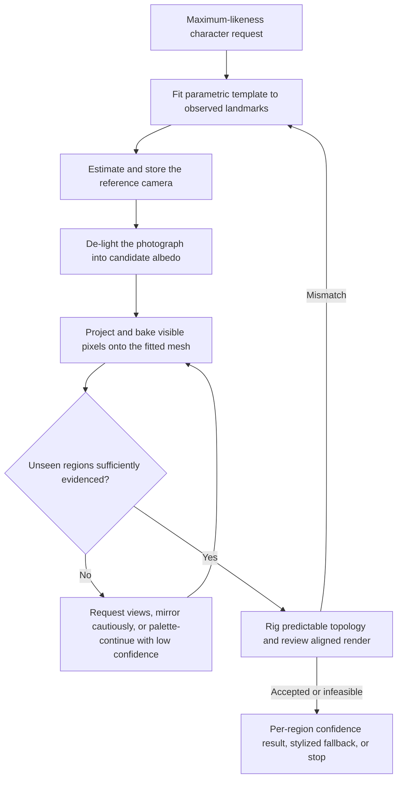

# img2threejs projection-first character likeness design

| Evidence capsule | Value |
| --- | --- |
| Scope | Asset design: single-image parametric character fitting and projected-texture likeness |
| Trigger | A user requests maximum resemblance to a specific person or character rather than an accepted stylized approximation |
| Source | The frozen [projection-first pipeline reference](https://github.com/img2threejs/img2threejs/blob/d6673386f89673a58736f8d398dd16ece67874f5/grimoire/character/likeness_maximization.md#L1-L17) |
| Author and evidence date | hoainho and img2threejs contributors; source artifact 2026-07-20; frozen revision 2026-08-06; retrieved 2026-08-21 |
| Evidence signals | Source-documented |
| Evidence limit | This is a source-documented design: the repository states that the projection path is not wired and its camera, de-light, and bake scripts are approximations or descriptors. |

## Loop

## Run the loop

1. Extract landmarks and fit a code-generated humanoid/face template by minimizing landmark
   reprojection error for shape, pose, and expression parameters.
2. Solve focal length, field of view, and orientation so the review image and projected texture use
   the same reference camera.
3. Remove baked illumination before treating photo pixels as albedo. Derive roughness, normal, and AO
   independently rather than reusing the colour image.
4. Project the de-lit reference from the matched camera and bake the visible result into UVs.
5. Prefer additional front/side/back views for hidden regions. Otherwise mirror only where valid or
   continue the nearest palette, recording the strategy and lower confidence per region.
6. Rig predictable topology with a skeleton and expression morphs, then compare the matched-camera
   render. Repeat fitting when observed regions disagree, or offer the stylized route when the input
   cannot support the target.

## Outputs and stop conditions

The intended outputs are fitted template parameters, `referenceCamera`, neutralized albedo, projected
UV texture, per-region provenance/confidence, a rigged procedural character, and aligned review
evidence. Stop on accepted regional evidence, request more views for material uncertainty, or stop
with an explicit limitation or stylized fallback. Never output a guaranteed 100-percent match.

## Supporting skills

**Observed:** agent-assisted landmarks, parametric human models, reprojection fitting, camera solving,
de-lighting, projective texturing, UV baking, Three.js shaders, confidence annotation, skeletons, and
morph targets.

**Potential (inference):** differentiable rendering, learned de-lighting, multi-view bundle adjustment,
identity-safe consent tracking, and calibrated likeness evaluation. These may not exist in the source.

## Evidence boundaries

The design cannot recover unobserved backs, occluded geometry, or true skin and hair microstructure.
The source's optional generative-assist route breaks the code-only boundary and has separate model and
asset terms. More importantly, the frozen upgrade plan explicitly says projection-first integration
remains future work and the included scripts are approximations; this page therefore documents the
authored route, not a shipped end-to-end capability or measured likeness result.

## Sources

- [Template fit, camera match, de-light, and projection stages](https://github.com/img2threejs/img2threejs/blob/d6673386f89673a58736f8d398dd16ece67874f5/grimoire/character/likeness_maximization.md#L11-L35)
- [Hidden-region routing, rigging, and honesty rule](https://github.com/img2threejs/img2threejs/blob/d6673386f89673a58736f8d398dd16ece67874f5/grimoire/character/likeness_maximization.md#L36-L58)
- [Character suitability and stylized fallback](https://github.com/img2threejs/img2threejs/blob/d6673386f89673a58736f8d398dd16ece67874f5/grimoire/intake/validation_rubric.md#L30-L42)
- [Not-yet-wired implementation boundary](https://github.com/img2threejs/img2threejs/blob/d6673386f89673a58736f8d398dd16ece67874f5/docs/UPGRADE_PLAN.md#L6-L25)
