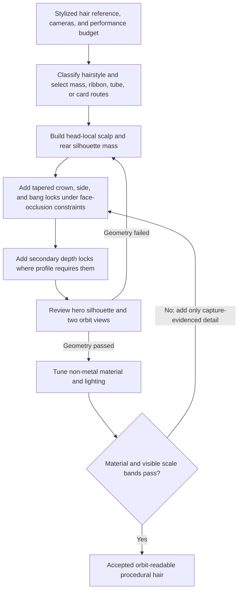

# img2threejs stylized procedural hair design

| Evidence capsule | Value |
| --- | --- |
| Scope | Asset design: code-only stylized character hair for Three.js WebGL |
| Trigger | A character reference requires broad, orbit-readable hair masses rather than strand-level grooming |
| Source | The frozen [stylized-hair design](https://github.com/img2threejs/img2threejs/blob/d6673386f89673a58736f8d398dd16ece67874f5/grimoire/character/stylized_hair_threejs.md#L1-L26) |
| Author and evidence date | Hoài Nhớ and img2threejs contributors; frozen local distillation 2026-08-06; retrieved 2026-08-21 |
| Evidence signals | Source-documented |
| Evidence limit | The document labels itself a local distillation requiring refresh, and its ordered implementation section is a backlog rather than evidence of the complete route running. |

## Loop

## Run the loop

1. Classify the reference into clustered locks, ribbons, tubes, cards, shells, or strands and select a
   hybrid route that preserves the observed silhouette and runtime constraint.
2. Build a hidden scalp/crown mass, then rear depth locks, primary tapered ribbon-loft crown locks,
   side locks, and bangs. Embed every root and keep both eye centres and profile clearance readable.
3. Use stable centerline frames, changing width/thickness, closed tips, controlled twist, and
   head-local deterministic parameters. Add rounded secondary locks only where the orbit needs depth.
4. Save and reopen a fixed hero plus positive/negative orbit captures. Review crown silhouette,
   spacing, bang/eye clearance, root continuity, taper, rear attachment, and profile depth as semantic
   features rather than one global score.
5. Correct geometry before tuning a warm non-metal hair material. Add cards or instanced wisps only
   when a screenshot demonstrates that a micro scale band is missing.

## Outputs and stop conditions

The intended outputs are a head-local parameter artifact, scalp mass, primary/secondary lock
geometry, material variants, review cameras, captures, and semantic decision. Stop when hero and orbit
geometry plus material checks pass; repeat on detached roots, occluded eyes, hollow profile, flat
cards, incorrect silhouette, or misleading foreground segmentation.

## Supporting skills

**Observed:** agent hairstyle classification, Catmull-Rom curves, custom `BufferGeometry`, ribbon
lofts, tube geometry, stable frames, UVs/normals, deterministic parameters, Three.js physical
materials, browser screenshots, visible-footprint review, and semantic feature gates.

**Potential (inference):** procedural lock fitting, collision-aware bang placement, tangent-highlight
shaders, and view-adaptive hair LOD. These capabilities may not exist in the source.

## Evidence boundaries

The selected counts and profiles are starting ranges for one Zenonia case, not universal constants.
Hidden topology and exact strand count are inferred. The source explicitly says its NotebookLM answer
could not be retrieved and should be refreshed before final research publication. A backlog describes
what to implement but does not prove that the custom ribbon factory, constraints, and full review loop
exist in the frozen repository.

## Sources

- [Provenance, incomplete distillation, and route requirements](https://github.com/img2threejs/img2threejs/blob/d6673386f89673a58736f8d398dd16ece67874f5/grimoire/character/stylized_hair_threejs.md#L7-L26)
- [Selected hybrid route and observed/inferred boundaries](https://github.com/img2threejs/img2threejs/blob/d6673386f89673a58736f8d398dd16ece67874f5/grimoire/character/stylized_hair_threejs.md#L78-L107)
- [Build order and geometry/material boundary](https://github.com/img2threejs/img2threejs/blob/d6673386f89673a58736f8d398dd16ece67874f5/grimoire/character/stylized_hair_threejs.md#L109-L147)
- [Parameter contract and screenshot fitting](https://github.com/img2threejs/img2threejs/blob/d6673386f89673a58736f8d398dd16ece67874f5/grimoire/character/stylized_hair_threejs.md#L149-L173)
- [Acceptance, diagnosis, and implementation backlog](https://github.com/img2threejs/img2threejs/blob/d6673386f89673a58736f8d398dd16ece67874f5/grimoire/character/stylized_hair_threejs.md#L175-L213)
