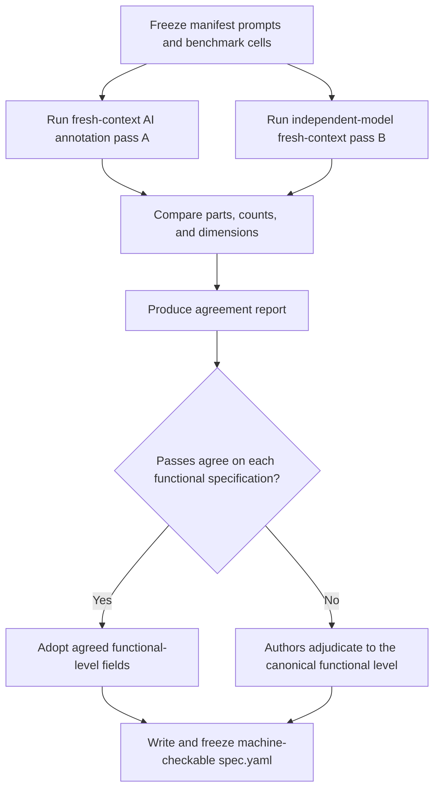

# Nova3D-Bench dual-pass specification freeze

| Evidence capsule | Value |
| --- | --- |
| Scope | Verification: creating auditable, frozen functional-part and constraint ground truth |
| Trigger | A fixed benchmark manifest of prompts needs machine-checkable part, count, joint, symmetry, and dimension specifications |
| Source | Noor et al.'s [Nova3D-Bench freeze protocol](https://arxiv.org/html/2607.22738v1#S4.SS1) |
| Author and evidence date | Nimra Noor, Muhammad Bilal, Abdullah Hussain, and Hassan Baig; paper v1 2026-07-22, retrieved 2026-08-21 |
| Evidence signals | Source-documented; Study-observed |
| Evidence limit | Annotation is AI-assisted and author-adjudicated with no independent human annotation; reported agreement does not establish correctness outside the frozen 54 items. |

## Loop

## Run the loop

1. Define the domain-by-difficulty cells and manifest prompts before evaluation. Each item will need
   machine-checkable parts/counts, expected joints, symmetry, and explicit dimension recipes.
2. Run annotation pass A and a fresh-context pass B with a different model. Keep the passes
   independent rather than letting the second see the first.
3. Compare part sets, counts, and dimensions and publish their agreement report. The study reports
   mean part F1 0.79, count agreement 0.93, and dimension agreement 0.90.
4. Adopt agreements and have authors adjudicate disagreements to one canonical functional-part
   level. Record measure recipes and tolerances needed for deterministic scoring.
5. Write `spec.yaml` and freeze it. Do not revise an item or specification after seeing model
   failures; failures remain in the result set.

## Outputs and stop conditions

Output is a frozen machine-checkable specification per benchmark item plus a cross-pass agreement
report and author-adjudicated canonical labels. Stop when all manifest items have frozen specs. The
post-freeze rule is the terminal gate: results cannot feed back into ground-truth changes.

## Supporting skills

**Observed:** two different AI annotation models in fresh contexts, functional-part decomposition,
agreement metrics, author adjudication, constraint measurement recipes, YAML specifications, and a
frozen benchmark manifest.

**Potential (inference):** adjudication-diff tooling, schema validation, annotation provenance,
leakage audits, and independent expert review.

## Evidence boundaries

The paper explicitly disclaims independent human annotation. The six domains, three levels, synthetic
references, and 54 items bound the protocol's demonstrated use. Agreement measures consistency, not
truth; author adjudication can preserve shared bias. Paper text is CC BY-NC-SA 4.0, while repository
clients use MIT and benchmark assets may have their own terms.

## Sources

- [Benchmark composition and machine-checkable specification](https://arxiv.org/html/2607.22738v1#S4.SS1)
- [Freeze diagram, agreement report, adjudication, and no-post-freeze rule](https://arxiv.org/html/2607.22738v1#S4.SS1)
- [Study limitations](https://arxiv.org/html/2607.22738v1#S13)
