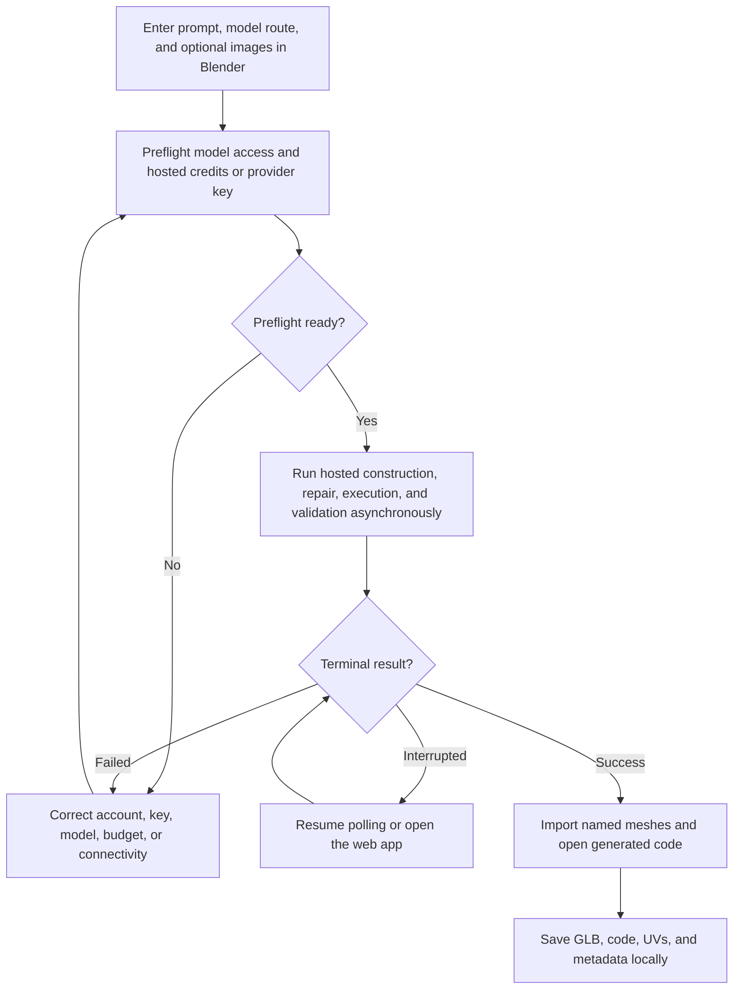

# Nova3D Blender add-on generation and local import

| Evidence capsule | Value |
| --- | --- |
| Scope | Asset: asynchronous code-native generation delivered into an active Blender scene |
| Trigger | A signed-in Blender user supplies a prompt, hosted or direct-key model, and up to three optional images |
| Source | RareSense's [Blender add-on generation guide](https://github.com/RareSense/Nova3D/blob/2299e02d57e513966afaa8cfcc510e8c01110dd7/blender-plugin/README.md#L47-L70) |
| Author and evidence date | RareSense contributors; source revision 2026-08-12, retrieved 2026-08-21 |
| Evidence signals | Source-documented |
| Evidence limit | The source includes interface screenshots, a release, and general repository demos, but no retained output ties a complete generation to this exact add-on workflow or establishes reliability across advertised Blender versions. |

## Loop

## Run the loop

1. In the add-on panel, enter the desired object, choose hosted credits or connect an Anthropic/OpenAI
   key, select an available model, and attach up to three references.
2. Let the add-on make its model-access preflight and, for hosted use, obtain the current price and
   available balance. Correct rejected keys, disabled models, exhausted credits, or spend limits
   before starting.
3. Start generation. The hosted workflow uses the same prompt construction, Blender execution,
   repair loop, and final validation for hosted and provider-key routes while Blender remains usable.
4. If Blender detaches or closes, preserve the backend pointer and resume polling or open the web
   app; detaching does not cancel the backend. Retry an unreachable client after connectivity returns.
5. On success, import named, separately editable meshes into the viewport, open `code.py` in the Text
   Editor, switch to material preview, and save `model.glb`, `code.py`, UV output, and `meta.json`.

## Outputs and stop conditions

Output is an imported Blender asset plus local GLB, executable construction code, UV artifacts, and
metadata. Stop at a validated successful import and complete local save. A detached waiter stops only
the local wait, not the backend; a terminal failure stops with its account/provider/workflow message.

## Supporting skills

**Observed:** Blender 3.6–5.x UI, Nova3D hosted and provider-key workflows, asynchronous polling,
backend repair/validation, GLB import, named mesh/hierarchy handling, Text Editor integration, UV
derivation, local artifact saving, and resumable pointers.

**Potential (inference):** post-import hierarchy checks, Blender undo checkpoints, scene-collection
isolation, local hash manifests, and viewport acceptance captures.

## Evidence boundaries

The add-on delegates generation to a proprietary service and a successful model-access preflight
does not guarantee sufficient balance for an unusually long run. Documentation says Blender 3.6–5.x
and reports testing on 5.1; that is not a compatibility study. MIT covers the add-on source, while
service use, provider models, references, and generated output are separately governed.

## Sources

- [Inputs, route preflight, generation, and local outputs](https://github.com/RareSense/Nova3D/blob/2299e02d57e513966afaa8cfcc510e8c01110dd7/blender-plugin/README.md#L47-L70)
- [Shared repair/validation and provider boundary](https://github.com/RareSense/Nova3D/blob/2299e02d57e513966afaa8cfcc510e8c01110dd7/blender-plugin/README.md#L72-L88)
- [Interruption, resume, and unreachable behavior](https://github.com/RareSense/Nova3D/blob/2299e02d57e513966afaa8cfcc510e8c01110dd7/blender-plugin/README.md#L89-L104)
- [Repository demonstrations](https://github.com/RareSense/Nova3D/blob/2299e02d57e513966afaa8cfcc510e8c01110dd7/README.md#L46-L104)
- [MIT license](https://github.com/RareSense/Nova3D/blob/2299e02d57e513966afaa8cfcc510e8c01110dd7/LICENSE)
