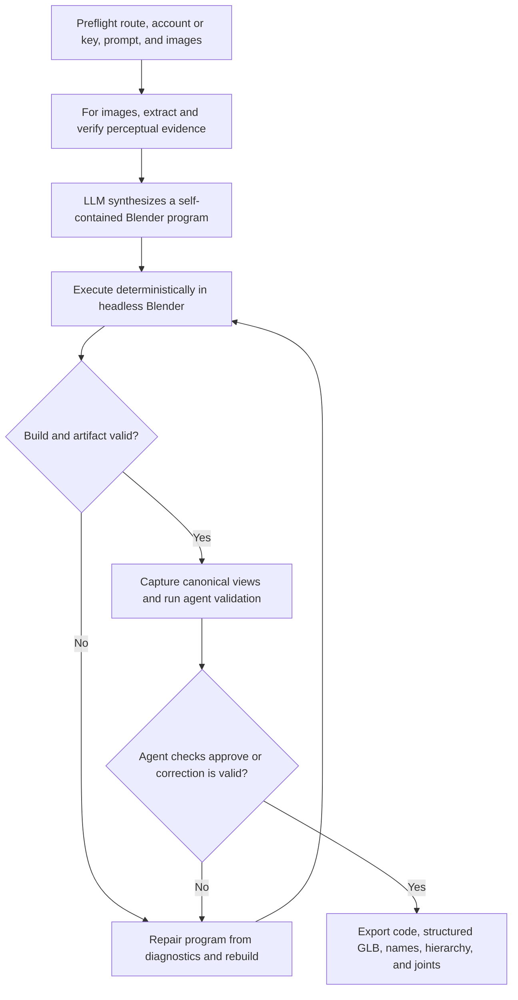

# Nova3D code-native generation, repair, and validation

| Evidence capsule | Value |
| --- | --- |
| Scope | Asset: text- or image-conditioned Blender program synthesis and structured GLB export |
| Trigger | A ready paid or provider-key workflow receives a bounded text prompt, optional reference images, and a selected model route |
| Source | Noor et al.'s [Nova3D method](https://arxiv.org/html/2607.22738v1#S3) and the frozen client's [v2 integration contract](https://github.com/RareSense/Nova3D/blob/2299e02d57e513966afaa8cfcc510e8c01110dd7/app/sketch_to_3d_v2_frontend_integration.md) |
| Author and evidence date | Nimra Noor, Muhammad Bilal, Abdullah Hussain, and Hassan Baig; paper v1 2026-07-22; client revision 2026-08-12; retrieved 2026-08-21 |
| Evidence signals | Source-documented; Author-practiced; Study-observed |
| Evidence limit | The 54-item study is author-conducted, uses AI-assisted author-adjudicated ground truth, and does not expose the proprietary hosted backend for independent inspection. |

## Loop

## Run the loop

1. Choose the current paid-credit or provider-key v2 route. Check workflow readiness; paid runs also
   estimate and verify credits, while provider-key runs verify the saved key. Enforce the client's
   prompt and image bounds before starting.
2. For image input, derive geometric priors and visual features, sample appearance evidence, and
   reject inconsistent palette outliers. Text-only requests enter at synthesis.
3. Use the selected frontier model and representation doctrine to write a self-contained Blender
   Python program with named parts, hierarchy, pivots, materials, and constraint-bearing constants.
4. Execute in headless Blender. Feed syntax, API, or construction diagnostics to the repair model and
   re-execute. The paper caps repair at three iterations and returns the best successful intermediate
   when the budget is exhausted.
5. Capture canonical renders and have checker agents assess shape, scale, and part coverage. Rebuild
   on mismatch. A deterministic guard rejects a correction that shrinks source excessively, drops
   hierarchy, or loses the entry point.
6. Return the latest valid or validated-correction result, including `code_artifact`, GLB/model
   artifact, names, hierarchy, and joints. The client polls terminal state and preserves an exact
   retry request on failure.

## Outputs and stop conditions

Successful output is executable `code.py` plus a structured `model.glb` with named meshes and groups,
hierarchy, pivots/joints, materials, and client artifacts. Stop when agent validation approves or a
guarded correction is valid. At exhausted repair budget, return the best valid intermediate when one
exists; otherwise emit a categorized failure and enable a new request.

## Supporting skills

**Observed:** frontier LLMs, image caption/perception, depth/normal/edge priors, evidence sampling,
Blender Python, headless deterministic execution, diagnostic repair, canonical rendering,
vision-capable checker agents, GraphFlow state polling, and structured artifact parsing.

**Potential (inference):** constraint-aware prompt linting, repair-diff inspection, agent-verdict
consensus, geometry telemetry, and reproducible artifact attestation.

## Evidence boundaries

The public repository contains clients and integrations, not the hosted generation implementation.
The paper's system description and July study can differ from the August client/backend revision.
Its reported 54/54 validity is bounded to the frozen benchmark, fixed configuration, and at most three
repairs; it is not independent validation or a guarantee for new prompts. MIT covers the clients;
the proprietary service, model providers, references, and generated content have separate terms.

## Sources

- [Method overview and pipeline figure](https://arxiv.org/html/2607.22738v1#S3)
- [Perception, synthesis, execution, checking, repair, and stop](https://arxiv.org/html/2607.22738v1#S3.SS3)
- [Representation guard and fallback](https://arxiv.org/html/2607.22738v1#S3.SS4)
- [Current v2 routing and preflights](https://github.com/RareSense/Nova3D/blob/2299e02d57e513966afaa8cfcc510e8c01110dd7/app/sketch_to_3d_v2_frontend_integration.md#L12-L27)
- [Current node order, polling, and terminal states](https://github.com/RareSense/Nova3D/blob/2299e02d57e513966afaa8cfcc510e8c01110dd7/app/sketch_to_3d_v2_frontend_integration.md#L379-L520)
- [Failure, retry, and acceptance cases](https://github.com/RareSense/Nova3D/blob/2299e02d57e513966afaa8cfcc510e8c01110dd7/app/sketch_to_3d_v2_frontend_integration.md#L598-L733)
- [Study results and limits](https://arxiv.org/html/2607.22738v1#S5)
- [Repository/backend and license boundary](https://github.com/RareSense/Nova3D/blob/2299e02d57e513966afaa8cfcc510e8c01110dd7/README.md#L24-L44)
