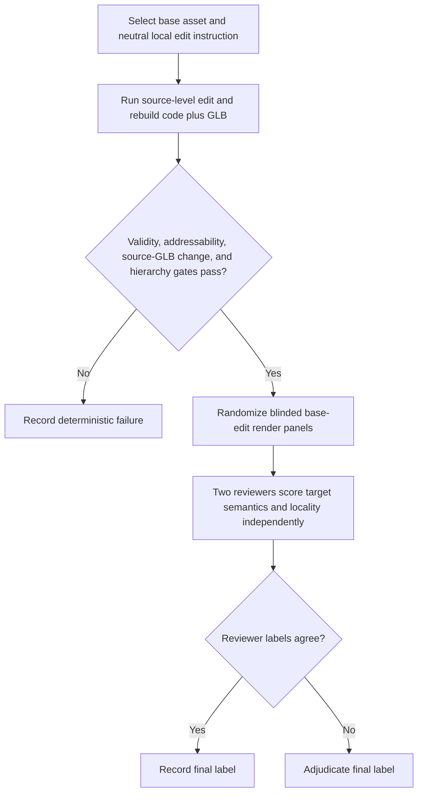

# Nova3D local-edit evaluation

| Evidence capsule | Value |
| --- | --- |
| Scope | Verification: testing whether a source-level AI edit changes its target while preserving the rest of a structured asset |
| Trigger | A generated code-native asset and one neutral additive or modification instruction are selected for evaluation |
| Source | Noor et al.'s [local-edit protocol](https://arxiv.org/html/2607.22738v1#S9) |
| Author and evidence date | Nimra Noor, Muhammad Bilal, Abdullah Hussain, and Hassan Baig; paper v1 2026-07-22, retrieved 2026-08-21 |
| Evidence signals | Source-documented; Study-observed |
| Evidence limit | The 18-asset case study uses two project-team reviewers and author adjudication, not external raters or a statistical benchmark against other edit systems. |

## Loop

## Run the loop

1. Select a stratified generated asset and one neutral instruction that either adds a part or modifies
   an existing one. Run Nova3D's source-level edit and compile edited `code.py` and `model.glb`.
2. Apply deterministic gates for artifact validity, target addressability, actual source/GLB change,
   and hierarchy preservation. Preserve gate failures as failures rather than hiding them from counts.
3. For gated outputs, prepare randomized base/edit render panels that conceal gate outcomes, run
   metadata, and the other reviewer's labels. Show only the edit instruction and the two panels.
4. Have two reviewers independently score target fulfillment, target anchor and scale, non-target
   preservation, locality, and overall pass.
5. Keep agreed labels; adjudicate disagreements to a final label. Report agreement and chance-
   corrected kappa separately from the adjudicated success rate.

## Outputs and stop conditions

Output is deterministic gate evidence, two blinded review records, an adjudicated final label, and
aggregate target/locality agreement measures. Stop at deterministic failure or final adjudication.
The source study reports 14/18 overall passes and 18/18 non-target/locality preservation; those are
observations, not acceptance promises for new edits.

## Supporting skills

**Observed:** Nova3D source-level LLM editing, deterministic Blender/GLB gates, hierarchy checks,
randomized render panels, two blinded project-team reviewers, adjudication, agreement percentages,
and Cohen's kappa.

**Potential (inference):** external-rater replication, edit-diff visualization, target masks,
pre-registered failure taxonomies, and larger cross-system edit benchmarks.

## Evidence boundaries

Reviewers were project-team members, the case study has 18 assets, and no baseline leaderboard is
reported. Blinding hides run details and other labels but not the edit instruction or base/edit pair.
The study supports locality more strongly than small-target semantic accuracy. Paper text is CC
BY-NC-SA 4.0; the client is MIT and generated inputs/outputs can carry separate terms.

## Sources

- [Code-native edit input and source-of-truth contract](https://arxiv.org/html/2607.22738v1#S3.SS1)
- [Local-edit deterministic and blinded-review protocol](https://arxiv.org/html/2607.22738v1#S9)
- [Observed outcomes and reviewer agreement](https://arxiv.org/html/2607.22738v1#S9)
- [Case-study and reviewer limitations](https://arxiv.org/html/2607.22738v1#S13)
