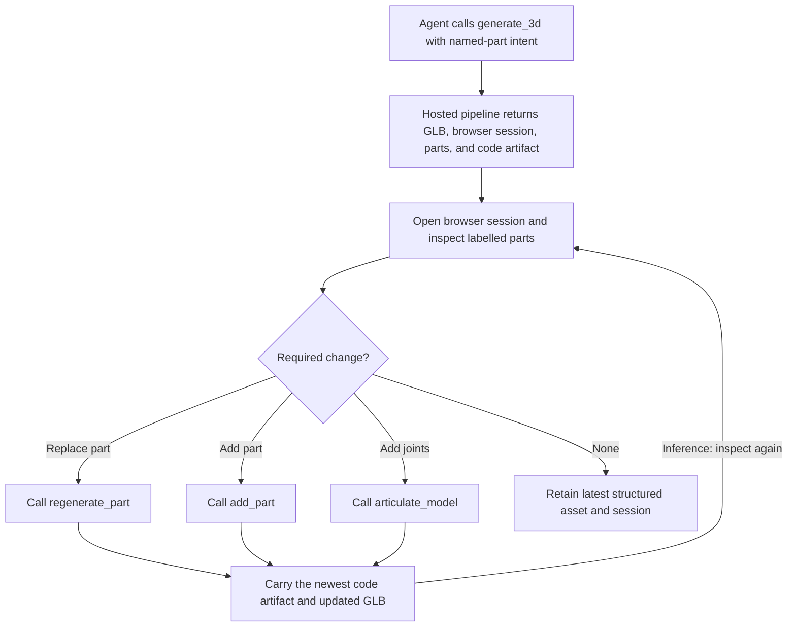

# Nova3D MCP part-aware generation and refinement

| Evidence capsule | Value |
| --- | --- |
| Scope | Asset: agent-driven structured generation, browser inspection, local part edits, and articulation |
| Trigger | An authenticated, credit-ready MCP client agent receives a structured 3D-asset request |
| Source | RareSense's [MCP typical workflow](https://github.com/RareSense/Nova3D/blob/2299e02d57e513966afaa8cfcc510e8c01110dd7/mcp/README.md#L364-L383) |
| Author and evidence date | RareSense contributors; source revision 2026-08-12, retrieved 2026-08-21 |
| Evidence signals | Source-documented |
| Evidence limit | Public demonstrations show general structured assets, edits, and articulation, but do not establish that the authors ran this exact MCP-client sequence or measured its edit-success rate. |

## Loop

## Run the loop

1. After onboarding reports `authenticated: true` and `generation_ready: true`, have the agent call
   `generate_3d` with explicit desired parts and optional image/model selection.
2. Retain the GLB URL, conversation URL, named parts, joint count, model artifact, workflow id, and
   especially the returned `code_artifact`.
3. Open the conversation URL in the hosted viewer and inspect the named meshes. Use exact part names
   for targeted replacement.
4. Choose a source-level edit: regenerate one named part, add a described component, or add
   articulation to selected meshes. Pass the most recent code artifact, plus current model URL or
   model artifact where articulation requires it.
5. Carry forward the updated code artifact and GLB after every edit. Reopening the same browser
   session and repeating inspection is editorial inference; the source explicitly provides the
   persistent session and newest-artifact rule but presents its sample edits linearly.

## Outputs and stop conditions

Output is the latest structured GLB, executable code artifact, named-parts list, joints/articulation
data, workflow id, and hydrated conversation history. Stop when inspection finds no required change.
If a call is still running, stop refinement and query status by workflow id rather than issuing an
edit against stale state.

## Supporting skills

**Observed:** an MCP-compatible coding agent, Nova3D GraphFlow generation, hosted 3D viewer,
`generate_3d`, `regenerate_part`, `add_part`, `articulate_model`, status polling, and versioned code
artifacts.

**Potential (inference):** part-diff review, session checkpoints, joint-limit inspection, edit-intent
tests, and artifact lineage visualization.

## Evidence boundaries

The MCP server exposes paid hosted generation only, not provider-key initial generation, and model
inspection requires the browser viewer. The local repository does not expose the proprietary backend.
The loop must use the newest artifact or edits can fork stale state. The MCP/client code is MIT;
hosted-service, provider, reference, and output terms remain separate.

## Sources

- [Code-native hosted pipeline and viewer boundary](https://github.com/RareSense/Nova3D/blob/2299e02d57e513966afaa8cfcc510e8c01110dd7/mcp/README.md#L32-L69)
- [Initial generation contract](https://github.com/RareSense/Nova3D/blob/2299e02d57e513966afaa8cfcc510e8c01110dd7/mcp/README.md#L271-L284)
- [Part replacement, addition, and articulation contracts](https://github.com/RareSense/Nova3D/blob/2299e02d57e513966afaa8cfcc510e8c01110dd7/mcp/README.md#L288-L338)
- [Typical refinement workflow and newest-artifact rule](https://github.com/RareSense/Nova3D/blob/2299e02d57e513966afaa8cfcc510e8c01110dd7/mcp/README.md#L364-L383)
- [Generated-asset, edit, and articulation demonstrations](https://github.com/RareSense/Nova3D/blob/2299e02d57e513966afaa8cfcc510e8c01110dd7/README.md#L46-L104)
- [MCP MIT license](https://github.com/RareSense/Nova3D/blob/2299e02d57e513966afaa8cfcc510e8c01110dd7/mcp/LICENSE)
