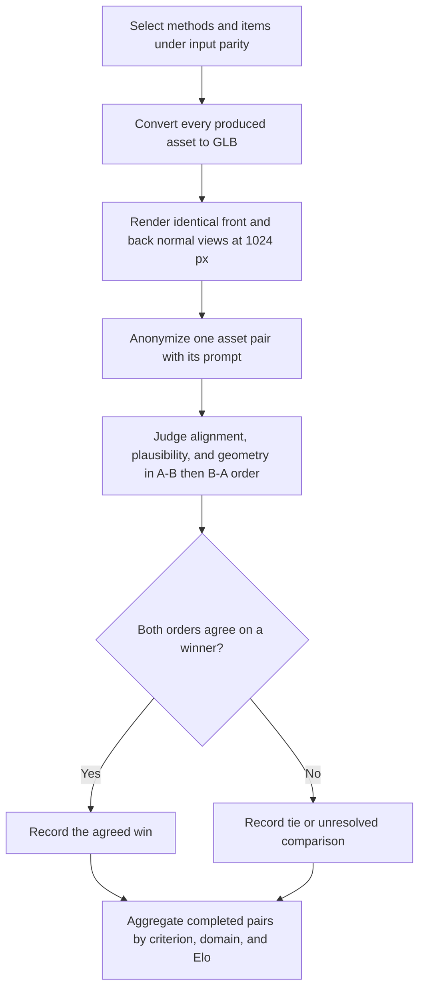

# Nova3D bidirectional VLM shape evaluation

| Evidence capsule | Value |
| --- | --- |
| Scope | Verification: prompt-grounded pairwise shape comparison across generated 3D systems |
| Trigger | Comparable generated assets and prompts are available under a declared input-parity policy |
| Source | Noor et al.'s [perceptual geometry protocol](https://arxiv.org/html/2607.22738v1#S6.SS1) |
| Author and evidence date | Nimra Noor, Muhammad Bilal, Abdullah Hussain, and Hassan Baig; paper v1 2026-07-22, retrieved 2026-08-21 |
| Evidence signals | Source-documented; Study-observed |
| Evidence limit | The author-run study uses GPT-4o over only front/back normal renders; that judge setup is not independently human-validated for this input type. |

## Loop

## Run the loop

1. Apply input parity: no baseline receives more conditioning than Nova3D for the item, and methods
   run only on supported modalities.
2. Convert each produced asset to GLB, normalize scale, and render it through one headless scene with
   identical camera and lighting. Use tight-cropped, texture-free front and back surface-normal views
   at 1024 px to isolate shape.
3. Anonymize a pair and ask GPT-4o to compare it against the prompt for alignment, structural
   plausibility, and geometric quality.
4. Swap A/B order and repeat the same judgment. Count a win only when both orders agree; otherwise
   retain the comparison as tie/unresolved rather than choosing one order.
5. After every planned pair completes, aggregate criterion and domain rates and a Bradley-Terry Elo
   ranking. Keep textured/as-delivered comparison as a separate track.

## Outputs and stop conditions

Output is two order-controlled verdicts per pair, a resolved win/tie/loss record, and criterion,
domain, opponent, and Elo aggregates. Stop after the fixed comparison matrix completes; the reported
study ran 324 pairs and 648 judgments. Do not interpret this track as texture quality or editability.

## Supporting skills

**Observed:** modality/input-parity design, GLB conversion, a shared headless render scene,
surface-normal rendering, anonymization, GPT-4o pairwise judging, A/B order reversal, and
Bradley-Terry aggregation.

**Potential (inference):** judge calibration sets, human spot-check panels, additional view coverage,
order-bias dashboards, and confidence intervals by prompt family.

## Evidence boundaries

Normal renders omit texture and show only two views. The VLM judge follows GPTEval3D but the paper
states it is not human-validated specifically for normal-render inputs. Baselines have different
native modalities and item counts, so not all aggregates share the same sample. The source makes no
state-of-the-art claim. Paper text is CC BY-NC-SA 4.0; generated assets retain separate terms.

## Sources

- [Input-parity and common-render controls](https://arxiv.org/html/2607.22738v1#S4.SS2)
- [Pairwise normal-render and bidirectional judgment protocol](https://arxiv.org/html/2607.22738v1#S6.SS1)
- [Separate textured track](https://arxiv.org/html/2607.22738v1#S6.SS2)
- [Judge and view limitations](https://arxiv.org/html/2607.22738v1#S13)
