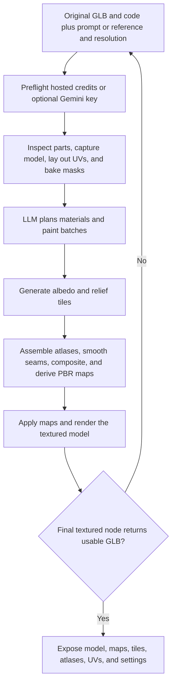

# Nova3D PBR texture generation and application

| Evidence capsule | Value |
| --- | --- |
| Scope | Asset: AI-planned and painted PBR textures applied to an existing generated model |
| Trigger | An original Nova3D generation has both GLB and code artifacts, and a user supplies material intent or a reference image |
| Source | RareSense's [`texture_3d_v2` client contract](https://github.com/RareSense/Nova3D/blob/2299e02d57e513966afaa8cfcc510e8c01110dd7/app/lib/features/cad/data/cad_service.dart#L595-L695) |
| Author and evidence date | RareSense contributors; source revision 2026-08-12, retrieved 2026-08-21 |
| Evidence signals | Source-documented |
| Evidence limit | Public examples show textured Nova3D outputs, but do not tie those outputs to this exact post-generation client flow; the hosted workflow is proprietary and has no independent visual acceptance study. |

## Loop

## Run the loop

1. Use the original generation's GLB and code artifacts, never an AI-edited or articulated
   derivative. Collect optional material intent/reference, 1K/2K/4K output choice, and optional
   Gemini key.
2. For keyless hosted work, clear the credit estimate and balance gate; a caller key uses provider
   billing. Start one in-flight texture run per source asset.
3. The workflow reads part groups, captures beauty and id views, prepares UV atlases, and bakes masks.
   An LLM creates the material and paint-batch plan.
4. Generate albedo and relief tiles, assemble atlases, bake seams, composite texture, derive albedo,
   normal, roughness, metallic, AO, and height maps, apply them, and capture the final model.
5. Poll terminal state and fetch the result. A stage-specific failure from planning, painting, baking,
   PBR derivation, or application ends that run. The client removes its per-source guard after either
   outcome, so the user may submit a new texture request.

## Outputs and stop conditions

Success yields a textured GLB; six PBR maps; albedo and relief tiles; painted/relief atlases; UV
layout, labels, SVG, and wireframe; plus reproducible settings. Stop only when `final_textured`
contains a usable GLB. Failure stops with the most specific stage message; no new construction
program is emitted, so the original code remains the source artifact.

## Supporting skills

**Observed:** Gemini or hosted provider routing, part/material grouping, model capture, UV layout,
mask baking, LLM material planning, image painting, relief generation, atlas assembly, seam baking,
PBR derivation, GraphFlow polling, and artifact download packaging.

**Potential (inference):** seam heatmaps, material-reference comparison, texel-density checks,
channel-range validation, and in-engine material review.

## Evidence boundaries

The public client exposes node order, contracts, and failures but not proprietary server code. The
default image route can upscale 1K paint into a larger atlas; true 2K/4K calls require the explicit
pro tier and greater cost. The workflow targets only original geometry and has no documented visual
approval gate after success. MIT covers the client, not service/model/reference/output terms.

## Sources

- [Input and resolution contract](https://github.com/RareSense/Nova3D/blob/2299e02d57e513966afaa8cfcc510e8c01110dd7/app/lib/features/cad/models/texture_request.dart#L1-L84)
- [Start, failure nodes, polling, and terminal result](https://github.com/RareSense/Nova3D/blob/2299e02d57e513966afaa8cfcc510e8c01110dd7/app/lib/features/cad/data/cad_service.dart#L595-L695)
- [Ordered texture stages](https://github.com/RareSense/Nova3D/blob/2299e02d57e513966afaa8cfcc510e8c01110dd7/app/lib/features/cad/models/cad_models.dart#L217-L240)
- [Result artifacts and stage-specific failure parsing](https://github.com/RareSense/Nova3D/blob/2299e02d57e513966afaa8cfcc510e8c01110dd7/app/lib/features/cad/models/texture_result.dart#L51-L119)
- [Run, retry availability, and original-geometry boundary](https://github.com/RareSense/Nova3D/blob/2299e02d57e513966afaa8cfcc510e8c01110dd7/app/lib/features/chat/state/chat_provider.dart#L1024-L1076)
- [Textured demonstrations](https://github.com/RareSense/Nova3D/blob/2299e02d57e513966afaa8cfcc510e8c01110dd7/README.md#L46-L72)
