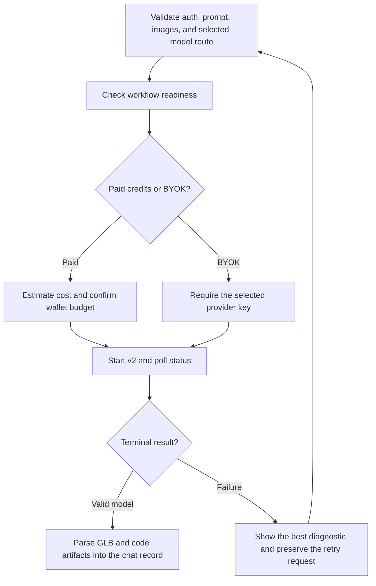

# Nova3D web-client paid or BYOK generation

| Evidence capsule | Value |
| --- | --- |
| Scope | Asset: preflighting, starting, monitoring, and retaining a hosted code-native 3D generation from the Flutter client |
| Trigger | A signed-in user submits a bounded prompt or reference images and selects either a paid-credit or saved-provider-key model route |
| Source | RareSense's [v2 frontend integration sheet](https://github.com/RareSense/Nova3D/blob/2299e02d57e513966afaa8cfcc510e8c01110dd7/app/sketch_to_3d_v2_frontend_integration.md#L1-L28) |
| Author and evidence date | RareSense contributor nemoooooooooo; source 2026-06-24, revision and retrieval 2026-08-21 |
| Evidence signals | Source-documented |
| Evidence limit | The open repository exposes the client contract and implementation points, not the proprietary GraphFlow generation backend, its repair prompts, model guarantees, or a retained request/result trace for this exact v2 flow. |

## Loop

## Run the loop

1. Require an auth token, a prompt of at most 40 words or an image-only request, no more than three
   source images, and a model selection. Resize images whose longest side exceeds 512 pixels and
   encode them as data URLs.
2. Select `sketch_to_3d_v2` for a paid-credit model or `sketch_to_3d_byok_v2` for a saved provider
   key, then call that workflow's readiness endpoint. Stop on auth or service unavailability.
3. For paid generation, obtain a credit estimate and wallet balance and block before start when the
   authorized budget is unavailable. For BYOK, skip Nova3D credit checks and require the matching
   locally saved provider key.
4. Start the selected v2 workflow with its route-specific payload and requested terminal nodes.
   Poll every three seconds. Continue through documented transient 404 and service errors, and keep
   polling after a start receive timeout because the workflow may already exist.
5. At terminal status, fetch the result. Prefer a validated-correction result, then the latest valid
   result, and extract the GLB/model and newest code artifact into the chat record.
6. On failure, display the most specific backend/tool message, preserve the original request for
   retry, and return to preflight after the user corrects auth, balance, provider key, quota, input,
   or another named cause.

## Outputs and stop conditions

Successful output is a finalized chat record containing model URL, workflow id, model and code
artifacts, optional joints, operation and model identity, prompt, and source model URL. Stop on a
valid GLB result. Auth, readiness, wallet, key, budget, timeout, Blender-generation, or upload
failure stops with a user-facing diagnostic and a retained retry request; recoverable polling errors
do not stop the run.

## Supporting skills

**Observed:** Flutter/Dart, auth bearer tokens, GraphFlow readiness/start/status/result endpoints,
paid-credit estimation, browser-local provider keys, image resizing and data URLs, LLM route
selection, Blender code generation and repair progress nodes, three-second polling, structured
failure categories, and browser model viewing.

**Potential (inference):** encrypted key delegation, request-cost receipts, polling backoff,
artifact provenance display, and retry-difference comparison. These capabilities may not exist.

## Evidence boundaries

The client sends a BYOK provider key to the configured GraphFlow service for execution; browser-local
storage does not mean the key remains local during a run. Paid and BYOK use different billing and
credential boundaries, while both depend on a hosted backend whose source is unavailable here.
Model options, endpoints, credit values, and service behavior are frozen-revision facts, not current
commercial guarantees. The clients are MIT; the hosted backend is proprietary, and model providers,
inputs, and generated outputs have separate terms.

## Sources

- [Runtime topology and current implementation points](https://github.com/RareSense/Nova3D/blob/2299e02d57e513966afaa8cfcc510e8c01110dd7/app/sketch_to_3d_v2_frontend_integration.md#L30-L58)
- [Route selection and auth contract](https://github.com/RareSense/Nova3D/blob/2299e02d57e513966afaa8cfcc510e8c01110dd7/app/sketch_to_3d_v2_frontend_integration.md#L83-L160)
- [Readiness, paid-wallet, and BYOK-key preflight](https://github.com/RareSense/Nova3D/blob/2299e02d57e513966afaa8cfcc510e8c01110dd7/app/sketch_to_3d_v2_frontend_integration.md#L161-L231)
- [Paid and BYOK request contracts](https://github.com/RareSense/Nova3D/blob/2299e02d57e513966afaa8cfcc510e8c01110dd7/app/sketch_to_3d_v2_frontend_integration.md#L233-L347)
- [Image and prompt guards](https://github.com/RareSense/Nova3D/blob/2299e02d57e513966afaa8cfcc510e8c01110dd7/app/sketch_to_3d_v2_frontend_integration.md#L349-L377)
- [Polling, transient failures, and terminal nodes](https://github.com/RareSense/Nova3D/blob/2299e02d57e513966afaa8cfcc510e8c01110dd7/app/sketch_to_3d_v2_frontend_integration.md#L414-L485)
- [Success artifact contract](https://github.com/RareSense/Nova3D/blob/2299e02d57e513966afaa8cfcc510e8c01110dd7/app/sketch_to_3d_v2_frontend_integration.md#L487-L597)
- [Failure, retry, and credit behavior](https://github.com/RareSense/Nova3D/blob/2299e02d57e513966afaa8cfcc510e8c01110dd7/app/sketch_to_3d_v2_frontend_integration.md#L598-L689)
- [Acceptance matrix](https://github.com/RareSense/Nova3D/blob/2299e02d57e513966afaa8cfcc510e8c01110dd7/app/sketch_to_3d_v2_frontend_integration.md#L710-L733)
- [Open-client and proprietary-backend boundary](https://github.com/RareSense/Nova3D/blob/2299e02d57e513966afaa8cfcc510e8c01110dd7/README.md#L24-L44)
- [License boundary](https://github.com/RareSense/Nova3D/blob/2299e02d57e513966afaa8cfcc510e8c01110dd7/README.md#L115-L117)
