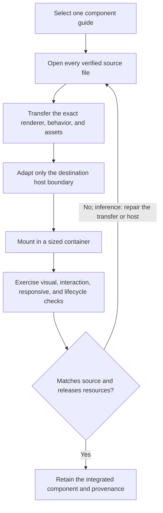

# ThreeUI source-exact component porting

| Evidence capsule | Value |
| --- | --- |
| Scope | Technical graphics: porting one catalog visual into an existing application |
| Trigger | An agent must implement, port, or adapt a ThreeUI Community visual from its verified source rather than approximate it |
| Source | Meng To's [standalone implementation-guide registry](https://github.com/MengTo/threeui/blob/02f9835e60ef8f0cac7907810aa223b7d414db1b/src/components/buildSkillMarkdown.js#L1-L53) |
| Author and evidence date | Meng To; source revision 2026-08-21, retrieved 2026-08-21 |
| Evidence signals | Source-documented |
| Evidence limit | The repository publishes 50 component-specific guides with this shared lifecycle, but does not show that the guides were used to produce the components or independently evaluate the ports. |

## Loop

## Run the loop

1. Select the catalog item's generated guide and open every file it lists as verified source.
   Identify the renderer, host lifecycle, styles, interactions, assets, and pinned source revision
   before editing.
2. Transfer the complete implementation. Preserve the authored GLSL, render passes, geometry,
   timing, state, content, and asset paths; some guides require byte-exact HTML or hashed assets.
3. Change only the host boundary required by the destination stack, such as a React wrapper,
   iframe, lazy-load boundary, or container sizing. Do not replace the renderer with a visually
   similar package or reconstruction.
4. Compare composition, animation timing, pointer behavior, and state transitions with the source.
   Exercise resize, high DPI, mobile or coarse pointer, reduced motion, visibility changes, and
   WebGL context loss where applicable. Confirm teardown releases frames, observers, listeners,
   geometry, buffers, textures, framebuffers, materials, and the renderer.
5. Accept only when the browser console is healthy and the component renders at native-or-better
   backing resolution. The repair-and-repeat connector is editorial inference: the guides state
   the checks and guardrails but do not prescribe one common retry command.

## Outputs and stop conditions

The output is a locally integrated component plus its source and asset provenance. Stop when its
rendered behavior matches the verified implementation, required responsive and lifecycle cases
pass, resources are released on teardown, and no source substitution or approximation remains.
If no guide exists for the selected catalog id, the registry throws instead of inventing one.

## Supporting skills

**Observed:** React, TypeScript or JavaScript, Three.js, raw WebGL, Canvas 2D, HTML/CSS, browser
developer tools, local assets, and source or asset hashes, depending on the selected guide.

**Potential (inference):** visual-regression capture, browser automation, GPU-resource inspection,
asset-integrity verification, and host-boundary review.

## Evidence boundaries

This page treats the 50 item guides as one parameterized pipeline family because their trigger,
transfer boundary, verification gate, and outcome are the same; item-specific renderer steps remain
in the selected source guide. Some guides refer to private-source snapshots or hashes not present in
the public checkout, so only publicly available Community source and assets are inspectable. The
repository code and ThreeUI-authored Community assets are MIT licensed; bundled fonts use the SIL
Open Font License, and externally loaded catalog media is not covered by the repository license.

## Sources

- [Guide registry and fail-closed lookup](https://github.com/MengTo/threeui/blob/02f9835e60ef8f0cac7907810aa223b7d414db1b/src/components/buildSkillMarkdown.js#L1-L53)
- [Complete-source bundle contract](https://github.com/MengTo/threeui/blob/02f9835e60ef8f0cac7907810aa223b7d414db1b/src/components/buildCopyBundles.js#L1-L71)
- [Repository scope and Community sync boundary](https://github.com/MengTo/threeui/blob/02f9835e60ef8f0cac7907810aa223b7d414db1b/README.md)
- [Asset-license boundaries](https://github.com/MengTo/threeui/blob/02f9835e60ef8f0cac7907810aa223b7d414db1b/ASSET-LICENSES.md#L1-L22)
- [MIT license](https://github.com/MengTo/threeui/blob/02f9835e60ef8f0cac7907810aa223b7d414db1b/LICENSE)
