# Round 2 evidence manifest

Status: **replacement geometry recaptured; atmospheric and vegetation follow-up awaits live WebGPU review; owner aesthetic review remains open**

All images in this manifest came from the running WebGPU app on 2026-08-17. The environment and
matched six-image sections were recaptured after the owner rejected the first two sparse biome
passes. Lighting, lens, inspection, and studio sections document earlier Round 2 control captures;
they remain evidence only for those named controls. No Round 1 image or software-rendered substitute
is included. Technical capture success does not assert owner acceptance or AAA quality.

The current worktree adds an atmospheric and close-vegetation follow-up after these images. Raster
view rays now keep the sun, moon, layered cloud structure, and restrained night stars fixed in world
space, and Path trace uses the same sky/fog palette. Trees add surface scars, moss accents, dead
branch stubs, hanging growth, flared palm roots, and clustered palm fruit. All authored shaders
generate, the environment and renderer contract tests pass, and both production bundles build.
These captures intentionally remain the promoted geometry set because no in-app browser or managed
Antiky runtime was available during that follow-up to inspect a real WebGPU frame. The follow-up is
therefore not claimed as visual evidence.

## Owner-directed environment replacement

The rejected generator composed every biome in `160 × 96 × 160`, left the rectangular edge visible,
used a thin terrain skin, and represented each tree crown as one filled block. The current
replacement uses one `384 × 128 × 384` scene in all three renderers. Natural terrain reaches all
four horizontal boundaries, while terrain-blended clearings, ridges, forest bands, shorelines, and
water horizons keep those finite storage limits out of the authored review views.

The new biome geometry is distinct rather than palette-only:

- forest uses modeled branch systems, porous crowns, conifers, a creek and bridge, ruins, ferns,
  shrubs, rock formations, paths, terrace gardens, practical lanterns, deer, mushrooms, and restrained
  firefly clusters;
- snow forest uses radial snow-loaded conifer boughs, a basin wall, drifts, rock formations, a
  ruined arch, timber rail, terrace gardens, trail, lanterns, foxes, and 13,269 deterministic
  weathering cells deposited on exposed pavilion surfaces;
- mountains use a four-peak ridge, snow line, exposed strata, conifers, angular crags, waterfall,
  cliff rail, ruined arch, paved sanctuary terrace, garden courts, wildlife, and cloth prayer flags;
- beach uses a curved coast, depth-layered sea and foam line, dunes, modeled palms with individual
  fronds and leaflets, shore rocks, fences, shade structure, jetty, canoe, flying birds, and sand
  forecourt; and
- swamp uses water channels, branched cypresses, hanging growth, reeds, lilies, fallen logs, a
  cypress horizon, lantern-lit stilt ruin, canoe, fireflies, and a hand-laid boardwalk into the
  sanctuary.

The focal Lantern Pavilion is now a 124,549-voxel, two-roof structure with a stepped plinth,
colonnade, veranda rails, framed glazing, entrance, roof ribs, lifted eaves, lantern tower, and
practical lights. At capture time, the five natural scenes contained 830,913 through 1,487,510
occupied voxels. The current unpromoted vegetation follow-up contains 831,504 through 1,489,047.
Scene tests require every natural environment to exceed 700,000
voxels, cover all 384 positions along every horizontal boundary, contain more than 15,000
elevated-detail columns, and use more than 12 palette entries. These thresholds reject the old
sparse slab implementation; they do not substitute for visual review.

The following captures hold Lantern Pavilion, Greedy mesh, Photorealistic, exposure 1.15, surface
variation 0.32, physical color grade on, DoF enabled at focus 180 and aperture 0.14, 1280 × 720, and
DPR 1. Each biome has an authored `vista` pose instead of forcing one generic camera to hide its
landmarks. Forest, mountains, beach, and swamp use 16.5 h golden light. Snow forest uses 22 h with
the moon enabled to prove the cool snow/warm practical-light treatment.

| Biome | Vista position | Yaw / pitch | Authored forms exposed |
| --- | --- | --- | --- |
| Forest | `[-118, 50, 135]` | `0.59 / -0.15` | creek edge, deer, lantern path, and ruined arch |
| Snow forest | `[112, 48, 138]` | `-0.43 / -0.14` | roof snow, fox, trail, conifer layers, and ruined arch |
| Mountains | `[-112, 62, 142]` | `0.50 / -0.16` | prayer flags, sanctuary overlook, crags, and four-ridge horizon |
| Beach | `[-126, 44, 158]` | `0.61 / -0.11` | bridge foreground, surf, jetty, palms, canoe, and birds |
| Swamp | `[-124, 43, 142]` | `0.60 / -0.10` | canoe foreground, water channels, boardwalk, cypresses, and fireflies |

| Forest | Snow forest | Mountains | Beach | Swamp |
| --- | --- | --- | --- | --- |
| [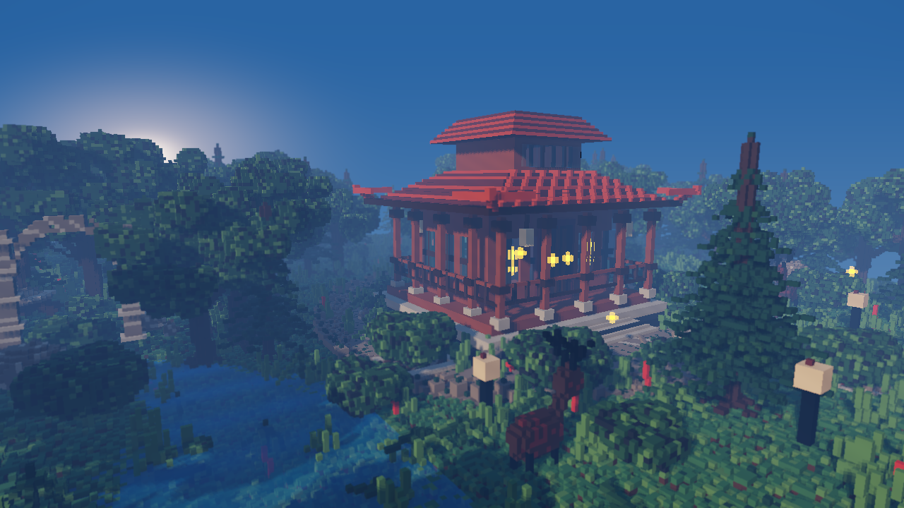](./evidence-images/environments/forest.png) | [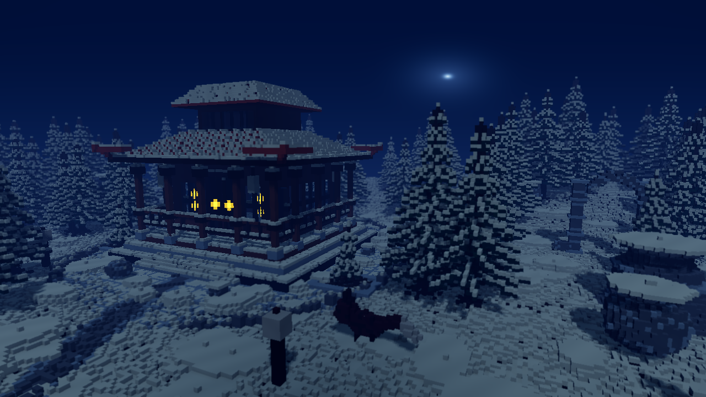](./evidence-images/environments/snow-forest.png) | [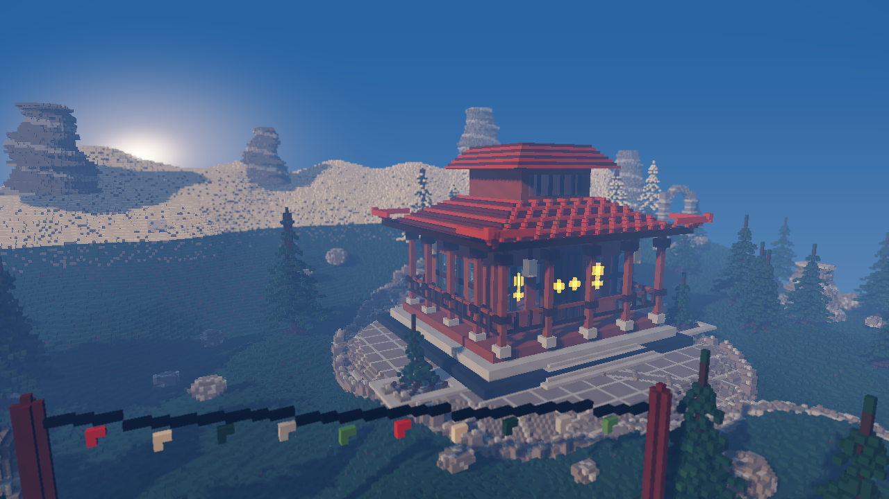](./evidence-images/environments/mountains.png) | [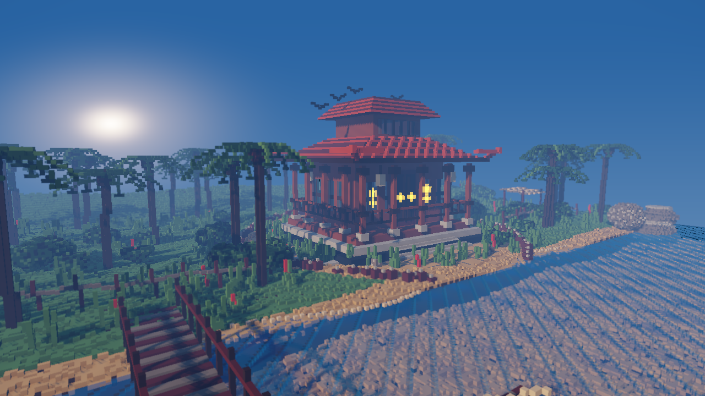](./evidence-images/environments/beach.png) | [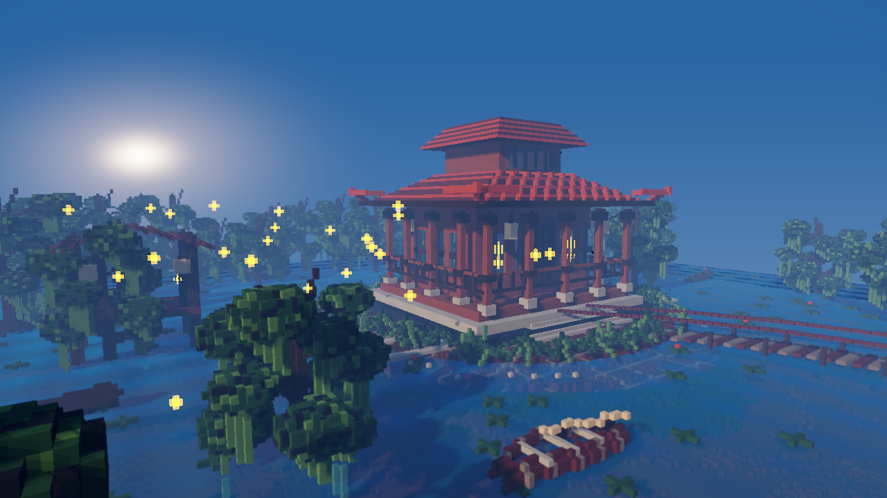](./evidence-images/environments/swamp.png) |

The [moonlit swamp](./evidence-images/environments/swamp-night.png) holds the same vista while
showing the reduced firefly field and warm practical lights against blue water. The former common
front-camera captures remain beside this set as `forest-front.png`, `snow-forest-front.png`,
`mountains-front.png`, `beach-front.png`, and `swamp-front.png`; they are secondary inspection views,
not the primary art-direction proof.

The same current snow geometry also rendered successfully through the two other pipelines using
the matched front-camera controls documented below:

| Face instances | Path trace |
| --- | --- |
| [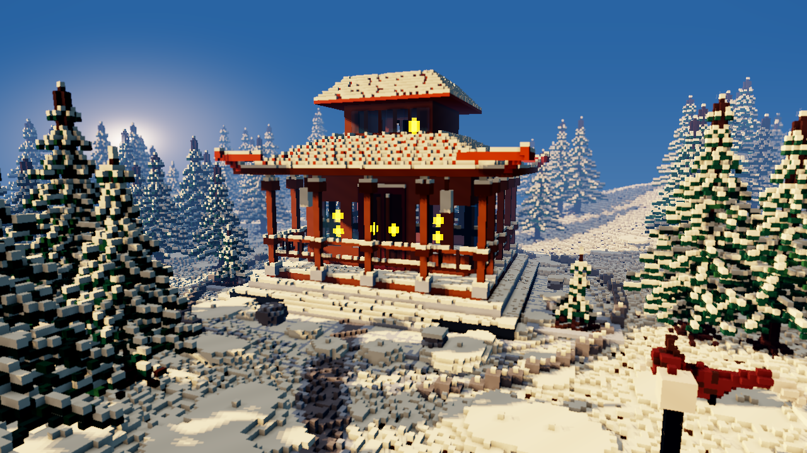](./evidence-images/environments/snow-forest-instances.png) |  |

The managed path-trace capture used a 75,497,472-byte packed dense volume, below the 128 MiB safety
cap, and an 899-step conservative traversal bound. Four palette indices share each storage `vec4`,
which preserves the complete 384-cell world without a BroMetal dependency patch. The managed
runtime stayed connected at 1280 × 720; every promoted capture returned a current observation and
no capture-action error. The exact canvas hashes are recorded in `evidence-images/SHA256SUMS`.

## Capture receipt

| Field | Value |
| --- | --- |
| Browser | Chromium 151.0.7922.34, browser revision 1234 |
| Automation | Playwright 1.62.1; isolated headless profiles plus one isolated headed profile for Pointer Lock |
| GPU API | WebGPU available; Chromium launched with `--enable-unsafe-webgpu` and Metal ANGLE |
| Managed canvas | 1280 × 720 drawing buffer, DPR 1, final canvas only |
| Studio viewports | 1280 × 720 and 1024 × 768, DPR 1 |
| Promoted geometry-pass runtime | One accepted build/runtime identity produced all five primary vistas and all six matched captures with current connection observations |
| Atmospheric and vegetation follow-up | Typed shaders generated, environment/renderer contracts passed, and current scene counts recorded; live WebGPU inspection and promotion still required |
| Standalone runtime | WebGPU present; no console errors and no uncaught page errors |
| Integrity | Full hashes are in [`evidence-images/SHA256SUMS`](./evidence-images/SHA256SUMS) |

## Current matched six-image set

Every image below uses Lantern Pavilion, snow forest, the front camera at position `[56, 44, 146]`,
yaw `-0.37`, pitch `-0.14`, 16.5 h, moon enabled with no daylight contribution, DoF enabled at focus
distance 180 and aperture 0.14, exposure 1.15, surface variation 0.32, final grade on, 1280 × 720,
and DPR 1. Only renderer and treatment change.

| Renderer | Photorealistic | Stylized |
| --- | --- | --- |
| Greedy mesh | [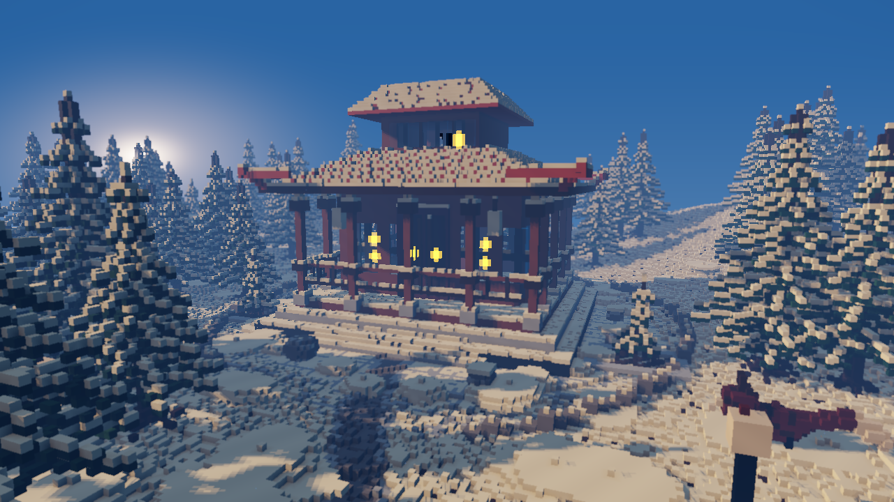](./evidence-images/matched/mesh-physical.png) | [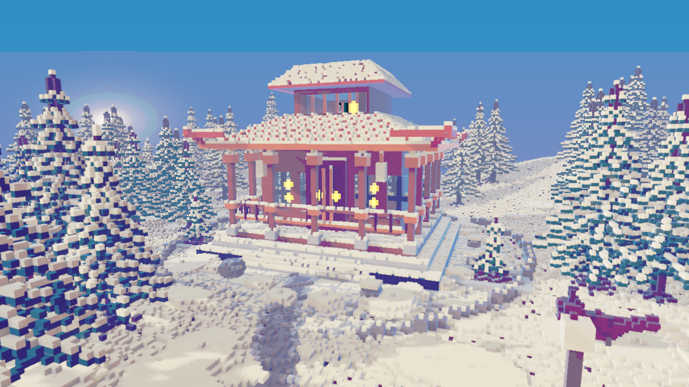](./evidence-images/matched/mesh-stylized.png) |
| Face instances |  | [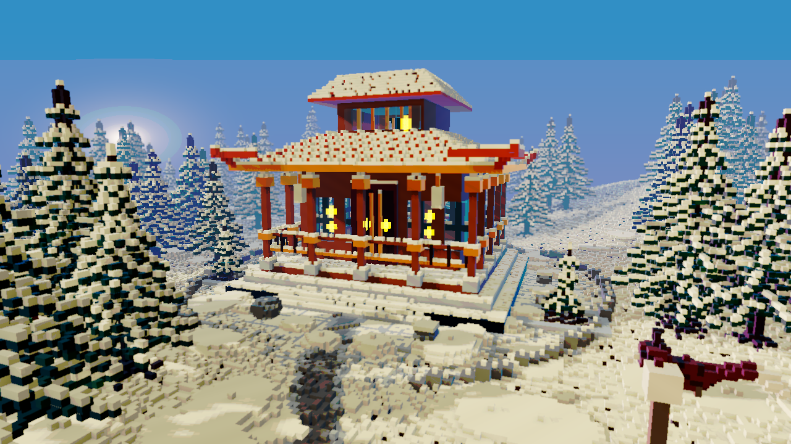](./evidence-images/matched/instances-stylized.png) |
| Path trace | [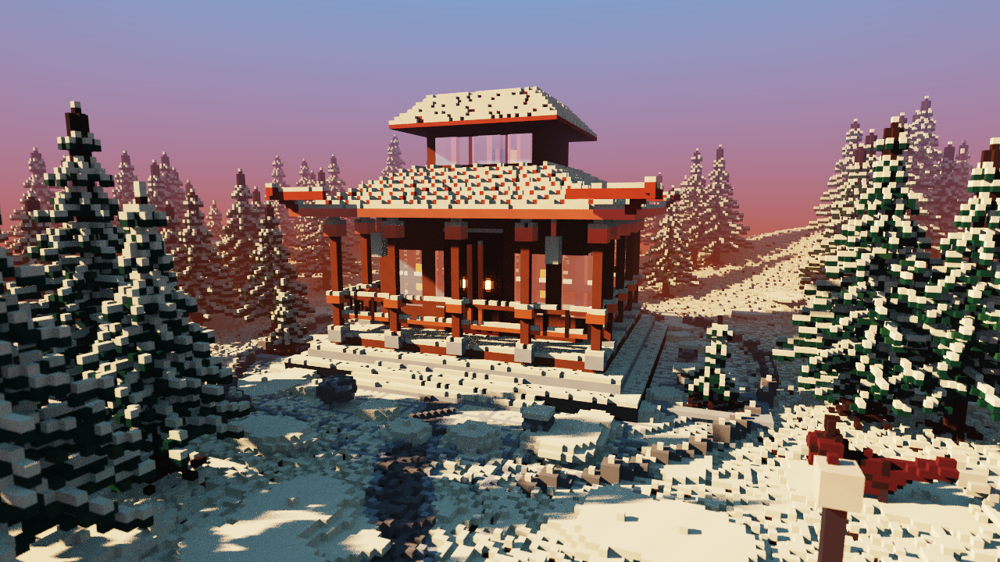](./evidence-images/matched/raytrace-physical.png) | [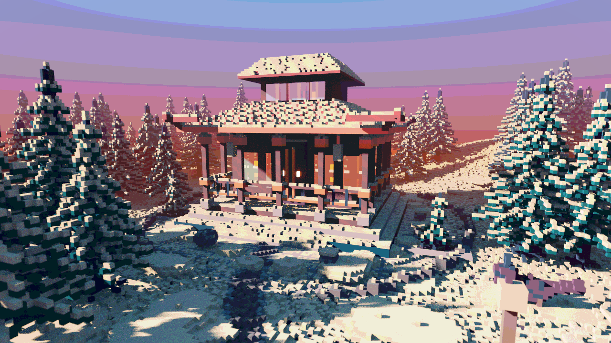](./evidence-images/matched/raytrace-stylized.png) |

Photorealistic keeps continuous light response, procedural surface breakup, material roughness,
metallic highlights, emissive lamps, and optical tint. Stylized changes shader behavior before
composition: diffuse light becomes bands, palette families shift, metal receives a colored rim,
glass gets a cyan edge response, water gets a bright teal response, and emission is stronger. The
path-trace Stylized sky also exposes its discrete bands clearly.

The six images prove that all three renderers accept the same expanded world, subject, camera, and
lighting controls. They also expose renderer-specific appearance: Face instances is more saturated
and Path trace is warmer and higher contrast than Greedy mesh. This matrix records that difference;
it does not claim pixel parity.

## Lens and lighting comparisons

The focus pair holds the Greedy mesh, Moon Gate Shrine, beach, camera, 13.5 h light, and aperture
1.15 fixed. Only focus distance changes from 112 to 180.

| Focus 112 | Focus 180 |
| --- | --- |
|  | [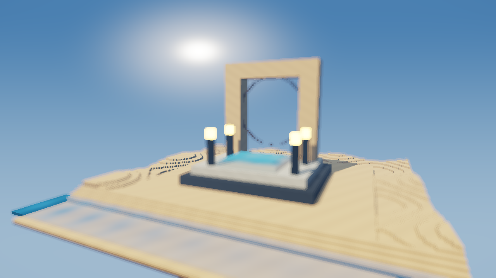](./evidence-images/lens/far.png) |

The following pair holds renderer, subject, environment, camera, time, focus distance 112,
exposure, variation, grade, and presentation fixed. The left frame disables DoF, making the
effective aperture zero. The right frame enables it at aperture 1.15. The shrine remains the
focus anchor while blur increases toward the foreground and background.

| DoF off | DoF on, aperture 1.15 |
| --- | --- |
| [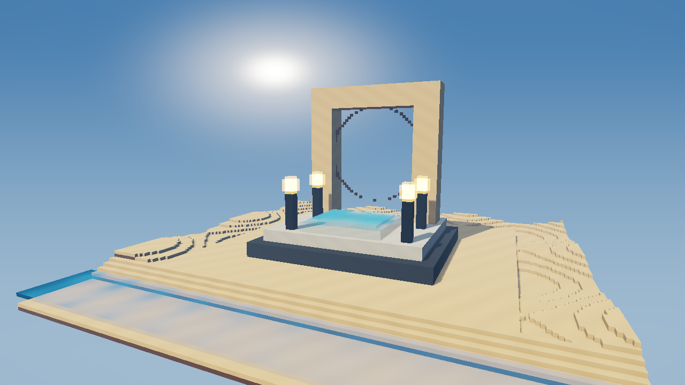](./evidence-images/lighting/day.png) |  |

The lighting set disables DoF and holds renderer, scene, camera, exposure, variation, and grade.
Day is 13.5 h. Both night images are 22 h; only the moon switch changes.

| Day | Night, moon on | Night, moon off |
| --- | --- | --- |
|  | [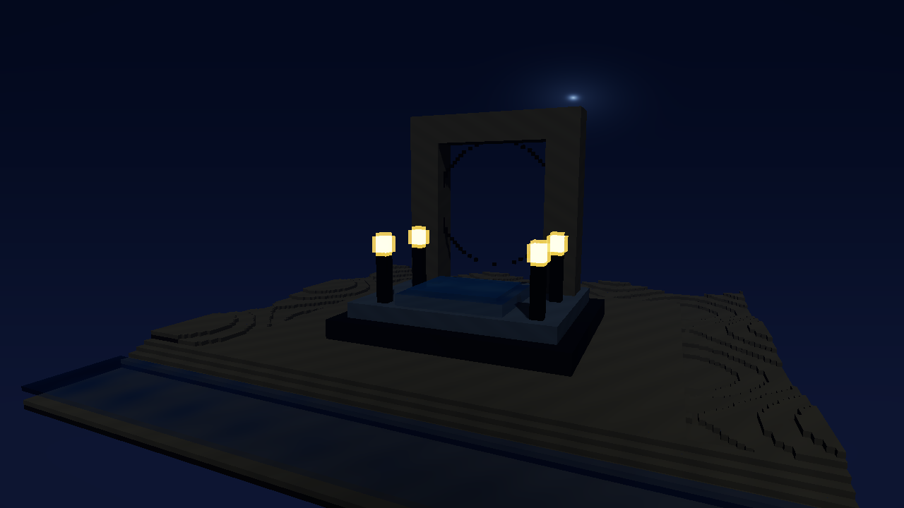](./evidence-images/lighting/night-moon-on.png) | [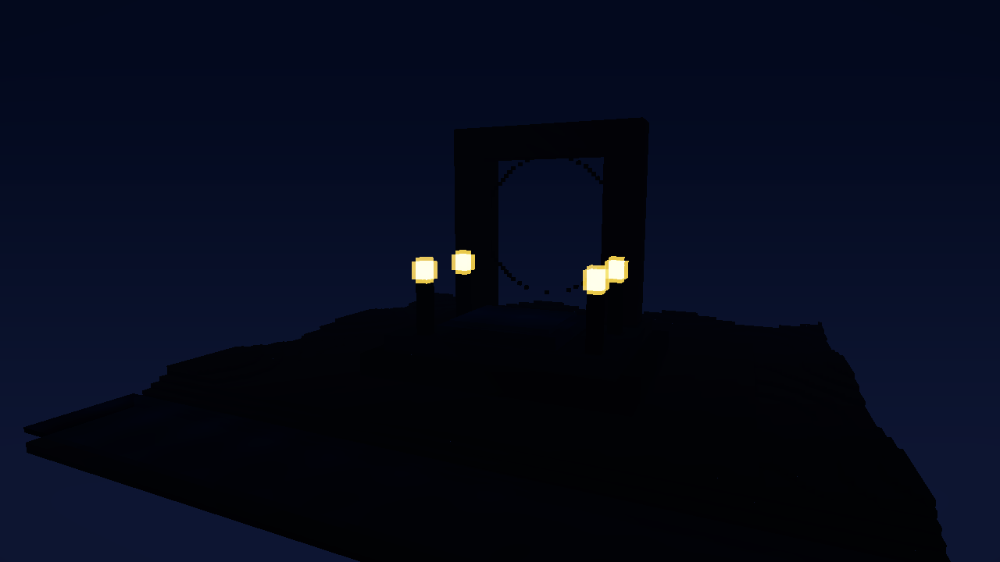](./evidence-images/lighting/night-moon-off.png) |

The night-on image has a visible moon disk, directional blue contribution, readable scene forms,
and moon-key shadows. The night-off image retains the selected time and emissive lamps while the
moon contribution disappears. The daylight image has neither a second moon key nor a fake second
sun.

### All-renderer daily arc

This matrix holds Moon Gate Shrine, beach, front camera, Photorealistic treatment, DPR 1,
1280 × 720, DoF off, moon on, exposure 1.15, surface variation 0.32, and final grade on. Only the
time changes: morning is 8 h, day is 13.5 h, evening is 18 h, and night is 22 h. Every row was
visually inspected after capture; all four states are distinct and contain a complete rendered
frame.

| Renderer | Morning | Day | Evening | Night |
| --- | --- | --- | --- | --- |
| Greedy mesh | [view](./evidence-images/lighting/times/mesh/morning.png) | [view](./evidence-images/lighting/times/mesh/day.png) | [view](./evidence-images/lighting/times/mesh/evening.png) | [view](./evidence-images/lighting/times/mesh/night.png) |
| Face instances | [view](./evidence-images/lighting/times/instances/morning.png) | [view](./evidence-images/lighting/times/instances/day.png) | [view](./evidence-images/lighting/times/instances/evening.png) | [view](./evidence-images/lighting/times/instances/night.png) |
| Path trace | [view](./evidence-images/lighting/times/raytrace/morning.png) | [view](./evidence-images/lighting/times/raytrace/day.png) | [view](./evidence-images/lighting/times/raytrace/evening.png) | [view](./evidence-images/lighting/times/raytrace/night.png) |

## Stylized without final grading

These Greedy mesh captures hold Moon Gate Shrine, beach, camera, 13.5 h, focus 112, aperture 0.14,
exposure, and variation fixed. Final color grading is off in both images.

| Photorealistic | Stylized |
| --- | --- |
| [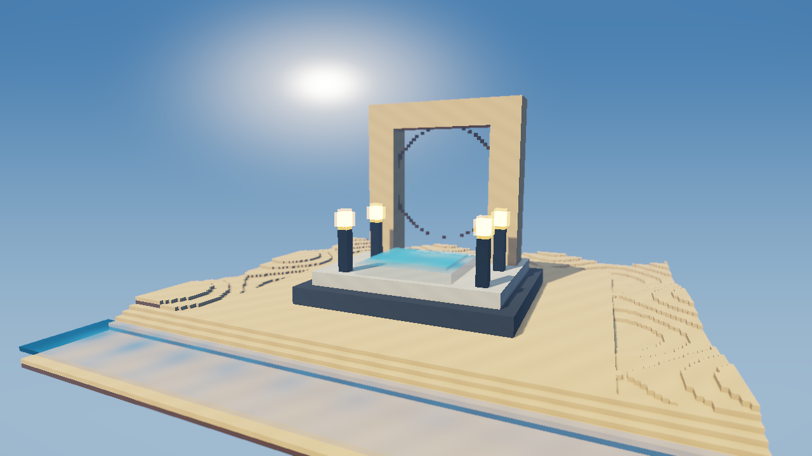](./evidence-images/presentation/physical-grade-off.png) | [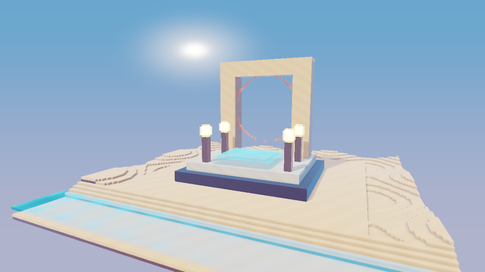](./evidence-images/presentation/stylized-grade-off.png) |

The palette, copper ring, water, base, and lamp-post responses remain different without the final
grade. This confirms that Stylized is not implemented only as a final-image filter.

## Four-sided model inspection

All twelve views use the Greedy mesh on the neutral pedestal in daylight with DoF disabled. Each
row uses the same subject placement and four fixed cameras.

| Subject | Front | Right | Back | Left |
| --- | --- | --- | --- | --- |
| Lantern Pavilion | [front](./evidence-images/inspection/pavilion-front.png) | [right](./evidence-images/inspection/pavilion-right.png) | [back](./evidence-images/inspection/pavilion-back.png) | [left](./evidence-images/inspection/pavilion-left.png) |
| Copper Survey Rover | [front](./evidence-images/inspection/rover-front.png) | [right](./evidence-images/inspection/rover-right.png) | [back](./evidence-images/inspection/rover-back.png) | [left](./evidence-images/inspection/rover-left.png) |
| Moon Gate Shrine | [front](./evidence-images/inspection/shrine-front.png) | [right](./evidence-images/inspection/shrine-right.png) | [back](./evidence-images/inspection/shrine-back.png) | [left](./evidence-images/inspection/shrine-left.png) |

The inspection shows intentional windows and gate openings, closed structural backs, continuous
bases, complete wheels/posts, and no renderer-created exterior holes.

## Environment and studio evidence

The selector is independent from the model and renderer. The current natural-environment evidence
is in [Owner-directed environment replacement](#owner-directed-environment-replacement). The table
below deliberately points to those replacement captures:

| Forest | Snow forest | Mountains | Beach | Swamp |
| --- | --- | --- | --- | --- |
| [view](./evidence-images/environments/forest.png) | [view](./evidence-images/environments/snow-forest.png) | [view](./evidence-images/environments/mountains.png) | [view](./evidence-images/environments/beach.png) | [view](./evidence-images/environments/swamp.png) |

[The live selector and receipt](./evidence-images/environments/selector-ui.png) show Moon Gate Shrine,
Beach, Face instances, and the current geometry/upload measurements together.

| 1280 × 720 | 1024 × 768 |
| --- | --- |
| [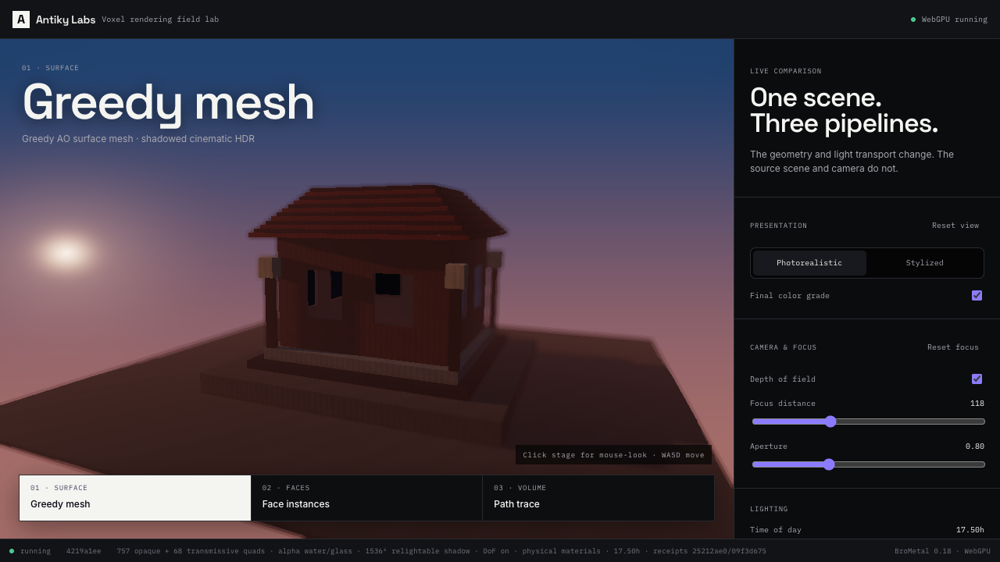](./evidence-images/studio/viewport-1280x720.png) | [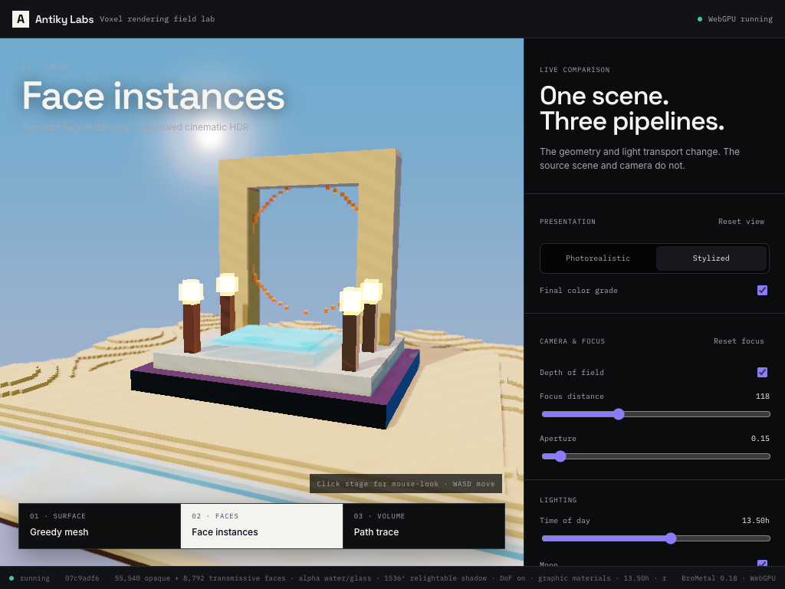](./evidence-images/studio/viewport-1024x768.png) |

At 1280 × 720 the stage canvas measured 939 × 640 CSS/device pixels. At 1024 × 768 it resized to
683 × 688 while the stage, renderer tabs, and inspector remained usable.

The [before](./evidence-images/studio/reload-before.png) and
[after](./evidence-images/studio/reload-after.png) reload frames show the live Face instances pipeline.
The browser receipt compared state before and after the button action and found exact persistence:
Moon Gate Shrine, beach, Stylized, focus 118, aperture 0.15, time 13.5 h, exposure 1.15, and surface
variation 0.32. The remounted renderer returned to `WebGPU running` with no console or page error.

## Live navigation and import receipt

[The navigation capture](./evidence-images/studio/navigation-active.png) shows the visible
`Mouse-look active` state after a real Pointer Lock request in Chromium. The audit pressed `W`,
applied mouse movement, and then released `W`. The canvas changed from SHA-256
`40422e9f1370bdddfb8080dab3a799ca0836e615ea1f28cc92d92282be5decb9` to
`8f6ba106e385774b6da379d89388d122374f33927aa70a357cb0dfa06e302c3b` and the camera visibly moved.
Escape released Pointer Lock and restored the inactive hint. The browser reported no console or
page errors.

[The import capture](./evidence-images/studio/import-catalog.png) comes from one three-file drop:
two valid in-memory `.vox` files and one truncated file. The catalog grew from three to
five entries, retained `acceptance-a.vox · model 1` and `acceptance-b.vox · model 1`, selected the
first accepted model, and displayed `broken.vox: VOX parse failed: file is truncated before MAIN`.
The valid model continued rendering while the rejection stayed visible.

## Known visual limits

- All three pipelines share one finite `384 × 128 × 384` voxel scene so the selected model and world
  remain identical across renderers. The authored cameras use terrain, forest, coast, and atmosphere
  to hide that storage boundary; this is not an infinite or streamed world.

- Raster glass and water use a separate alpha-blended pass. They have animated normals,
  view-dependent opacity, tint, specular response, and background visibility, but do not implement
  refractive ray bending or per-face depth sorting.
- Path-traced glass and water run a fifth bounded DDA traversal to the first different solid or the
  sky. Attenuation and tint depend on travel distance, but the transmission ray is not bent by an
  index of refraction.
- Raster moon shadows reuse the directional shadow map from the active night key light. This is the
  documented equivalent, not a second independently composited shadow map.
- “Photorealistic” names the physically oriented material and presentation treatment. It does not
  claim that voxel geometry is indistinguishable from a photograph.
- The reference-led bar still requires the owner's aesthetic judgment. Technical capture success
  and the preset name do not supply that judgment.

## Owner review gate

Review the replacement environment set and the current matched set against
[`reference-analysis.md`](./reference-analysis.md), with particular attention to scale, tree and
ground detail, foreground/middle/background separation, readable light direction, material
separation, and whether each biome feels deliberately authored. The goal remains open. A new fully
matched Photorealistic/Stylized matrix now uses the replacement geometry; owner aesthetic acceptance
is the remaining sign-off gate.
